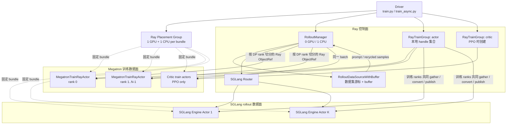
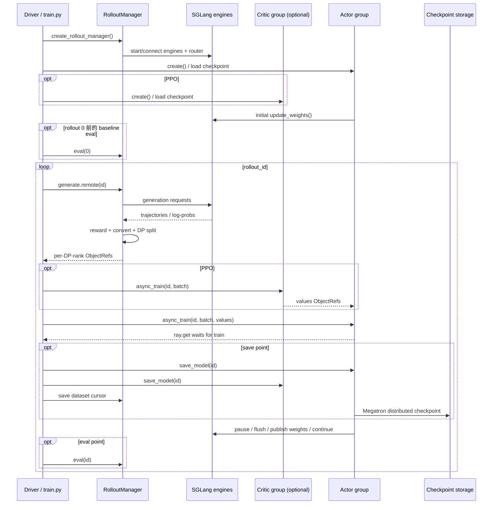

# 02. 架构与控制流：一次 rollout 如何变成一次参数更新

> **适用源码快照**：本文基于 `main@aaf5c209`。以下类名、调用顺序和行号均针对该快照；阅读其他版本时应以 `train.py`、`train_async.py` 和 `slime/ray/` 的实际实现为准。

## 先抓住三层

slime 可分成三层：

1. **驱动层**：`train.py` / `train_async.py`，决定何时生成、训练、保存、同步和评估；
2. **Ray 编排层**：placement group、`RolloutManager`、`RayTrainGroup`，把逻辑角色映射到进程与 GPU；
3. **执行层**：Megatron train actors 与 SGLang engine actors，真正执行前后向、优化器更新和 token generation。

不要把 `actor` 这个词混为一谈：RL 中的 actor 是策略模型；Ray actor 是远程有状态进程。`MegatronTrainRayActor` 恰好同时是“承载 RL actor/critic 的 Ray actor”。

## 总体架构

图中 `RayTrainGroup` 不是 remote actor，而是 driver 进程里的 handle 容器；`RolloutManager` 和每个训练 worker / SGLang engine 才是 Ray actors。训练 worker 的分配可见 [actor_group.py](https://github.com/THUDM/slime/blob/aaf5c2092b01219fa0d5c2d323741d409086ca32/slime/ray/actor_group.py#L57)，`RolloutManager` 的 Ray actor 创建见 [placement_group.py](https://github.com/THUDM/slime/blob/aaf5c2092b01219fa0d5c2d323741d409086ca32/slime/ray/placement_group.py#L227)，SGLang engine 则由 manager 初始化期间的 server 启动路径创建，见 [rollout.py](https://github.com/THUDM/slime/blob/aaf5c2092b01219fa0d5c2d323741d409086ca32/slime/ray/rollout.py#L1090)。

## Placement group：先锁拓扑，再启动进程

`create_placement_groups()` 是资源布局入口。它先为每张 GPU 创建一个 `{"GPU": 1, "CPU": 1}` bundle，使用 `PACK` 策略申请 placement group，并通过临时 `InfoActor` 获取节点 IP 与物理 GPU id，再稳定排序，见 [placement_group.py](https://github.com/THUDM/slime/blob/aaf5c2092b01219fa0d5c2d323741d409086ca32/slime/ray/placement_group.py#L42)。

这一步不只是“向 Ray 要 N 张卡”：

- placement group 把相关角色的资源作为一个调度整体；
- bundle index 决定每个 rank 落到哪张物理卡；
- IP/GPU 排序让分布式 rank 顺序稳定，便于组建 Megatron/NCCL 拓扑；
- `PACK` 倾向尽可能紧凑放置资源。

资源数量由部署形态决定，见 [placement_group.py](https://github.com/THUDM/slime/blob/aaf5c2092b01219fa0d5c2d323741d409086ca32/slime/ray/placement_group.py#L100)：

- train-only：只申请 actor GPU；
- external rollout：本地只申请 actor GPU；
- rollout-only：只申请 rollout GPU；
- colocate：申请 `max(actor_gpus, rollout_gpus)`；
- 分离：申请 `actor_gpus + rollout_gpus`，rollout bundle 从 actor 之后的 offset 开始。

### Actor 与 critic 的一个快照细节

PPO 会创建独立的 actor `RayTrainGroup` 和 critic `RayTrainGroup`，但该快照把 `result["critic"]` 指向 actor 的同一组 placement-group bundles，见 [placement_group.py](https://github.com/THUDM/slime/blob/aaf5c2092b01219fa0d5c2d323741d409086ca32/slime/ray/placement_group.py#L130)；参数校验还把 critic GPU 数强制设为 actor GPU 数，并开启 train offload，见 [arguments.py](https://github.com/THUDM/slime/blob/aaf5c2092b01219fa0d5c2d323741d409086ca32/slime/utils/arguments.py#L1853)。因此应描述为：

> actor/critic 是两个模型角色和两组 Ray workers，使用相同并行规模，在同一组 PG GPU slots 上依靠 offload 管理显存生命周期。

不能仅根据角色数推断总 GPU 数翻倍，也不要沿用旧文档中“critic 参数可独立决定 GPU 数”的说法。

## `RayTrainGroup`：把一个模型角色展开为多个 rank

`RayTrainGroup` 根据 `num_nodes * num_gpus_per_node` 为每个 rank 创建一个 `MegatronTrainRayActor`。rank 0 先返回 master address/port，随后其他 rank 使用同一 rendezvous 信息启动，见 [actor_group.py](https://github.com/THUDM/slime/blob/aaf5c2092b01219fa0d5c2d323741d409086ca32/slime/ray/actor_group.py#L114)。

它对 driver 暴露的是组操作：

- `create()`：创建所有 workers，调用每个 worker 的 `init()`，收集恢复后的 start rollout id；
- `async_train()`：对所有 rank 发出 `.train.remote(...)`，返回 ObjectRef 列表；
- `save_model()`：让所有 rank 参与 distributed checkpoint；
- `update_weights()`：让训练 ranks 共同完成 gather/convert/send；
- `clear_memory()`、`offload()`、`release()`：管理生命周期。

组方法集中在 [actor_group.py](https://github.com/THUDM/slime/blob/aaf5c2092b01219fa0d5c2d323741d409086ca32/slime/ray/actor_group.py#L130)。名字中的 `async_train` 表示“先返回一组 Ray ObjectRef”，是否等待由 driver 的 `ray.get` 决定；它并不自动保证训练与 rollout 重叠。

## `RolloutManager`：rollout 控制面的中心

`RolloutManager` 是一个 0-GPU Ray actor。初始化时它：

1. 启动或连接 SGLang servers；
2. 加载 `data_source_path` 对应的数据源；
3. 动态加载 rollout、eval、reward post-process、sample conversion 等函数；
4. 等待 engine 初始化完成；
5. 创建一个用于权重更新的分布式锁。

对应代码在 [rollout.py](https://github.com/THUDM/slime/blob/aaf5c2092b01219fa0d5c2d323741d409086ca32/slime/ray/rollout.py#L430)。

一次 `generate(rollout_id)` 会调用 rollout 函数，记录原始数据与指标，把 `Sample` 转为训练字典，然后按 Megatron data-parallel rank 切分，见 [rollout.py](https://github.com/THUDM/slime/blob/aaf5c2092b01219fa0d5c2d323741d409086ca32/slime/ray/rollout.py#L552)。切分结果通过 Ray object store（或 NIXL tensor transport）装入 `Box`，避免 driver 搬运大批 tensor，见 [rollout.py](https://github.com/THUDM/slime/blob/aaf5c2092b01219fa0d5c2d323741d409086ca32/slime/ray/rollout.py#L828)。

默认数据源 `RolloutDataSourceWithBuffer` 先消费 buffer 中回收的 sample，再从全局数据集取新 prompt；它还维护 epoch、offset、sample index 等状态，见 [data_source.py](https://github.com/THUDM/slime/blob/aaf5c2092b01219fa0d5c2d323741d409086ca32/slime/rollout/data_source.py#L168)。因此所谓 “Data Buffer” 在默认实现中不是独立 GPU 服务，而是 `RolloutManager` 内的数据源对象及其内存 buffer。

## 训练 actor 与 critic

每个 `MegatronTrainRayActor` 初始化 torch distributed 与 Megatron，加载模型、优化器和 scheduler，并返回 `loaded_rollout_id + 1`，见 [actor.py](https://github.com/THUDM/slime/blob/aaf5c2092b01219fa0d5c2d323741d409086ca32/slime/backends/megatron_utils/actor.py#L53)。rank 0 还把 DP/CP/VPP 配置写回 `RolloutManager`，让它能按真实训练并行配置切 batch。

训练统一从 `train()` 进入：

- role 为 critic：先前向得到 values，计算 advantages/returns，以 value loss 更新 critic，并把最后 pipeline stage 的 values 搬到 CPU 返回；
- role 为 actor：可计算 reference/teacher/current policy log-prob，接收 critic values，计算 advantages/returns，再做 policy/SFT/custom loss 更新。

分派逻辑见 [actor.py](https://github.com/THUDM/slime/blob/aaf5c2092b01219fa0d5c2d323741d409086ca32/slime/backends/megatron_utils/actor.py#L364)，critic 路径见 [actor.py](https://github.com/THUDM/slime/blob/aaf5c2092b01219fa0d5c2d323741d409086ca32/slime/backends/megatron_utils/actor.py#L386)，actor 路径见 [actor.py](https://github.com/THUDM/slime/blob/aaf5c2092b01219fa0d5c2d323741d409086ca32/slime/backends/megatron_utils/actor.py#L414)。

PPO 时 driver 先发起 critic 训练，拿到每个 worker 的 `value_refs`，再作为 `external_data` 传给 actor；Ray 会根据 ObjectRef 依赖调度。非 PPO 路径不创建 critic。

## 同步模式的端到端控制流

顶层源码从 GPU 分配、RolloutManager 创建、模型创建到初始权重发布依次见 [train.py](https://github.com/THUDM/slime/blob/aaf5c2092b01219fa0d5c2d323741d409086ca32/train.py#L13)。主循环严格等待 generate，再等待 train，最后更新 rollout 权重，见 [train.py](https://github.com/THUDM/slime/blob/aaf5c2092b01219fa0d5c2d323741d409086ca32/train.py#L48)。

几个重要语义：

- **RolloutManager 必须先于训练模型创建**：训练 rank 初始化后要把并行配置写回 manager，manager 也可能先计算每 epoch 的 rollout 数；
- **初始权重必同步**：即使 SGLang 从 HF checkpoint 启动，driver 仍在第一轮前用 actor 当前权重覆盖它，见 [train.py](https://github.com/THUDM/slime/blob/aaf5c2092b01219fa0d5c2d323741d409086ca32/train.py#L26)；
- **同步入口默认有初始评估**：配置 eval 且未设置 `skip_eval_before_train` 时，`train.py` 会在 rollout 0 的生成前先做 baseline eval；`train_async.py` 没有这一步；
- **critic-only warmup**：前 `num_critic_only_steps` 可只训练 critic；
- **save 与 update weights 是两条路径**：save 为恢复，update 为在线 serving 一致性。

## 权重同步如何跨越 Megatron 与 SGLang

训练后，Megatron 参数可能按 TP/PP/EP 分片，而 SGLang 的权重命名和布局不同。`MegatronTrainRayActor` 在初始化时按配置选择 updater，见 [actor.py](https://github.com/THUDM/slime/blob/aaf5c2092b01219fa0d5c2d323741d409086ca32/slime/backends/megatron_utils/actor.py#L150)：

| 模式 | 适用布局 | 主要路径 |
| --- | --- | --- |
| full + NCCL | 训推分离，默认 | gather Megatron shards，转为 HF/SGLang 名称，分块广播到 engines |
| full + tensor | colocate | GPU/Gloo 整理分片，通过 CUDA IPC/Ray 把 tensor 交给同卡 engine |
| full + disk | 共享文件系统或 external engines | 写完整 HF checkpoint，engine 从磁盘 reload |
| delta + disk | 大模型、跨集群等 | 发布相对前一版本变化，再由 engine host 合并并 reload |

默认 NCCL updater 在发送前暂停 generation、flush cache，发布完再恢复，防止一次请求跨越两个权重版本，见 [update_weight_from_distributed.py](https://github.com/THUDM/slime/blob/aaf5c2092b01219fa0d5c2d323741d409086ca32/slime/backends/megatron_utils/update_weight/update_weight_from_distributed.py#L102)。它还使用 RolloutManager 持有的锁避免并发 broadcast deadlock。

full + disk 模式先写版本化目录，之后由 `RayTrainGroup` 协调 SGLang reload，见 [update_weight_from_disk.py](https://github.com/THUDM/slime/blob/aaf5c2092b01219fa0d5c2d323741d409086ca32/slime/backends/megatron_utils/update_weight/update_weight_from_disk.py#L65) 和 [actor_group.py](https://github.com/THUDM/slime/blob/aaf5c2092b01219fa0d5c2d323741d409086ca32/slime/ray/actor_group.py#L219)。delta updater 则自行发布差量、让各 engine host 合并并 reload；delta 不支持 colocate，该组合会在参数校验中直接拒绝，见 [arguments.py](https://github.com/THUDM/slime/blob/aaf5c2092b01219fa0d5c2d323741d409086ca32/slime/utils/arguments.py#L2004)。

## Checkpoint 与恢复

checkpoint 有两类状态：

1. **训练状态**：actor/critic 的模型、优化器、scheduler 等，最终调用 Megatron `save_checkpoint()`，见 [model.py](https://github.com/THUDM/slime/blob/aaf5c2092b01219fa0d5c2d323741d409086ca32/slime/backends/megatron_utils/model.py#L937)；
2. **rollout 数据状态**：全局数据集的 offset、epoch、sample/group index 和 metadata，保存到 `save/rollout/global_dataset_state_dict_*.pt`，见 [data_source.py](https://github.com/THUDM/slime/blob/aaf5c2092b01219fa0d5c2d323741d409086ca32/slime/rollout/data_source.py#L123)。

`create_training_models()` 会检查**被选作进度来源的那一组** workers 返回的 start rollout id 在组内一致；非 PPO 时该组是 actor，PPO 时当前代码只采用 critic IDs，并没有比较 actor 与 critic 的 checkpoint 进度。若用户显式传了 `--start-rollout-id`，当前路径也不会把它与 checkpoint 返回值交叉校验。随后全局数据源会按最终 start id 加载前一轮状态，见 [placement_group.py](https://github.com/THUDM/slime/blob/aaf5c2092b01219fa0d5c2d323741d409086ca32/slime/ray/placement_group.py#L186)。因此 PPO 恢复前应由操作者额外确认 actor、critic、显式 start id 和数据游标处于同一边界。

保存由 `save_interval` 或 epoch/final/release 条件触发。若启用 Megatron async save，下一次保存前会先 finalize 上一次异步写入，最后一步或强制同步点会再次等待，见 [actor.py](https://github.com/THUDM/slime/blob/aaf5c2092b01219fa0d5c2d323741d409086ca32/slime/backends/megatron_utils/actor.py#L541)。

还有一个重要的恢复边界：上述“模型 checkpoint 与数据游标对齐”只适合按同步 `train.py` 的顺序理解。`train_async.py` 会在训练 N 之前先提交 `generate(N+1)`；保存模型 N 时，单线程 `RolloutManager` 可能已经完成 N+1 并推进了数据 offset，随后保存的游标便领先于模型。fully-async worker 还持有未持久化的 active tasks、完成队列和 buffer。当前源码不能据此承诺异步模式 exact resume；恢复可能跳过或重排 prompt，生产方案需要另行持久化预留/在途状态并做故障注入验证。

面试中要特别区分：

- **训练 checkpoint**：用于进程退出后的可恢复性；
- **HF 权重同步目录**：给 SGLang 在线 reload，默认可以清理；
- **SGLang 当前显存权重**：服务运行态，不是完整训练恢复点；
- **数据源 state**：在同步、且模型与游标 checkpoint 边界对齐时用于避免重复或跳过 prompt；异步模式不保证 exact resume。

## 一条实用的排障顺序

1. placement group 是否 ready，rank 到节点/GPU 的映射是否符合预期；
2. SGLang engine/router 是否全部健康并注册；
3. RolloutManager 是否产出正确数量、形状和 rollout id 的 `Sample`；
4. DP split 的 `num_microbatches`、partition 是否与训练并行配置一致；
5. actor/critic 的 start rollout id 是否一致；
6. 权重版本更新前后 generation 是否被 pause，cache 是否 flush；
7. checkpoint 与数据源游标是否在同一 rollout 边界保存。

这套顺序沿着真实控制流从资源到数据再到状态检查，比先怀疑算法公式更容易缩小问题范围。
