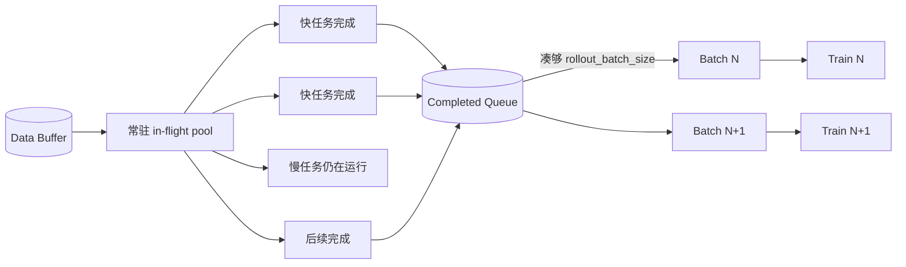

# 03. 同步、流水异步与 fully-async：时序、陈旧度和选择

> **适用源码快照**：本文基于 `v0.3.2@3778dbf6`（扫描日期 2026-08-29）。异步语义高度依赖实现细节；下文的“一轮滞后”等结论仅对应这个快照的 `train_async.py` 与 `slime.rollout.fully_async_rollout`。

## 先消除一个命名误区

slime 中至少有三种不同层次的“异步”：

1. rollout 内用 `asyncio` 并发许多 SGLang 请求；
2. `RayTrainGroup.async_train()` 返回 ObjectRef，但 driver 随后可以立刻 `ray.get`；
3. `train_async.py` 真正让 **下一批生成与当前批训练** 在不同 GPU 上重叠。

因此，看到函数名带 `async` 不等于整个 RL loop 已异步。判断标准是：关键路径上 generate 与 train 是否同时在运行、driver 在哪里 `ray.get`。

## 三种执行模式总览

| 模式 | 驱动 | rollout 函数 | 跨 batch 行为 | 策略陈旧度 | colocate |
| --- | --- | --- | --- | --- | --- |
| 同步 | `train.py` | 默认或自定义 | 每轮 generate 完成后才 train | 通常最新已发布策略 | 支持 |
| N/N+1 流水 | `train_async.py` | 默认或自定义 | train(N) 与 generate(N+1) 重叠 | 默认同步间隔 1 时，N+1 相对训练结果滞后一轮 | 不支持 |
| fully-async rollout | `train_async.py` | `generate_rollout_fully_async` | 常驻生成池跨越 rollout 调用，按完成顺序凑 batch | 不再是固定一轮；取决于在途任务与完成队列 | 不支持 |

fully-async 不是第三个顶层 driver；示例明确同时要求 `train_async.py` 和专用 rollout function，见 [examples/fully_async/README.md](https://github.com/THUDM/slime/blob/3778dbf6d1a533ab478ecf5ddaa11449a47752b2/examples/fully_async/README.md#L42)。

## 模式一：`train.py` 的同步执行

核心循环顺序是：

```text
optional baseline eval（rollout 0 前）
generate(N, weights=W_N)
    -> train(N)
    -> optional save
    -> update rollout weights to W_(N+1)
    -> optional eval
    -> generate(N+1, weights=W_(N+1))
```

源码中 `ray.get(rollout_manager.generate.remote(...))` 先等待生成完成，之后 `ray.get(actor_model.async_train(...))` 等待训练完成，最后才 `actor_model.update_weights()`，见 [train.py](https://github.com/THUDM/slime/blob/3778dbf6d1a533ab478ecf5ddaa11449a47752b2/train.py#L49)。

若配置了 eval 且没有 `--skip-eval-before-train`，同步 driver 还会在 rollout 0 的生成前执行一次 baseline eval；这是 `train_async.py` 当前没有的时间点。比较两种 driver 的指标曲线时必须对齐这个差异。

### 同步时序图

```mermaid
gantt
    title train.py：同一轮生成与训练不重叠
    dateFormat X
    axisFormat %s
    section Rollout GPU
    generate N (W_N)       :r1, 0, 3
    wait                   :milestone, 3, 0
    weight update          :r2, 7, 1
    generate N+1 (W_N+1)   :r3, 8, 3
    section Train GPU
    wait for N             :t0, 0, 3
    train N                :t1, 3, 4
    wait                   :t2, 7, 1
```



这里的“同步”是 round boundary 同步，不表示 rollout 内部串行；一次 `generate` 仍可向多个 SGLang engines 并发发请求。

### 优点

- rollout batch 与更新它的训练 step 对应关系最清楚；
- 下一轮默认使用刚发布的新策略，staleness 最小；
- eval、save、offload/onload 的边界直观；
- 支持 colocate，卡数有限时可让 Megatron 与 SGLang 分时复用 GPU。

### 代价

训推分离时，两边会交替空闲：rollout 期间训练 GPU 等待，训练期间 rollout GPU 等待。若生成与训练耗时相近，理论上可重叠的空窗非常明显。

## 模式二：`train_async.py` 的 N/N+1 流水

异步 driver 先提交第一个 `generate(0)`。每轮开始时等待当前 future，然后**立刻提交下一轮 generate**，再训练当前 batch，见 [train_async.py](https://github.com/THUDM/slime/blob/3778dbf6d1a533ab478ecf5ddaa11449a47752b2/train_async.py#L32)。默认 `update_weights_interval=1` 时，时序是：

```text
generate(N, W_N) 完成
├─ generate(N+1, W_N) 开始
└─ train(N) 开始，得到 W_(N+1)
   等待 generate(N+1) 完成
   pause/flush/sync W_(N+1)
下一轮：train(N+1) 与 generate(N+2, W_(N+1)) 重叠
```

### 异步时序图

```mermaid
gantt
    title train_async.py：N/N+1 batch pipeline
    dateFormat X
    axisFormat %s
    section Rollout GPU
    generate N (W_N)         :r0, 0, 3
    generate N+1 (W_N)       :r1, 3, 4
    sync W_N+1               :r2, 7, 1
    generate N+2 (W_N+1)     :r3, 8, 4
    section Train GPU
    wait first batch         :t0, 0, 3
    train N                  :t1, 3, 4
    sync barrier             :t2, 7, 1
    train N+1                :t3, 8, 4
```



### 为什么 N+1 是一轮旧策略

`generate(N+1)` 在 `train(N)` 之前提交；权重更新发生在 `train(N)` 结束后。为避免在生成中途换权重，driver 还会先 `ray.get` 等待 pending generation 完成，再调用 `update_weights()`，见 [train_async.py](https://github.com/THUDM/slime/blob/3778dbf6d1a533ab478ecf5ddaa11449a47752b2/train_async.py#L66)。因此默认同步间隔 1 时：

- batch N 用行为策略 `W_N` 生成；
- 训练 N 后目标 actor 已变为 `W_(N+1)`；
- batch N+1 仍来自 `W_N`，所以训练它时是一轮 stale。

这个设计用可解释的一轮滞后换取生成与训练重叠。它并不在单条 trajectory 生成到一半时切换模型。

### `update_weights_interval > 1` 会发生什么

常规（非 `release_train`）运行只有满足 `(rollout_id + 1) % update_weights_interval == 0` 才同步，参数默认值为 1，见 [arguments.py](https://github.com/THUDM/slime/blob/3778dbf6d1a533ab478ecf5ddaa11449a47752b2/slime/utils/arguments.py#L547)。间隔增大时，同一 rollout 权重会覆盖更多 batch；staleness 不再简单等于一轮，而且在一个同步窗口内会逐步增大。`release_train` 是例外：driver 每轮都执行 full + disk 权重发布，并在该生命周期中释放训练 actors、让 rollout engines reload。

好处是减少大型模型权重 gather、格式转换、传输、pause/flush 的开销；风险是 behavior policy 与当前训练 policy 距离更大。是否可接受取决于学习率、每批 optimizer steps、clip/importance correction、reward 分布等，不能只看系统吞吐。

### 为什么不支持 colocate

`train_async.py` 入口直接断言 `not args.colocate`，见 [train_async.py](https://github.com/THUDM/slime/blob/3778dbf6d1a533ab478ecf5ddaa11449a47752b2/train_async.py#L11)。原因是 N/N+1 的收益来自 train GPU 与 rollout GPU 同时工作；若两者占同一批卡，还要靠 offload 分时释放显存，就无法安全地同时驻留和计算。

这是当前实现的硬限制，不是“性能不推荐”。需要 colocate 时应选 `train.py`。

### 其他与同步 driver 的差异

当前 `train_async.py` 不是机械地给同步循环加 future：

- 没有 `train.py` 中逐轮 rollout offload/onload 逻辑；
- 权重同步只在配置间隔触发；
- 没有 `train.py` 在 rollout 0 前的 baseline eval；
- eval 在训练后触发，但 pending generate 与 actor 方法的串行/远程依赖应纳入时序考虑；
- save 仍按同样的 periodic 条件执行。

因此不能把只为同步/colocate 写的配置原样换成 `train_async.py` 而不复核资源与参数。

## 模式三：`examples/fully_async` 的跨 batch 常驻生成池

普通 N/N+1 流水虽然重叠了两个 batch，但每次 `RolloutManager.generate()` 仍要凑齐整批结果才返回。如果一个 batch 中有少数极慢轨迹，训练仍受 straggler 控制。

fully-async rollout 把“并发窗口”从单个 batch 提升到跨 batch 的常驻 worker：

1. 第一次调用创建全局 `AsyncRolloutWorker`（后台 thread + asyncio loop）；
2. worker 持续从 Data Buffer 取 group，把在途任务补满到固定 concurrency；完成队列积压到并发上限时会暂停取新 prompt，形成背压；
3. 任意 group 完成后进入 `output_queue`；
4. 每次 `generate_rollout_fully_async()` 通过 `get_completed_groups(limit=...)` 只取本轮还缺的数量，凑够 `rollout_batch_size` 个已完成 group 就返回；
5. 在途任务跨调用保留；多余的完成组留在队列中供下一轮直接消费（“queue stays warm” 契约），不会被丢弃。早期快照中一次轮询会 drain 整个队列并静默丢弃超出 target 的完成组，该缺陷已由 [PR #2238](https://github.com/THUDM/slime/pull/2238) 修复。

常驻 worker 的创建和并发数计算见 [fully_async_rollout.py](https://github.com/THUDM/slime/blob/3778dbf6d1a533ab478ecf5ddaa11449a47752b2/slime/rollout/fully_async_rollout.py#L53)，带背压的补任务循环见 [fully_async_rollout.py](https://github.com/THUDM/slime/blob/3778dbf6d1a533ab478ecf5ddaa11449a47752b2/slime/rollout/fully_async_rollout.py#L131)，按需取完成组的逻辑见 [fully_async_rollout.py](https://github.com/THUDM/slime/blob/3778dbf6d1a533ab478ecf5ddaa11449a47752b2/slime/rollout/fully_async_rollout.py#L107) 与 [fully_async_rollout.py](https://github.com/THUDM/slime/blob/3778dbf6d1a533ab478ecf5ddaa11449a47752b2/slime/rollout/fully_async_rollout.py#L228)。

### 逻辑时序



它缓解 head-of-line blocking：batch N 不必等待“最早发出但最慢”的那条任务，只需等待任意足够多的任务完成。输出在交给训练前按 `sample.index` 排序，但跨 rollout 的全局顺序只是 best effort，见 [fully_async_rollout.py](https://github.com/THUDM/slime/blob/3778dbf6d1a533ab478ecf5ddaa11449a47752b2/slime/rollout/fully_async_rollout.py#L251)。

### staleness 为什么不再固定为一轮

常驻池跨越 `generate` 调用，完成队列也可能在上一轮就已有库存。于是某条 trajectory 从发起、完成、进入某个训练 batch，到真正消费之间的距离取决于：

- 任务耗时长尾；
- 并发池大小；
- completed queue 积压；
- train/rollout 相对速度；
- 权重同步间隔和更新时的 abort/requeue。

专用 worker 没有按 weight version 过滤已完成队列的逻辑，所以不能从源码保证“最多 stale 一轮”。权重更新期间若底层生成收到 abort 信号，包含 `ABORTED` sample 的 group 会被放回 Data Buffer，而不是交给训练，见 [fully_async_rollout.py](https://github.com/THUDM/slime/blob/3778dbf6d1a533ab478ecf5ddaa11449a47752b2/slime/rollout/fully_async_rollout.py#L200)。这防止已明确中止的轨迹污染 batch，但不等于清除所有已完成旧版本样本。

### 当前限制

- rollout entrypoint 明确拒绝 evaluation mode，见 [fully_async_rollout.py](https://github.com/THUDM/slime/blob/3778dbf6d1a533ab478ecf5ddaa11449a47752b2/slime/rollout/fully_async_rollout.py#L272)；若 `eval_function_path` 默认继承该函数，启用 eval 会失败，需要单独设计兼容的 eval 路径；
- 依赖可回填样本的 Data Buffer，代码断言启用 global dataset；
- `ABORTED` 轨迹当前整组重新排队，不是从部分轨迹精确续跑；
- active tasks、完成队列和预取后的 data-source offset 没有作为一个事务随模型 checkpoint 保存，因此当前不提供 exact resume 保证；
- 由于它依赖 `train_async.py`，同样不能 colocate；
- 吞吐提高不自动解决 off-policy 偏差，需要结合训练指标验证。

## 三种模式该怎么选

### 选择 `train.py`，如果

- GPU 数有限，需要 colocate；
- 首次打通新模型、新 reward 或新数据格式；
- 算法对 behavior policy 新鲜度敏感；
- 更看重可复现、易定位的 round boundary；
- rollout 与训练本来就在同一资源上，无法真正并行。

### 选择 `train_async.py` 的 N/N+1 流水，如果

- train 与 rollout 已分离到不同 GPU；
- 两阶段耗时可观，重叠能显著提升利用率；
- 可以接受并验证默认约一轮的 policy lag；
- batch 内长尾尚不严重，整批 barrier 不是主要瓶颈。

### 选择 fully-async rollout，如果

- agent/tool/environment 轨迹耗时方差很大；
- straggler 明显拖慢每个 batch；
- 可以监控和控制更复杂、非固定的 staleness；
- 当前任务不依赖同一 fully-async entrypoint 做 eval；
- Data Buffer 的重排、回收语义与算法允许的采样分布一致。

## 上线前应观察什么

不要只比较 samples/s。至少同时观察：

- rollout、train、weight update、wait 时间占比；
- rollout weight version 与训练 step 的差距分布；
- completed queue 与在途任务数量；
- `ABORTED` / requeue 比例；
- importance ratio、clip fraction、KL、reward 与梯度范数；
- eval 指标是否因 staleness 或样本重排恶化；
- 同步间隔增大后节省的时间是否超过收敛损失。

一个稳妥的迁移路径是：先用同步模式验证正确性与基线，再切 N/N+1 并保持 `update_weights_interval=1`，最后才在确有长尾证据时启用 fully-async。每一步只引入一种新的时序变量，回归更容易定位。

## 面试高频追问

**问：`async_train()` 为什么不代表 fully async？**

答：它只是批量发出 Ray remote calls 并返回 ObjectRefs。`train.py` 紧接着 `ray.get`，所以训练仍是 round barrier；真正的流水来自 `train_async.py` 提前提交下一轮 generate。

**问：N/N+1 为什么不会在一条生成中途换权重？**

答：同步前 driver 先等待 pending generate future，权重 updater 还会 pause generation、flush cache，再发布和恢复。

**问：fully-async 是否总比 N/N+1 快？**

答：不是。只有 batch 内长尾足以造成 head-of-line blocking 时，跨 batch 常驻池才有额外收益；它也增加队列、重排、staleness 和评估约束。

**问：异步能否和 colocate 一起用？**

答：当前快照不能。`train_async.py` 是硬断言；共享 GPU 的训练/生成通过分时 offload 工作，与同时重叠的目标冲突。
