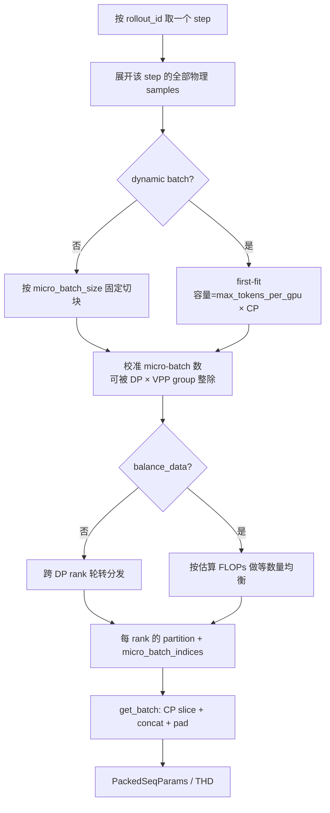

# 04. 数据管线：从一行数据到一次 Actor 更新

> **源码快照**：本文按 `main@aaf5c209` 撰写。slime 仍在快速演进；面试中若讨论其他版本，应先核对 `slime/utils/dp_schedule.py` 对 GBS 的定义。

## 先建立一张全景图

slime 的核心不是“读取一批 prompt，然后调用一次 loss”，而是把推理侧不规则的轨迹，转换成 Megatron 侧可并行、可打包且归一化口径明确的训练批次。


面试时可以先用一句话概括：**数据源按 prompt 建组，SGLang 把组内 `Sample` 补成轨迹，rollout manager 负责奖励、过滤、展平和调度，Megatron 再计算训练口径的 logprob、优势与损失。**

## 1. Dataset：磁盘行如何变成 Sample

### 1.1 JSONL、Parquet 与字段映射

`read_file` 实际支持 `.jsonl` 和 `.parquet`：JSONL 逐行 `json.loads`，坏行会打印错误后跳过；Parquet 依赖 `pyarrow`，按 record batch 转成 Python dict 流式迭代（[`slime/utils/data.py#L25`](https://github.com/THUDM/slime/blob/aaf5c2092b01219fa0d5c2d323741d409086ca32/slime/utils/data.py#L25)）。因此参数帮助中“目前只支持 JSONL”的说法已经落后于读取实现（[`slime/utils/arguments.py#L634`](https://github.com/THUDM/slime/blob/aaf5c2092b01219fa0d5c2d323741d409086ca32/slime/utils/arguments.py#L634)）。

| 参数 | 默认值 | 写入位置 | 含义 |
|---|---:|---|---|
| `--input-key` | `input` | `Sample.prompt` | 字符串或 OpenAI messages |
| `--label-key` | `None` | `Sample.label` | 规则奖励常用标准答案 |
| `--metadata-key` | `metadata` | `Sample.metadata` | 数据源、难度、额外监督等 |
| `--tool-key` | `tools` | `metadata["tools"]` | chat template 使用的工具 schema |
| `--multimodal-keys` | `None` | messages + `multimodal_inputs` | 媒体类型到数据列的映射 |

一个文本 JSONL 行可以是：

```json
{"prompt": [{"role": "user", "content": "计算 17×19"}], "answer": "323", "metadata": {"source": "math"}}
```

对应参数是 `--input-key prompt --label-key answer --apply-chat-template`。`Dataset` 逐行构造 prompt、解析 tools、可选应用 tokenizer chat template，最后只先填充 `prompt/label/metadata/multimodal_inputs` 等字段；响应、奖励和 logprob 尚为空（[`slime/utils/data.py#L202`](https://github.com/THUDM/slime/blob/aaf5c2092b01219fa0d5c2d323741d409086ca32/slime/utils/data.py#L202)）。

### 1.2 字符串 prompt 与 OpenAI messages

`_build_messages` 的行为取决于是否需要 conversation 形式（[`slime/utils/data.py#L130`](https://github.com/THUDM/slime/blob/aaf5c2092b01219fa0d5c2d323741d409086ca32/slime/utils/data.py#L130)）：

- 普通字符串且既不应用 chat template、也没有多模态字段：保持字符串。
- 字符串但需要 conversation：包装成 `[{'role': 'user', 'content': ...}]`。
- 输入已经是 OpenAI messages：保留 role/content 结构。
- `--apply-chat-template` 开启后，调用 tokenizer 的 `apply_chat_template(..., add_generation_prompt=True)`，最终 `Sample.prompt` 通常成为已渲染字符串。

这解释了常见报错：“自定义生成函数为什么收到字符串而不是 messages？”——因为 chat template 已在 Dataset 阶段把 messages 渲染了。若 agent 逻辑需要原始 messages，应检查自定义数据/rollout 路径，而不能假设 `Sample.prompt` 永远是 list。

### 1.3 多模态的两份表示

`--multimodal-keys '{"image":"images"}'` 会把消息里的 `<image>` 占位符按出现顺序替换为 OpenAI 风格的 content item，并严格检查占位符数和媒体数相等（[`slime/utils/data.py#L140`](https://github.com/THUDM/slime/blob/aaf5c2092b01219fa0d5c2d323741d409086ca32/slime/utils/data.py#L140)）。图片、视频、音频的占位符定义见 [`slime/utils/types.py#L462`](https://github.com/THUDM/slime/blob/aaf5c2092b01219fa0d5c2d323741d409086ca32/slime/utils/types.py#L462)。

多模态沿管线保留两种表示：

| 字段 | 内容 | 消费者 |
|---|---|---|
| `multimodal_inputs` | 原始图片/视频等，如 PIL、路径或 URL 解析结果 | SGLang 请求构造 |
| `multimodal_train_inputs` | processor 产生的 `pixel_values` 等张量 | Megatron actor forward |

Dataset 先用 processor 提取原始视觉输入（[`slime/utils/data.py#L247`](https://github.com/THUDM/slime/blob/aaf5c2092b01219fa0d5c2d323741d409086ca32/slime/utils/data.py#L247)）；生成时 `_prepare_prompt_ids` 必要时再次调用 processor，并缓存训练张量（[`slime/rollout/sglang_rollout.py#L43`](https://github.com/THUDM/slime/blob/aaf5c2092b01219fa0d5c2d323741d409086ca32/slime/rollout/sglang_rollout.py#L43)）。有图片时请求向 SGLang 发送 `text + image_data`，纯文本则发送 `input_ids`（[`slime/rollout/sglang_rollout.py#L174`](https://github.com/THUDM/slime/blob/aaf5c2092b01219fa0d5c2d323741d409086ca32/slime/rollout/sglang_rollout.py#L174)）。训练端把同一 micro-batch 的多模态张量按 key 拼接（[`slime/backends/megatron_utils/data.py#L150`](https://github.com/THUDM/slime/blob/aaf5c2092b01219fa0d5c2d323741d409086ca32/slime/backends/megatron_utils/data.py#L150)）。

## 2. RolloutDataSource：prompt group 与三个 ID

`RolloutDataSource` 持有 dataset offset、epoch、shuffle 状态和三个递增计数器；它还会保存/恢复这些状态，从而让断点续训继续消费同一数据位置（[`slime/rollout/data_source.py#L50`](https://github.com/THUDM/slime/blob/aaf5c2092b01219fa0d5c2d323741d409086ca32/slime/rollout/data_source.py#L50)）。

一次 `get_samples(P)` 取出 `P` 个 prompt。每个 prompt 深拷贝 `n_samples_per_prompt` 次，形成二维结构：

```text
list[prompt group]
  └─ list[Sample]  # 同一 prompt 的 n 个独立采样
```

源码在复制时设置 `group_index` 和 `index`（[`slime/rollout/data_source.py#L90`](https://github.com/THUDM/slime/blob/aaf5c2092b01219fa0d5c2d323741d409086ca32/slime/rollout/data_source.py#L90)）。三个 ID 的职责不能混用：

| 标识 | 默认由谁设置 | 同一 prompt 的 n 个响应 | fan-out 兄弟样本 | 用途 |
|---|---|---|---|---|
| `group_index` | DataSource | 相同 | 通常继承相同 | 奖励分组、zero-std 统计 |
| `index` | DataSource | 各不相同 | 深拷贝时可能相同 | 原始采样请求的全局身份、排序 |
| `Sample.rollout_id` | 默认空；fan-out 自定义生成器必须设置 | 默认路径后续各自唯一 | **必须相同** | 训练 step 切分、per-rollout loss 归一化、GBS 计数 |

还有一个容易混淆的同名量：外层训练循环的 `rollout_id` 参数表示第几轮“采样→训练”循环（例如 checkpoint/日志 step）；它不等于 `Sample.rollout_id`。后者是**一轮数据内部的逻辑训练单位 ID**。`Sample` 的字段和契约注释见 [`slime/utils/types.py#L93`](https://github.com/THUDM/slime/blob/aaf5c2092b01219fa0d5c2d323741d409086ca32/slime/utils/types.py#L93)。

## 3. Sample 如何被 SGLang 补成轨迹

### 3.1 请求与返回

`GenerateState` 保存 tokenizer/processor、采样参数和并发 semaphore；每个 prompt group 作为一个异步任务提交，组内采样并行执行（[`slime/rollout/sglang_rollout.py#L84`](https://github.com/THUDM/slime/blob/aaf5c2092b01219fa0d5c2d323741d409086ca32/slime/rollout/sglang_rollout.py#L84)）。默认 `generate`：

1. 准备 prompt token IDs；
2. 向 `/generate` 发送 sampling params，并强制 `return_logprob=True`；
3. 从 `output_token_logprobs` 拆出生成 token 和其 logprob；
4. 调用 `append_response_tokens(..., trainable=True)` 写回 `Sample`（[`slime/rollout/sglang_rollout.py#L153`](https://github.com/THUDM/slime/blob/aaf5c2092b01219fa0d5c2d323741d409086ca32/slime/rollout/sglang_rollout.py#L153)）。

`append_response_tokens` 同步维护 `tokens`、`response_length`、`rollout_log_probs` 和 `loss_mask`。模型生成 token 的 mask 为 1；工具/环境注入 token 应以 `trainable=False` 追加，mask 为 0、占位 logprob 为 0（[`slime/utils/types.py#L253`](https://github.com/THUDM/slime/blob/aaf5c2092b01219fa0d5c2d323741d409086ca32/slime/utils/types.py#L253)）。这使多轮 agent 轨迹能把“模型动作”和“环境观察”放在同一 token 序列中，但只对模型动作反向传播。

必须始终满足：

```text
len(loss_mask) == len(rollout_log_probs) == response_length
len(tokens) == prompt_length + response_length
```

### 3.2 四种 logprob 不要混为一谈

| 名称/字段 | 哪个模型、何时算 | 主要用途 |
|---|---|---|
| behavior logprob / `rollout_log_probs` | SGLang 真正采样 token 时的策略 | 推理-训练偏差监控、TIS，或 `--use-rollout-logprobs` 直接作为 old |
| old logprob / `log_probs` | optimizer 更新前，Megatron actor/old_actor forward | PPO/GRPO 类 ratio 的分母 |
| `ref_log_probs` | 冻结或周期更新的 reference model | KL reward shaping 或直接 KL loss |
| `teacher_log_probs` | OPD teacher（Megatron 或 rollout 侧） | on-policy distillation 的 teacher target |

“behavior”和“old”在理想 on-policy 情况下来自同一组权重，但数值仍可能因 SGLang 与 Megatron kernel、温度、top-p 截断、MoE 路由或权重陈旧而不同。Actor 训练流程会按配置切换 ref/teacher/old_actor 权重并计算相应 logprob（[`slime/backends/megatron_utils/actor.py#L414`](https://github.com/THUDM/slime/blob/aaf5c2092b01219fa0d5c2d323741d409086ca32/slime/backends/megatron_utils/actor.py#L414)）。若 `--use-rollout-logprobs`，优势和 policy ratio 选择 behavior logprob；否则默认使用训练引擎重算的 old logprob（[`slime/backends/megatron_utils/loss.py#L686`](https://github.com/THUDM/slime/blob/aaf5c2092b01219fa0d5c2d323741d409086ca32/slime/backends/megatron_utils/loss.py#L686)）。

## 4. Reward、过滤与补采样

默认路径先生成，再算奖励：普通 RM 对单个 sample 调用，`--group-rm` 则等组内所有结果返回后批量打分（[`slime/rollout/sglang_rollout.py#L223`](https://github.com/THUDM/slime/blob/aaf5c2092b01219fa0d5c2d323741d409086ca32/slime/rollout/sglang_rollout.py#L223)、[`slime/rollout/sglang_rollout.py#L294`](https://github.com/THUDM/slime/blob/aaf5c2092b01219fa0d5c2d323741d409086ca32/slime/rollout/sglang_rollout.py#L294)）。reward 可以是 float，也可以是 dict；`--reward-key` 决定从 dict 取哪个值（[`slime/utils/types.py#L246`](https://github.com/THUDM/slime/blob/aaf5c2092b01219fa0d5c2d323741d409086ca32/slime/utils/types.py#L246)）。

当前 `--group-rm` 预期组内元素直接是 `Sample`；若 custom generate 返回 `list[Sample]` 形成 fan-out，嵌套列表会进入 group RM，现有实现会按 `Sample` 访问字段并失败。这个组合当前不能直接使用：应改为单 sample RM、在 custom rollout 中自行展平/分组，或先为嵌套 contract 补实现和测试。

rollout loop 的目标是收满 `rollout_batch_size` 个**有效 prompt group**。它可以超采样，任一异步 group 完成后执行 dynamic filter；被丢弃的 group 不计入目标，继续从 DataSource 补请求（[`slime/rollout/sglang_rollout.py#L375`](https://github.com/THUDM/slime/blob/aaf5c2092b01219fa0d5c2d323741d409086ca32/slime/rollout/sglang_rollout.py#L375)）。收满后还可调用 `rollout_sample_filter` 做就地处理。

`Sample.Status.FAILED` 本身主要用于观测，**不会自动让样本退出训练**。基础设施失败还要通过重试/回填、filter、`remove_sample=True` 或全零 mask 明确处理，否则转换阶段可能补出全 1 mask，坏样本仍会产生梯度。

默认 reward post-process 在 flatten 后执行：GRPO/GSPO/CISPO/REINFORCE++ Baseline 可按 prompt 组减均值，前三者还可除以组内标准差（[`slime/ray/rollout.py#L682`](https://github.com/THUDM/slime/blob/aaf5c2092b01219fa0d5c2d323741d409086ca32/slime/ray/rollout.py#L682)）。这里有一个重要边界：默认实现靠固定 shape `reshape(-1, n_samples_per_prompt)` 推断分组；可变 fan-out 会退化为把整个 batch 当成一组。

自定义 reward post-process 还必须先定义**逻辑 rollout 的 reward 语义**。如果希望同一 prompt 下的逻辑 rollouts 等权，应先按 `group_index` 分 prompt，再按 `rollout_id` 聚合 siblings 的 reward，基于逻辑 rollout 做均值/std，最后广播回 siblings。直接对全部物理 siblings 求均值会让 fan-out 更多的 rollout 权重更大。仓库的 fan-out test helper 展示了 hook 接线和按 `group_index` 分组，但仍对物理 siblings 求均值，不是所有 reward 语义下的通用正确答案（[`slime/rollout/_fanout_test_helpers.py#L76`](https://github.com/THUDM/slime/blob/aaf5c2092b01219fa0d5c2d323741d409086ca32/slime/rollout/_fanout_test_helpers.py#L76)）。

## 5. Fan-out contract：一次生成变成多条训练 Sample

自定义生成函数可以让一个输入 `Sample` 返回 `list[Sample]`，例如把一条多轮轨迹拆成多条 prefix-chained 训练样本。于是形状从默认的：

```text
prompt × response = list[list[Sample]]
```

变成：

```text
prompt × response × siblings = list[list[list[Sample]]]
```

框架最终会递归 flatten，但 flatten 前会验证深度至少为 3 的 sibling list：每个 sibling 的 `Sample.rollout_id` 都非空且完全相同（[`slime/ray/rollout.py#L631`](https://github.com/THUDM/slime/blob/aaf5c2092b01219fa0d5c2d323741d409086ca32/slime/ray/rollout.py#L631)、[`slime/ray/rollout.py#L898`](https://github.com/THUDM/slime/blob/aaf5c2092b01219fa0d5c2d323741d409086ca32/slime/ray/rollout.py#L898)）。

这个 contract 同时保证三件事：

1. siblings 被安排在同一个 optimizer step；
2. GBS 只把这次逻辑 rollout 计一次；
3. loss 先在该 rollout 的所有有效 token 上汇总，再作为一个 rollout 参与 batch 平均。

反例是给每个 sibling 不同 `rollout_id`：训练不会理解它们来自同一执行，长 fan-out 会获得更大权重。全部留空也不行：默认转换会为每条物理 sample 合成唯一 ID，同样发生过计数。

## 6. 从 Sample 列表到 RolloutBatch

`RolloutManager.generate` 完成生成和日志后，依次调用 `_convert_samples_to_train_data` 与 `_split_train_data_by_dp`（[`slime/ray/rollout.py#L552`](https://github.com/THUDM/slime/blob/aaf5c2092b01219fa0d5c2d323741d409086ca32/slime/ray/rollout.py#L552)）。`RolloutBatch` 本质是 dict 类型别名，不是一个带行为的 class（[`slime/utils/types.py#L456`](https://github.com/THUDM/slime/blob/aaf5c2092b01219fa0d5c2d323741d409086ca32/slime/utils/types.py#L456)）。

核心字段如下：

| 字段 | 粒度 | 来源/作用 |
|---|---|---|
| `tokens` | sample | prompt + response |
| `response_lengths` | sample | 定位 response logits |
| `rewards/raw_reward` | sample | 训练值 / 原始观测值 |
| `loss_masks` | response token | 排除环境 token、被删除 sample |
| `sample_indices` | sample | DataSource `index` |
| `rollout_ids` | sample | step 和归一化的逻辑 key |
| `rollout_mask_sums` | sample | 同一 rollout 所有 siblings 的有效 token 总数 |
| `rollout_log_probs` | response token | 可选 behavior logprob |
| `multimodal_train_inputs` | sample | 训练 processor 张量 |
| `teacher_log_probs` | response token | 可选 OPD teacher |

转换逻辑会为未设置的 `Sample.rollout_id` 合成互不冲突的唯一整数，并补默认全 1 mask；`remove_sample=True` 则把整条 response mask 清零（[`slime/ray/rollout.py#L709`](https://github.com/THUDM/slime/blob/aaf5c2092b01219fa0d5c2d323741d409086ca32/slime/ray/rollout.py#L709)）。随后按 `rollout_id` 预计算 `rollout_mask_sums`，即使 siblings 被 first-fit 拆到不同 micro-batch，分母仍是整个逻辑 rollout 的有效 token 总数。

默认 loss reducer 可写成：

$$
L_{\text{step}}=\frac{1}{|\mathcal R|}\sum_{r\in\mathcal R}
\frac{\sum_{i:\rho_i=r}\sum_t m_{i,t}\,\ell_{i,t}}
{\max(1,\sum_{i:\rho_i=r}\sum_t m_{i,t})},
$$

其中 $\rho_i$ 是 sample 的 `rollout_id`，$m_{i,t}$ 是 `loss_mask`。实现中的 micro-batch closure 先产生各 rollout 的部分和，最后用 step GBS（逻辑 rollout 数）归一化；对应 reducer 见 [`slime/backends/megatron_utils/cp_utils.py#L47`](https://github.com/THUDM/slime/blob/aaf5c2092b01219fa0d5c2d323741d409086ca32/slime/backends/megatron_utils/cp_utils.py#L47)。开启 `--calculate-per-token-loss` 后则改为全 step 有效 token 加权，而不是每 rollout 等权。

## 7. GBS 的真实口径：唯一 rollout ID 与术语漂移

这是该快照最值得追问的实现细节。关键不是“参数公式已经失效”，而是注释里的 `sample` 究竟指物理训练片段还是一次逻辑生成。

`build_dp_schedule` 先按 `rollout_indices` 去重分组，再用：

$$
N_{\text{step}}=\left\lfloor\frac{|\operatorname{unique}(\texttt{rollout\_ids})|}{\texttt{global\_batch\_size}}\right\rfloor
$$

切 step；每个 step 恰含 `global_batch_size` 个**逻辑 rollout**，同一 ID 的所有物理 samples 保持在同一 step，尾部不足一个完整 step 的 rollout 被丢弃（[`slime/utils/dp_schedule.py#L82`](https://github.com/THUDM/slime/blob/aaf5c2092b01219fa0d5c2d323741d409086ca32/slime/utils/dp_schedule.py#L82)）。

参数后处理用下面的公式自动推导：

$$
\texttt{global\_batch\_size}
=\frac{\texttt{rollout\_batch\_size}\times\texttt{n\_samples\_per\_prompt}}
{\texttt{num\_steps\_per\_rollout}},
$$

见 [`slime/utils/arguments.py#L1916`](https://github.com/THUDM/slime/blob/aaf5c2092b01219fa0d5c2d323741d409086ca32/slime/utils/arguments.py#L1916)；quick-start 把这里笼统描述为 sample 数（[`docs/zh/get_started/quick_start.md#L151`](https://github.com/THUDM/slime/blob/aaf5c2092b01219fa0d5c2d323741d409086ca32/docs/zh/get_started/quick_start.md#L151)），容易把物理片段与逻辑 rollout 混在一起。

在仓库标准 contract 下，公式与 scheduler 是一致的：

- **默认路径**：每个 prompt 的每次生成最终得到一个唯一 `rollout_id`，所以 distinct ID 数就是 `rollout_batch_size × n_samples_per_prompt`。
- **custom fan-out**：一次原始生成拆出的 siblings 共享该生成的 ID；物理 Sample 数增加，但唯一 ID 数仍是 `rollout_batch_size × n_samples_per_prompt`，因此同一公式仍成立。

例：16 个 prompt、每 prompt 2 次采样，共 32 次逻辑 rollout；若每次各 fan-out 为 3 条，会得到 96 条物理 Sample，但仍只有 32 个唯一 ID。想训练 2 step，GBS 是 `32 / 2 = 16`；参数自动公式也会得到 16，而不是 48。

真正需要手工复核的情况是：完整自定义 rollout 改变了每轮逻辑生成数、丢弃/合并了 rollout ID，或返回值不再遵守默认 `P × n` contract。此时参数层无法从 fan-out 后结果自动感知真实唯一 ID 数，应显式设置 GBS并用 dump/调度测试验证。

## 8. Step 内如何打包到 DP / CP

调度顺序是 **先 pack，后 distribute**（[`slime/utils/dp_schedule.py#L1`](https://github.com/THUDM/slime/blob/aaf5c2092b01219fa0d5c2d323741d409086ca32/slime/utils/dp_schedule.py#L1)）：



### static 与 dynamic

| 模式 | micro-batch 怎么形成 | 关键约束/风险 |
|---|---|---|
| static | 每 `micro_batch_size` 条 sample 固定切块 | micro-batch 总数必须对齐 DP/VPP；否则直接断言 |
| dynamic | first-fit 按 token 容量装箱 | 容量为 `max_tokens_per_gpu × cp_size`；单条超长样本允许独占并超限 |
| dynamic + `balance_by_flops` | 根据估算 FLOPs 分区 | 不保证 token cap，可能 OOM |

所有 DP rank 在每个 step 必须运行相同 micro-batch 数，否则 pipeline 同步会失配。动态模式可继续拆最大多样本 bin 来满足 DP/VPP 对齐；静态模式不能随意拆，否则破坏固定 MBS 语义（[`slime/utils/dp_schedule.py#L117`](https://github.com/THUDM/slime/blob/aaf5c2092b01219fa0d5c2d323741d409086ca32/slime/utils/dp_schedule.py#L117)）。

训练端 `get_batch` 保存未拼接序列，按 CP rank 切 token，再把变长序列拼成一个一维 token stream，padding 后构造 `PackedSeqParams(qkv_format="thd")`；loss mask 用同样布局切分和拼接（[`slime/backends/megatron_utils/data.py#L28`](https://github.com/THUDM/slime/blob/aaf5c2092b01219fa0d5c2d323741d409086ca32/slime/backends/megatron_utils/data.py#L28)）。因此“packed sequence”是计算布局，不代表样本边界消失：`cu_seqlens`、`total_lengths`、`response_lengths` 与 mask 仍保留边界。

## 9. Actor train 的最后一公里

每个 DP worker 收到只属于自己的 `RolloutBatch` 分片，先把 token/mask/logprob 等搬到 GPU。Actor 的顺序是（[`slime/backends/megatron_utils/actor.py#L346`](https://github.com/THUDM/slime/blob/aaf5c2092b01219fa0d5c2d323741d409086ca32/slime/backends/megatron_utils/actor.py#L346)）：

1. 必要时切到 ref，得到 `ref_log_probs`；
2. 必要时切到 teacher，得到 `teacher_log_probs`；
3. 选择 old_actor/actor，必要时得到更新前 `log_probs`；
4. 切回 actor，统一计算 advantages/returns；
5. 按 `num_microbatches[step]` 运行 forward/backward；
6. 每个 step 执行 optimizer 和 scheduler 更新。

若 estimator 是 PPO，外层训练先启动 critic；critic 计算 values、训练 value head，并把旧 values 传给 actor，再由 actor 计算 GAE（[`train_async.py#L31`](https://github.com/THUDM/slime/blob/aaf5c2092b01219fa0d5c2d323741d409086ca32/train_async.py#L31)、[`slime/backends/megatron_utils/actor.py#L386`](https://github.com/THUDM/slime/blob/aaf5c2092b01219fa0d5c2d323741d409086ca32/slime/backends/megatron_utils/actor.py#L386)）。其他 estimator 不会仅因名字自动创建 critic，详见下一章。

## 10. 面试排障清单

| 现象 | 优先检查 | 原因 |
|---|---|---|
| GRPO advantage 几乎全 0 | 同 `group_index` 的 raw reward、`zero_std/*` | 组内奖励无差异，减均值后没有信号 |
| 训练 step 数与公式不符 | `unique(rollout_ids)`、尾部是否不足 GBS | 调度器不按物理 sample 数切 step |
| fan-out 后 loss 被放大 | siblings 是否共享非空 `rollout_id` | 否则每条 sibling 被当成独立 rollout |
| fan-out 后 reward 中心化异常 | 是否仍用固定 reshape | 先按 `group_index` 分 prompt，再按 `rollout_id` 聚合逻辑 rollout，归一化后广播 |
| `train_rollout_logprob_abs_diff` 大 | 先确认配置下比较的是 current/old 还是 current/behavior，再查权重同步、温度/top-p、MoE routing、mask | 比较对象随 `use_rollout_logprobs` 改变，不能一律诊断为 serving mismatch |
| dynamic batch OOM | 单样本长度、`balance_by_flops`、CP 容量 | FLOPs 均衡不承诺 token cap |
| loss mask 长度断言 | 工具 token 是否用 `append_response_tokens` 追加 | token/logprob/mask 必须同步增长 |
| 多模态 forward 缺张量 | `multimodal_train_inputs` 是否生成和传输 | 推理原始媒体与训练 tensor 是两份数据 |

最后记住四个边界：**`group_index` 管 prompt 组，`rollout_id` 管训练计数，mask 管有效 token，GBS 按 distinct rollout ID 计；全零 mask 的 ID 仍占一个 slot，默认与标准 fan-out 下 ID 数仍由 prompt 数乘每 prompt 生成数决定。**
