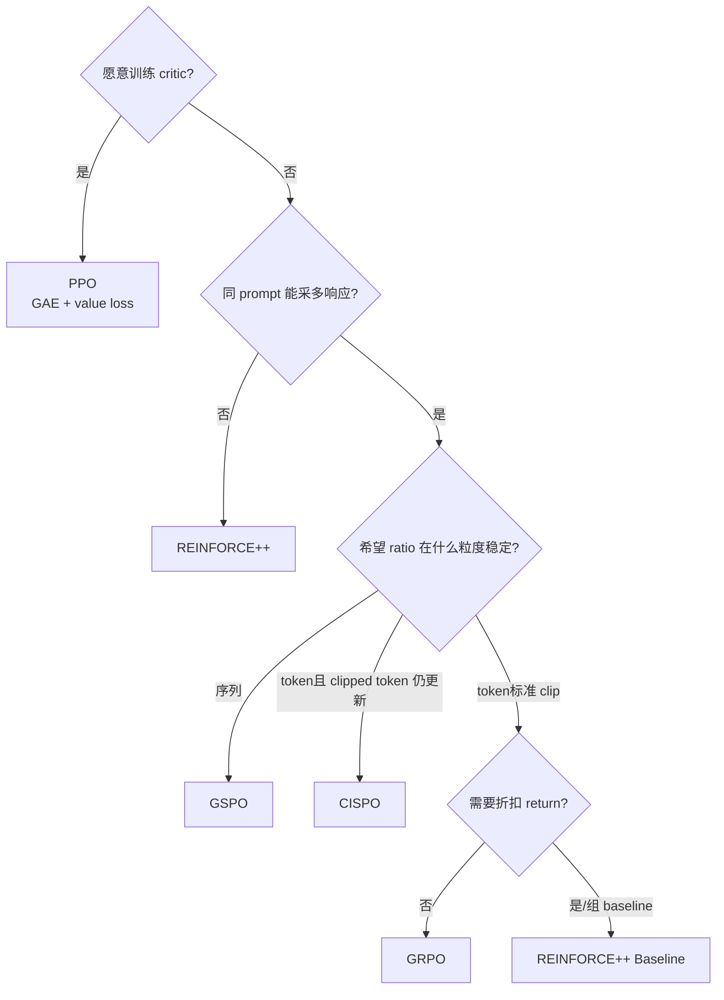

# 05. 算法与损失：从 RL 术语到 slime 的真实实现

> **源码快照**：本文按 `main@3778dbf6`（v0.3.2，扫描日期 2026-08-29）撰写。算法名容易让人直接套论文公式；本文以 slime 的实际分支为准。

## 先说最重要的结论

`--advantage-estimator` **只是一枚实现分流开关，不等于完整 recipe**。它至少影响两处：优势/回报怎么构造，以及 policy loss 使用 token-level ratio、sequence-level ratio 还是 CISPO 形式；但 KL、entropy、old policy 来源、loss reducer、off-policy correction、采样组大小等都由其他参数独立决定。

在该快照中，只有：

```text
--advantage-estimator ppo
```

会自动令 `args.use_critic=True`（[`slime/utils/arguments.py#L1913`](https://github.com/THUDM/slime/blob/3778dbf6d1a533ab478ecf5ddaa11449a47752b2/slime/utils/arguments.py#L1913)），继而创建 critic（[`slime/ray/placement_group.py#L186`](https://github.com/THUDM/slime/blob/3778dbf6d1a533ab478ecf5ddaa11449a47752b2/slime/ray/placement_group.py#L186)）。选择 GRPO、GSPO、CISPO 或两种 REINFORCE++ 都不会自动启 critic；自定义 advantage 函数也不会仅因“可能需要 value”而自动获得 critic。

## 1. 把 RL 基础术语映射到 slime

语言模型 RL 可以把一条 response 看成轨迹 $\tau=(x,y_1,\ldots,y_T)$：prompt $x$ 是上下文，模型每次选择 token $y_t$ 是 action，历史 $(x,y_{<t})$ 是 state。

| RL 术语 | 数学记号 | slime 中的具体对象 |
|---|---|---|
| policy / actor | $\pi_\theta$ | 正在训练的 Megatron 模型 |
| behavior policy | $\mu$ | SGLang 真正执行采样的模型快照 |
| old policy | $\pi_{\text{old}}$ | 当前 rollout 内、更新前由 Megatron 重算的 actor，或显式选用 behavior logprob |
| reference policy | $\pi_{\text{ref}}$ | KL 约束所用冻结/周期更新模型 |
| teacher policy | $\pi_T$ | OPD 蒸馏教师，不是 PPO old/ref 的同义词 |
| trajectory / rollout | $\tau$ | 一次逻辑生成执行；可 fan-out 成多个同 `rollout_id` 的 `Sample` |
| reward | $R(\tau)$ | RM 或规则函数写入 `Sample.reward` 的序列级标量 |
| return | $G_t$ | 从 token $t$ 起累计的折扣奖励 |
| value / critic | $V_\phi(s_t)$ | PPO value head 对未来回报的估计 |
| advantage | $A_t$ | action 相对 baseline 的好坏，policy gradient 的权重 |
| loss mask | $m_t\in\{0,1\}$ | 只让模型生成 token 参与训练 |

四种 logprob 的区别在面试中经常被追问：

$$
\ell_t^\theta=\log\pi_\theta(y_t\mid x,y_{<t}),\quad
\ell_t^{old}=\log\pi_{old}(y_t\mid x,y_{<t}),
$$

$$
\ell_t^{beh}=\log\mu(y_t\mid x,y_{<t}),\quad
\ell_t^{ref}=\log\pi_{ref}(y_t\mid x,y_{<t}).
$$

SGLang 返回的是 `rollout_log_probs`，即 $\ell^{beh}$；Actor 在训练前 forward 得到 `log_probs`，通常承担 $\ell^{old}$；ref forward 得到 `ref_log_probs`；teacher 则是 `teacher_log_probs`。选择逻辑见 [`slime/backends/megatron_utils/actor.py#L391`](https://github.com/THUDM/slime/blob/3778dbf6d1a533ab478ecf5ddaa11449a47752b2/slime/backends/megatron_utils/actor.py#L391) 和 [`slime/backends/megatron_utils/loss.py#L731`](https://github.com/THUDM/slime/blob/3778dbf6d1a533ab478ecf5ddaa11449a47752b2/slime/backends/megatron_utils/loss.py#L731)。

## 2. 公共骨架：ratio、clipping 与 reducer

### 2.1 token-level clipped surrogate

除 GSPO 和 CISPO 的特殊分支外，slime 的 policy loss 使用 PPO 风格 surrogate。定义：

$$
r_t(\theta)=\exp(\ell_t^\theta-\ell_t^{old}),
$$

$$
L_t^{clip}(\theta)=-\min\left(
r_t A_t,
\operatorname{clip}(r_t,1-\epsilon_l,1+\epsilon_h)A_t
\right).
$$

源码把 `ppo_kl = old_log_probs - log_probs`，再计算 `ratio = exp(-ppo_kl)`，与上式完全一致（[`slime/backends/megatron_utils/loss.py#L1032`](https://github.com/THUDM/slime/blob/3778dbf6d1a533ab478ecf5ddaa11449a47752b2/slime/backends/megatron_utils/loss.py#L1032)、[`slime/utils/ppo_utils.py#L125`](https://github.com/THUDM/slime/blob/3778dbf6d1a533ab478ecf5ddaa11449a47752b2/slime/utils/ppo_utils.py#L125)）。`eps_clip` 和 `eps_clip_high` 分别控制下界与上界。`compute_policy_loss` 还支持 [Dual-Clip PPO](https://arxiv.org/pdf/1912.09729) 的第三重下界 `--eps-clip-c`（对 $A<0$ 且 ratio 极大的 token 再套一层 `c·A` 下限，抑制“负优势 × 巨大 ratio”的梯度爆炸）；该形参曾长期未接通 CLI 值，自 [PR #2247](https://github.com/THUDM/slime/pull/2247) 起调用点已真正传入（[`loss.py#L1042`](https://github.com/THUDM/slime/blob/3778dbf6d1a533ab478ecf5ddaa11449a47752b2/slime/backends/megatron_utils/loss.py#L1042)），并配套了 `tests/test_policy_loss.py` 回归——这是“读实现而不是读参数表”的典型案例。

这里的 `ppo_kl` 是 $\ell^{old}-\ell^\theta$ 的有符号 log-ratio 统计，**不是 actor 对 reference 的 KL**。首次更新时 old 与 current 很接近，ratio 约为 1；同一 rollout 做多次 optimizer step 后，current 改变，clipping 才更频繁介入。

### 2.2 mask 与“每 rollout 等权”

所有逐 token loss 都先乘 $m_{i,t}$。默认 reducer 不是简单对展平 token 求平均，而是先在同一 `rollout_id` 的全部 siblings 内按有效 token 平均，再对 step 内逻辑 rollouts 平均：

$$
L=\frac{1}{|\mathcal R|}\sum_{r\in\mathcal R}
\frac{\sum_{i:\rho_i=r}\sum_t m_{i,t}L_{i,t}}
{\max(1,\sum_{i:\rho_i=r}\sum_t m_{i,t})}.
$$

因此长 response 不会仅因 token 多而自动获得更大 trajectory 权重，fan-out 也不会仅因 siblings 多而放大。`--calculate-per-token-loss` 才会切换为全局有效 token 加权。分母在 rollout 侧预计算为 `rollout_mask_sums`，训练 reducer 见 [`slime/backends/megatron_utils/cp_utils.py#L47`](https://github.com/THUDM/slime/blob/3778dbf6d1a533ab478ecf5ddaa11449a47752b2/slime/backends/megatron_utils/cp_utils.py#L47)。

### 2.3 entropy

policy 总损失先写成：

$$
L_{actor}=L_{pg}-c_H\,\mathbb E[H(\pi_\theta)],
$$

其中 $c_H$ 是 `entropy_coef`。源码中的 `entropy_loss` 指记录/相减的平均 entropy，本身不是带负号的交叉熵（[`slime/backends/megatron_utils/loss.py#L1111`](https://github.com/THUDM/slime/blob/3778dbf6d1a533ab478ecf5ddaa11449a47752b2/slime/backends/megatron_utils/loss.py#L1111)）。

## 3. KL 有三条不同路径

不要只说“开 KL”；要说清它进入哪里、比较谁与谁。

### 3.1 reward shaping：`kl_coef`

逐 token 近似 KL 由 current/old 选定的 logprob 与 `ref_log_probs` 计算。以 `k1` 为例是 $\ell-\ell^{ref}$；`k2` 为平方近似；`k3/low_var_kl` 使用非负低方差形式（[`slime/utils/ppo_utils.py#L12`](https://github.com/THUDM/slime/blob/3778dbf6d1a533ab478ecf5ddaa11449a47752b2/slime/utils/ppo_utils.py#L12)）。

- PPO：构造新的 `token_level_rewards = -\beta KL_t`，并在最后一个 response token 加序列 reward，再做 GAE。v0.3.2 不再原地缩放 `rollout_data["kl"]`：reward shaping 使用新张量，供观测的 raw current/reference `rollout/kl` 保持未乘系数、未叠加序列 reward 的值（[`slime/backends/megatron_utils/loss.py#L769`](https://github.com/THUDM/slime/blob/3778dbf6d1a533ab478ecf5ddaa11449a47752b2/slime/backends/megatron_utils/loss.py#L769)）。
- REINFORCE++：把 $-\beta KL_t$ 作为稠密 token reward，最后有效 token 加序列 reward，再反向折扣累计。
- REINFORCE++ Baseline：优势是组基线后的 reward 广播，再减 $\beta KL_t$。
- **GRPO/GSPO/CISPO 在该快照的 built-in branch 中，`get_grpo_returns` 只广播 rewards，传入的 `kl` 没有参与 returns**（[`slime/utils/ppo_utils.py#L361`](https://github.com/THUDM/slime/blob/3778dbf6d1a533ab478ecf5ddaa11449a47752b2/slime/utils/ppo_utils.py#L361)）。因此不要仅凭 `kl_coef` 的通用 help 文案就断言它一定对这三者完成 reward shaping。

### 3.2 直接 KL loss：`use_kl_loss + kl_loss_coef`

这是独立加到 actor loss 的项：

$$
L=L_{actor}+c_{KL}\,\widehat{KL}(\pi_\theta,\pi_{ref}).
$$

实现见 [`slime/backends/megatron_utils/loss.py#L1115`](https://github.com/THUDM/slime/blob/3778dbf6d1a533ab478ecf5ddaa11449a47752b2/slime/backends/megatron_utils/loss.py#L1115)。参数校验禁止 `kl_coef` 与 `kl_loss_coef` 同时非零（[`slime/utils/arguments.py#L1850`](https://github.com/THUDM/slime/blob/3778dbf6d1a533ab478ecf5ddaa11449a47752b2/slime/utils/arguments.py#L1850)），避免两套 reference 约束叠加后难以解释。

### 3.3 OPD teacher penalty

OPD 是另一条正交路径：计算 student 与 teacher 的 reverse log-ratio，并从 advantages 中减去 `opd_kl_coef × reverse_kl`。它可叠加在任一 estimator 上，不应把 `teacher_log_probs` 当作 `ref_log_probs`（[`slime/backends/megatron_utils/loss.py#L663`](https://github.com/THUDM/slime/blob/3778dbf6d1a533ab478ecf5ddaa11449a47752b2/slime/backends/megatron_utils/loss.py#L663)）。`rollout_temperature` 必须严格为正；Megatron 的 student/teacher logprob forward 都由同一 `compute_log_prob` 路径按这个温度缩放 logits，SGLang teacher 请求也显式传入同一个温度，因此比较的是同温度分布，而不是 teacher 使用独立温度（[`slime/utils/arguments.py#L1774`](https://github.com/THUDM/slime/blob/3778dbf6d1a533ab478ecf5ddaa11449a47752b2/slime/utils/arguments.py#L1774)、[`slime/backends/megatron_utils/loss.py#L133`](https://github.com/THUDM/slime/blob/3778dbf6d1a533ab478ecf5ddaa11449a47752b2/slime/backends/megatron_utils/loss.py#L133)、[`slime/rollout/on_policy_distillation.py#L8`](https://github.com/THUDM/slime/blob/3778dbf6d1a533ab478ecf5ddaa11449a47752b2/slime/rollout/on_policy_distillation.py#L8)）。

## 4. 六种 estimator 在 slime 里到底做什么

总入口是 `compute_advantages_and_returns`（[`slime/backends/megatron_utils/loss.py#L704`](https://github.com/THUDM/slime/blob/3778dbf6d1a533ab478ecf5ddaa11449a47752b2/slime/backends/megatron_utils/loss.py#L704)），policy loss 的二次分流在 [`slime/backends/megatron_utils/loss.py#L933`](https://github.com/THUDM/slime/blob/3778dbf6d1a533ab478ecf5ddaa11449a47752b2/slime/backends/megatron_utils/loss.py#L933)。

### 4.1 GRPO

对 prompt $g$ 的第 $i$ 个响应，常见组优势是：

$$
\widetilde R_{g,i}=R_{g,i}-\bar R_g,
\qquad
A_{g,i}=\frac{\widetilde R_{g,i}}{s_g+10^{-6}},
$$

其中 $\bar R_g$、$s_g$ 是组内均值和标准差。关闭 `grpo_std_normalization` 时只减均值，即 Dr.GRPO 风格。slime 在 rollout post-process 阶段先完成这个归一化，再把序列标量广播给每个 response token（[`slime/ray/rollout.py#L279`](https://github.com/THUDM/slime/blob/3778dbf6d1a533ab478ecf5ddaa11449a47752b2/slime/ray/rollout.py#L279)、[`slime/utils/ppo_utils.py#L361`](https://github.com/THUDM/slime/blob/3778dbf6d1a533ab478ecf5ddaa11449a47752b2/slime/utils/ppo_utils.py#L361)）。

随后仍使用 token-level PPO clipped surrogate。因此 slime 的 `grpo` 是“组相对 advantage + 通用 token clipped policy loss + 其他独立开关”的组合，不是一份自动补齐所有论文超参的 recipe。

适合：一个 prompt 可采多个响应、reward 可排序、不想维护 critic。主要风险：组内奖励全相同则减均值后信号为 0；组太小导致方差大；不等长 fan-out 若仍靠固定 reshape 分组会中心化错误。

### 4.2 GSPO

GSPO 与 GRPO 共用同一组 reward advantage；区别在 ratio。对一条 response 的有效 token 集 $M$：

$$
r_{seq}(\theta)=\exp\left(
\frac{1}{|M|}\sum_{t\in M}(\ell_t^\theta-\ell_t^{old})
\right).
$$

slime 先在完整序列上求平均 log-ratio，再把同一个值扩展到该序列各 token，进入相同 clipped surrogate（[`slime/utils/ppo_utils.py#L95`](https://github.com/THUDM/slime/blob/3778dbf6d1a533ab478ecf5ddaa11449a47752b2/slime/utils/ppo_utils.py#L95)）。CP 场景会先 all-gather 完整 response，避免各 rank 用局部片段算出不同 sequence ratio。

适合：长链推理、希望以序列为更新单位、降低单 token 极端 ratio 对 clipping 的支配。代价是需要完整序列聚合；sequence ratio 也可能掩盖少数 token 的严重偏移，所以仍需观察 behavior/train mismatch 和 entropy。

### 4.3 CISPO

CISPO 仍使用组 reward advantage，但 policy loss 改成：

$$
L_t^{CISPO}=-\operatorname{sg}\!\left[
\operatorname{clip}(r_t,1-\epsilon_l,1+\epsilon_h)
\right]A_t\ell_t^\theta,
$$

其中 $\operatorname{sg}$ 表示 stop-gradient（[`slime/utils/ppo_utils.py#L152`](https://github.com/THUDM/slime/blob/3778dbf6d1a533ab478ecf5ddaa11449a47752b2/slime/utils/ppo_utils.py#L152)）。与 PPO 的 `min` surrogate 不同，ratio 被截断但 clipped token 仍通过 $\ell_t^\theta$ 贡献梯度。

规范 CISPO 通常是单边/宽下界。slime 复用 delta-from-1 参数；若沿用默认 `eps_clip=0.2`，下界仍是 0.8。参数校验会告警，并建议将 `eps_clip=1.0` 关闭有效下界，再单独调 `eps_clip_high`（[`slime/utils/arguments.py#L1883`](https://github.com/THUDM/slime/blob/3778dbf6d1a533ab478ecf5ddaa11449a47752b2/slime/utils/arguments.py#L1883)）。

适合：希望极端 ratio 被截断、但不希望 PPO clipping 让相应 token 完全失去梯度。风险是 clip 边界语义配错，以及大 advantage/高学习率下仍可能不稳定。

### 4.4 REINFORCE++

它不使用 critic。先把 reference KL 当稠密负奖励，并在最后一个有效 token 加序列 reward：

$$
r_t=-\beta KL_t+\mathbf 1[t=t_{last}]R,
\qquad
G_t=r_t+\gamma G_{t+1}.
$$

然后令 $A_t=G_t$，再做跨数据并行、按 mask 的 advantage whitening（实现要求显式 `--normalize-advantages`，否则参数校验失败）。两处实现细节在近期更新过：折扣 return 已从逐 token Python 循环改为 pad + `chunked_discounted_returns` 的向量化实现（[PR #2205](https://github.com/THUDM/slime/pull/2205)，见 [`slime/utils/ppo_utils.py#L371`](https://github.com/THUDM/slime/blob/3778dbf6d1a533ab478ecf5ddaa11449a47752b2/slime/utils/ppo_utils.py#L371) 与 [`#L608`](https://github.com/THUDM/slime/blob/3778dbf6d1a533ab478ecf5ddaa11449a47752b2/slime/utils/ppo_utils.py#L608)）；whitening 的归约组自 [PR #2235](https://github.com/THUDM/slime/pull/2235) 起使用**包含 context parallel 的 DP 组**（[`loss.py#L868`](https://github.com/THUDM/slime/blob/3778dbf6d1a533ab478ecf5ddaa11449a47752b2/slime/backends/megatron_utils/loss.py#L868)），修复了此前每个 CP rank 只用本地片段统计量做白化的偏差。强制归一化校验见 [`slime/utils/arguments.py#L1852`](https://github.com/THUDM/slime/blob/3778dbf6d1a533ab478ecf5ddaa11449a47752b2/slime/utils/arguments.py#L1852)。

注意：在 slime 中它后续仍走通用 token-level clipped surrogate，并非朴素的 $-A_t\log\pi_\theta$ 单项实现。这正是“estimator 名称不等于完整 recipe”的典型例子。

适合：没有可靠 critic、希望 token 位置通过折扣 return 获得不同权重。风险是 Monte Carlo 方差高、terminal reward 稀疏、$\gamma$ 与 response 长度强耦合。

### 4.5 REINFORCE++ Baseline

先按 prompt 组减 reward 均值得到 $R_i-\bar R_g$，但默认不做 GRPO 的组内 std 除法；随后：

$$
A_{i,t}=(R_i-\bar R_g)-\beta KL_{i,t},
$$

再执行全局 masked advantage whitening。源码见 [`slime/utils/ppo_utils.py#L448`](https://github.com/THUDM/slime/blob/3778dbf6d1a533ab478ecf5ddaa11449a47752b2/slime/utils/ppo_utils.py#L448)。它同样不启 critic，policy loss 同样是通用 token-level clipped surrogate。

适合：想用组 baseline 降低 REINFORCE 方差，又不想训练 critic。风险与 GRPO 相似：组内 reward 无差异时主要只剩 KL 信号；固定 shape reward 分组不适合不等长 fan-out。

### 4.6 PPO

PPO 是唯一自动启 critic 的 estimator。slime 先由 critic 对每个 response token 预测旧 value $V_t$；reference KL 作为稠密 reward，terminal token 再加序列 reward。GAE 定义为：

$$
\delta_t=r_t+\gamma V_{t+1}-V_t,
$$

$$
A_t=\delta_t+\gamma\lambda A_{t+1},
\qquad
G_t=A_t+V_t.
$$

实现会在 CP 间恢复完整 response、padding 成 batch 后做 chunked GAE（[`slime/utils/ppo_utils.py#L476`](https://github.com/THUDM/slime/blob/3778dbf6d1a533ab478ecf5ddaa11449a47752b2/slime/utils/ppo_utils.py#L476)）。Actor 用 $A_t$ 进入 clipped surrogate；critic 则用 clipped value loss：

$$
V_t^{clip}=V_t^{old}+\operatorname{clip}(V_t-V_t^{old},-\epsilon_v,\epsilon_v),
$$

$$
L_V=\max\left[(V_t-G_t)^2,(V_t^{clip}-G_t)^2\right].
$$

对应源码在 [`slime/backends/megatron_utils/loss.py#L1175`](https://github.com/THUDM/slime/blob/3778dbf6d1a533ab478ecf5ddaa11449a47752b2/slime/backends/megatron_utils/loss.py#L1175)。训练循环先训练 critic并返回 values，再训练 actor（[`train_async.py#L49`](https://github.com/THUDM/slime/blob/3778dbf6d1a533ab478ecf5ddaa11449a47752b2/train_async.py#L49)）。

适合：需要 token-level credit assignment、轨迹较长且愿意用 critic 降方差。成本是额外模型/显存/通信和 value 拟合不稳定；critic 偏差会直接污染 advantage。

## 5. 横向选型矩阵

| 选择 | 需要同 prompt 多响应 | 自动 critic | advantage/return | ratio / policy loss | 更适合 | 主要代价 |
|---|---:|---:|---|---|---|---|
| GRPO | 是 | 否 | 组 reward 标准化后广播 | token ratio + PPO clip | 数学/代码等可验证任务 | zero-std、组采样成本 |
| GSPO | 是 | 否 | 同 GRPO | 几何平均 sequence ratio + PPO clip | 长推理链、序列级稳定性 | 全序列聚合、局部偏移被平均 |
| CISPO | 是 | 否 | 同 GRPO | stop-grad clipped token ratio × logprob | 希望 clipped token 仍有梯度 | 边界敏感、recipe 较新 |
| REINFORCE++ | 否 | 否 | KL-shaped 折扣 MC return | token ratio + PPO clip | 无 critic、需要位置差异 | 高方差，必须 advantage whitening |
| REINFORCE++ Baseline | 是 | 否 | 组 baseline − token KL | token ratio + PPO clip | 无 critic但需组 baseline | zero-std、必须 whitening |
| PPO | 否 | **是** | critic + GAE | token ratio + PPO clip；另训 value loss | token credit assignment、成熟方案 | 最重，critic 可能失稳 |

一个实用决策顺序：



矩阵只是起点。最终 recipe 还必须明确：`n_samples_per_prompt`、reward normalization、是否 std normalize、old logprob 来源、KL 路径、entropy、上下 clip、训练 step 数、loss reducer、TIS/OPSM、学习率和采样温度。

## 6. 配置组合的面试检查法

拿到一段启动参数，不要先背算法定义；按以下顺序还原真实目标函数：

1. **优势来源**：`advantage_estimator` 进入哪个 return/advantage 分支？是否需要组 reward 或 critic？
2. **old policy 来源**：默认 Megatron 重算，还是 `use_rollout_logprobs` 直接用 behavior？
3. **ratio 粒度**：GSPO 是 sequence；CISPO 是 stop-grad truncated token ratio；其余 built-in estimator 是 token PPO clip。
4. **reference 约束**：`kl_coef` reward shaping、`kl_loss_coef` direct loss，还是都为 0？
5. **teacher 约束**：是否启 OPD？它修改 advantage，不是 reference KL 的别名。
6. **归一化**：reward 是按 prompt 组减均值/除 std，还是 advantage 在全局 masked whitening？两者不是一回事。
7. **reducer**：per-rollout mean 还是 per-token mean？fan-out 的 `rollout_id` 是否正确？
8. **on/off-policy**：采样权重多久同步一次？是否开启 TIS/OPSM？

特别注意两组互斥/约束：`kl_coef` 与非零 `kl_loss_coef` 不能并用；`use_rollout_logprobs` 与 TIS 不能并用（[`slime/utils/arguments.py#L1850`](https://github.com/THUDM/slime/blob/3778dbf6d1a533ab478ecf5ddaa11449a47752b2/slime/utils/arguments.py#L1850)）。

## 7. 指标怎么读

### 7.1 最小监控面板

| 指标 | 表示什么 | 健康信号 | 异常解释 |
|---|---|---|---|
| `rollout/raw_reward` | RM 原始输出 | 随训练/评估改善但不过快饱和 | reward hacking、数据难度漂移 |
| `rollout/rewards` | 归一化后训练 reward | 组算法通常均值近 0 | 分组错误或 normalization 未生效 |
| `zero_std/count_*` | 组内 reward 完全相同的 prompt 数 | 占比可控 | 大量出现时 GRPO 类无有效组信号 |
| `response_lengths` / truncated | 输出长度与截断 | 与任务预期一致 | 长度奖励漏洞、max length 太小 |
| `train/pg_loss` | policy gradient 项 | 有限、不过度震荡 | advantage/ratio/mask 数值异常 |
| `train/pg_clipfrac` | 被 policy clipping 影响的比例 | 非长期 0，也非长期接近 1 | LR 太小/太大，old policy 太陈旧 |
| `rollout/kl` | `kl_coef != 0` 时 advantage 阶段计算的 raw current/reference KL 估计；系数为 0 时是零占位 | 与 reference 约束预期相符 | 不是 old-current，也不是 train/rollout mismatch；PPO shaping 不再改写它 |
| `train/ppo_kl` | old-current 的平均 signed log-ratio | on-policy 首步接近 0 | 不是 reference KL；偏大说明更新/陈旧度大 |
| `train/kl_loss` | current-reference KL loss | 与设定约束相符 | reference 漂移或系数不合理 |
| `train/entropy_loss` | 平均 policy entropy | 缓慢变化 | 骤降可能模式坍缩，骤升可能学不到 |
| `train/train_rollout_logprob_abs_diff` | train 与 rollout logprob 的平均绝对差 | 结合 step 与配置看 | 默认比较 train-old 与 rollout；`use_rollout_logprobs` 时比较 current 与 rollout，后者也包含 optimizer drift |
| `train/advantages` / `returns` | 优势和回报尺度 | 有限且分布不过度尖锐 | reward/KL/whitening/GAE 问题 |
| `train/value_loss` / `value_clipfrac` | PPO critic 拟合与 clipping | loss 可控、clipfrac 不饱和 | critic LR、value clip、return 尺度不合适 |
| `train/grad_norm` | 更新尺度 | 有限、无持续尖峰 | ratio/advantage 爆炸或坏样本 |
| `train/global_batch_size` | 当前 step 的 distinct rollout ID 数 | 等于调度配置 | 全零 mask rollout 仍占 slot，不等于实际有梯度的 rollout 数 |

policy loss 自带的指标键见 [`slime/backends/megatron_utils/loss.py#L1141`](https://github.com/THUDM/slime/blob/3778dbf6d1a533ab478ecf5ddaa11449a47752b2/slime/backends/megatron_utils/loss.py#L1141)，critic 指标见 [`slime/backends/megatron_utils/loss.py#L1224`](https://github.com/THUDM/slime/blob/3778dbf6d1a533ab478ecf5ddaa11449a47752b2/slime/backends/megatron_utils/loss.py#L1224)。`train/ppo_kl` 和 `train/train_rollout_logprob_abs_diff` 在 policy loss 中走训练 reducer；`rollout/kl` 不在 rollout logger 的 `per_rollout_mean_keys` 集合中，不能声称它使用同一个 per-rollout reducer（[`slime/observability/train_metric_utils.py#L178`](https://github.com/THUDM/slime/blob/3778dbf6d1a533ab478ecf5ddaa11449a47752b2/slime/observability/train_metric_utils.py#L178)）。

### 7.2 TIS / mismatch 指标

先区分两种 ratio：

- `ois = exp(current - old)`：policy surrogate 的 current/old ratio；
- `tis = exp(train_old - behavior)`：Megatron 训练前重算分布相对 SGLang behavior 的 correction ratio。

后者可写成：

$$
w_t^{beh\to train}=\exp(\ell_t^{train}-\ell_t^{beh})
$$

做 truncated importance sampling。`tis_clipfrac` 等用于观察 behavior correction 幅度；若大量 token 被截断/拒绝，说明数据已明显 off-policy，修正只能限损，不能替代更及时的权重同步。

与 TIS 互补的还有两组开关：`--use-opsm`（Off-Policy Sequence Masking）先在**序列粒度**计算 mismatch，超阈值的整条序列直接不参与梯度，指标为 `opsm_clipfrac`（[`ppo_utils.py#L54`](https://github.com/THUDM/slime/blob/3778dbf6d1a533ab478ecf5ddaa11449a47752b2/slime/utils/ppo_utils.py#L54)）；MoE 模型可再叠加 `--use-routing-replay` / `--use-rollout-routing-replay`，直接在训练 forward 中重放 rollout 的专家路由，从根源消除路由翻转造成的 mismatch（[`slime/utils/routing_replay.py`](https://github.com/THUDM/slime/blob/3778dbf6d1a533ab478ecf5ddaa11449a47752b2/slime/utils/routing_replay.py)）。排查思路：先看路由与采样参数（根因），再决定 TIS/OPSM 的容错档位。`train_rollout_logprob_abs_diff` 的比较对象还会随 `use_rollout_logprobs` 改变，多步 optimizer 造成的 current/old drift 不能一律诊断为 SGLang mismatch。TIS 的入口与原始 mask/修改后 mask 分母处理见 [`slime/backends/megatron_utils/loss.py#L883`](https://github.com/THUDM/slime/blob/3778dbf6d1a533ab478ecf5ddaa11449a47752b2/slime/backends/megatron_utils/loss.py#L883)。

## 8. 常见失败模式与定位

| 失败模式 | 表面现象 | 根因 | 优先动作 |
|---|---|---|---|
| GRPO 无学习信号 | advantage/grad 近 0 | 组内 reward 全相同 | 看 raw reward 与 `zero_std/*`；改 RM、温度或组大小 |
| 奖励很高但 eval 不涨 | rollout reward 快速饱和 | reward hacking / 数据泄漏 | 抽样人工复核，拆分 reward category，保留独立 eval |
| clipfrac 长期很高 | loss 抖、KL/grad 大 | LR 大、多 epoch、old/behavior 陈旧 | 降 LR/step，增加权重同步，核对 logprob mismatch |
| clipfrac 长期为 0 | 更新很弱 | LR 太小、只做一次且 ratio≈1、advantage 小 | 看 grad/advantage，再调 LR 或训练步数 |
| entropy 快速塌缩 | 输出模板化 | 奖励过尖、KL/entropy 约束弱 | 查 reward 分布，调 KL/entropy、温度 |
| PPO value loss 爆炸 | returns/values 尺度失衡 | critic LR、reward scale、GAE 参数错误 | 画 values/returns 分布，调 value clip/LR、$\gamma,\lambda$ |
| CISPO 行为像双边 clip | 低 ratio 也被截断 | 沿用 `eps_clip=0.2` | canonical 设置用 `eps_clip=1.0`，单调 `eps_clip_high` |
| GSPO 仍不稳定 | sequence ratio 看似正常 | 少数 token 偏移被均值掩盖 | 同时看 token mismatch、entropy、极值分位数 |
| fan-out 后算法权重异常 | siblings 多的轨迹占优 | `rollout_id` 未共享 | 检查 fan-out contract 和 `rollout_mask_sums` |
| fan-out 后 GRPO 中心化错 | rewards 均值异常 | 固定 reshape 把全 batch 当一组 | 按 `group_index` 分 prompt，再按 `rollout_id` 聚合，归一化后广播 |
| reference KL 不生效 | 只看到 `ppo_kl` | 把 old-current 指标误当 ref KL，或系数路径选错 | 明确 `kl_coef`/`kl_loss_coef`，看 `kl_loss/ref_log_probs` |
| REINFORCE++ 启动即断言 | 参数解析失败 | 未开 `normalize_advantages` | 两种 REINFORCE++ 都必须显式开启 |

## 9. 一分钟面试回答模板

如果被问“slime 支持哪些 RL 算法，它们有什么区别”，可以回答：

> slime 把 advantage estimator 和 policy loss 组合起来实现多种 recipe。GRPO 用同 prompt 组奖励做相对优势，默认配 token-level PPO clip；GSPO 保留组优势但把 ratio 改为序列几何平均；CISPO 对 token ratio 做 stop-gradient 截断，因此 clipped token 仍有梯度。REINFORCE++ 用无 critic 的折扣 Monte Carlo return，Baseline 版本再加组均值 baseline，两者在 slime 里仍走通用 clipped surrogate。PPO 是唯一自动创建 critic 的选项，用 token value、GAE 和 clipped value loss。KL reward shaping、直接 KL loss、OPD teacher、entropy、TIS 和 loss reducer 都是正交开关，所以 estimator 名称不能当成完整 recipe。

如果面试官继续追问，就沿“advantage 来源 → old/behavior 来源 → ratio 粒度 → KL 位置 → reducer → 指标”六步展开，基本能覆盖实现与实战两端。
