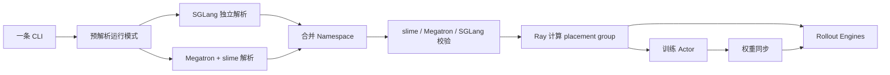
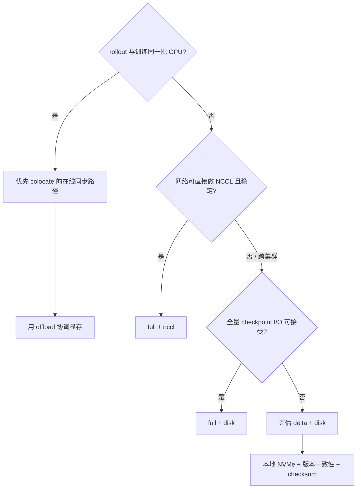

# 06. 配置、资源与权重同步：先算清楚，再启动

> **快照说明**：本文基于 `main@aaf5c209`（2026-07-26）整理。slime、Megatron-Core、SGLang 与 Ray 都在快速演进；本文中的命令全部是**阅读和改写用的示例，不保证在本机直接运行**。面试时应先说清版本、硬件和部署假设，再讨论参数。

这一章回答三个常见面试问题：一条启动命令到底被谁解析；训练、推理分别要多少卡；训练后的权重怎样安全地交给 rollout engine。

## 1. 一分钟心智模型



源码入口是 [`parse_args()`](https://github.com/THUDM/slime/blob/aaf5c2092b01219fa0d5c2d323741d409086ca32/slime/utils/arguments.py#L1548)，训练主循环则在 [`train.py`](https://github.com/THUDM/slime/blob/aaf5c2092b01219fa0d5c2d323741d409086ca32/train.py#L9)。零基础候选人只要先记住：**CLI 同时描述算法、模型和部署，最终必须在启动前被交叉校验。**

## 2. 参数解析为什么是“三层”

严格说，代码中有一个预解析步骤和两个正式 parser；面试里可概括成三层：

| 层 | 解析内容 | 为什么单独做 | 关键证据 |
|---|---|---|---|
| 0：模式预解析 | `--train-backend`、`--debug-rollout-only`、`--debug-train-only`、`--load-debug-rollout-data` | 先决定是否根本不需要 SGLang | [`_pre_parse_mode`](https://github.com/THUDM/slime/blob/aaf5c2092b01219fa0d5c2d323741d409086ca32/slime/utils/arguments.py#L1532) |
| 1：SGLang | `--sglang-*`、router、`--sglang-config` | SGLang 有自己的参数集合；用 `parse_known_args()` 只消费相关参数 | [`sglang_parse_args`](https://github.com/THUDM/slime/blob/aaf5c2092b01219fa0d5c2d323741d409086ca32/slime/backends/sglang_utils/arguments.py#L185) |
| 2：Megatron + slime | Megatron 原生参数以及 slime 追加的资源、rollout、算法、debug 等参数 | 复用 Megatron parser，同时忽略已由 SGLang/预解析消费的参数 | [`parse_args`](https://github.com/THUDM/slime/blob/aaf5c2092b01219fa0d5c2d323741d409086ca32/slime/utils/arguments.py#L1563) |

随后程序把预解析和 SGLang namespace 合并到 Megatron/slime namespace，并依次做 slime、Megatron、SGLang 校验（按 debug 模式跳过不需要的一侧），见 [`arguments.py`](https://github.com/THUDM/slime/blob/aaf5c2092b01219fa0d5c2d323741d409086ca32/slime/utils/arguments.py#L1574)。因此：

- 参数“能被 argparse 接受”不等于组合合法；例如 delta + NCCL 会在 slime 校验阶段失败。
- `--sglang-*` 不是随意字符串。slime 会暂时包装 SGLang 的 `add_argument`，统一加前缀，并跳过由 slime 自己决定的 `model_path`、TP、端口等字段，见 [`add_sglang_arguments`](https://github.com/THUDM/slime/blob/aaf5c2092b01219fa0d5c2d323741d409086ca32/slime/backends/sglang_utils/arguments.py#L35)。
- 默认训练后端当前只接受 `megatron`，不要把“框架抽象上可扩展”误说成“当前已有多个训练后端”。

### 参数组地图

`get_slime_extra_args_provider()` 把 slime 参数注入 Megatron parser（入口见 [`arguments.py`](https://github.com/THUDM/slime/blob/aaf5c2092b01219fa0d5c2d323741d409086ca32/slime/utils/arguments.py#L35)）。脚本通常按下面的语义分组数组，方便审查：

| 脚本参数组 | 典型内容 | 面试检查点 |
|---|---|---|
| `CKPT_ARGS` | `--hf-checkpoint`、`--ref-load`、`--load`、`--save` | 三个 checkpoint 是否被混淆 |
| `RAY_ARGS` | actor/rollout 卡数、`--colocate`、offload/release | placement group 是否放得下 |
| `ROLLOUT_ARGS` | 数据、采样、长度、batch、RM | 默认逻辑 rollout 数、目标 step 数与 GBS 是否一致；fan-out 看唯一 `rollout_id` |
| `SGLANG_ARGS` | `--sglang-*`、每 engine 卡数、外部 engine 地址 | TP/PP、端口、显存比例、路由是否匹配 |
| `PERF_ARGS` | TP/PP/CP/EP/ETP、动态 batch、重计算 | 并行乘积、模型结构和内存目标 |
| `ALGO_ARGS` | advantage、KL、clip、loss | 算法必需字段及互斥项 |
| `OPTIMIZER_ARGS` | lr、optimizer、scheduler | 是否与恢复语义一致 |
| `DEBUG/OBS_ARGS` | dump、replay、W&B、TensorBoard、metrics | 能否最小化复现 |
| `CUSTOM_ARGS` | `--*-path`、`--custom-config-path` | 模块能否从所有 Ray worker import |

源码内部还细分 fault tolerance、eval、OPD、reward model、rollout buffer、Megatron hooks、MTP 和 CI 等组；完整注册顺序见 [`arguments.py`](https://github.com/THUDM/slime/blob/aaf5c2092b01219fa0d5c2d323741d409086ca32/slime/utils/arguments.py#L1497)。分组只是 shell 可读性习惯，最终仍是一条扁平 CLI。

## 3. 三种“模型/checkpoint”不是一回事

| 名称 | 主要消费者 | 作用 | 常见误区 |
|---|---|---|---|
| 模型插件 / provider | Megatron 训练侧 | 构造与特定架构匹配的 Megatron 模型；可由 `--custom-model-provider-path` 替换 | 插件定义结构，不等于已经加载了权重 |
| Hugging Face checkpoint：`--hf-checkpoint` | SGLang、tokenizer/processor、HF config 校验 | 启动 rollout 模型、提供 tokenizer，并作为训推转换的结构基准 | 它不必是训练侧最新参数；首次正式训练前仍会同步 actor 权重，参数说明见 [`arguments.py`](https://github.com/THUDM/slime/blob/aaf5c2092b01219fa0d5c2d323741d409086ca32/slime/utils/arguments.py#L308) |
| Megatron checkpoint：`--ref-load` / `--load` / `--save` | 训练 actor、reference/critic、optimizer/RNG 恢复 | 分布式训练格式与完整续训状态 | HF 目录不能自动等同于可续训的 Megatron checkpoint |

更细的语义是：

- `--ref-load` 是 reference checkpoint；没有有效 `--load` 时也可作为训练初始化来源，见 [`arguments.py`](https://github.com/THUDM/slime/blob/aaf5c2092b01219fa0d5c2d323741d409086ca32/slime/utils/arguments.py#L829)。
- `--load` 指向有效 Megatron checkpoint 时可恢复；若不是带 tracker 的有效目录，raw 模式会转成 finetune 初始化，关闭 optimizer/RNG 恢复并回退到 `--ref-load`，见 [`slime_validate_args`](https://github.com/THUDM/slime/blob/aaf5c2092b01219fa0d5c2d323741d409086ca32/slime/utils/arguments.py#L1760)。
- `--save` 与 `--save-interval` 保存 Megatron 状态；`--no-save-optim` 会减小体积，但文档化的直接代价是不能完整恢复训练（参数帮助见 [`arguments.py`](https://github.com/THUDM/slime/blob/aaf5c2092b01219fa0d5c2d323741d409086ca32/slime/utils/arguments.py#L842)）。
- `--save-hf` 是额外导出 HF 权重，不应当代替训练 checkpoint。

HF → Megatron 的转换工具入口是 [`tools/convert_hf_to_torch_dist.py`](https://github.com/THUDM/slime/blob/aaf5c2092b01219fa0d5c2d323741d409086ca32/tools/convert_hf_to_torch_dist.py#L21)。转换时必须使用与训练一致的模型插件和架构参数，否则“文件存在”仍可能结构不匹配。

## 4. 资源计算：分离、colocate、external

先定义：

```text
A = actor_num_nodes × actor_num_gpus_per_node
R = rollout_num_gpus
```

Ray 的真实计算在 [`_get_placement_group_layout`](https://github.com/THUDM/slime/blob/aaf5c2092b01219fa0d5c2d323741d409086ca32/slime/ray/placement_group.py#L100)，返回“placement group 总 GPU 数、rollout 在其中的偏移”。

| 模式 | 本地 placement group GPU | rollout 起点 | 解释 |
|---|---:|---:|---|
| 训推分离 | `A + R` | `A` | actor 占前 A 张，rollout 占后 R 张 |
| colocate | `max(A, R)` | `0` | 两者从同一组 GPU 开始；若未显式给 R，校验阶段默认令 `R=A` |
| external rollout | `A` | `A` | 本地只放训练；rollout engine 已在外部运行，不占该 placement group |
| train-only debug | `A` | `0` | 不启动 SGLang |
| rollout-only debug | `R` | `0` | 不创建训练 actor |

一个容易被问到的边界：`--rollout-num-gpus 0` 表示保留 router、但不启动本地 engine；并不等于自动连接外部 engine。外部模式要显式给 `--rollout-external-engine-addrs`。这些布局已有参数化单测覆盖，见 [`tests/test_placement_group.py`](https://github.com/THUDM/slime/blob/aaf5c2092b01219fa0d5c2d323741d409086ca32/tests/test_placement_group.py#L30)。

### 计算例题

> 2 个 actor 节点、每节点 8 卡，rollout 需要 32 卡。

- 分离：`A=16`、`R=32`，Ray 需要能放置 48 个 GPU bundle。
- colocate：placement group 需要 32 卡；前 16 卡训推重叠，后 16 卡仅 rollout。是否合理还取决于多节点拓扑与 SGLang engine 切分。
- external：slime 本地 placement group 只需 16 卡，但所有训练节点必须能访问外部 router/engine，且权重同步 transport 必须跨越这条边界。

Ray placement group 默认 `PACK`，若资源暂时放不下会持续等待并周期打印集群总 GPU/可用 GPU，而不是立即报错，见 [`placement_group.py`](https://github.com/THUDM/slime/blob/aaf5c2092b01219fa0d5c2d323741d409086ca32/slime/ray/placement_group.py#L42)。所以“Ray pending”首先是资源账不平或节点尚未注册，不应先怀疑模型代码。

## 5. TP / PP / DP / CP / EP / ETP 怎么讲

| 缩写 | 切什么 | 主要收益 | 主要代价 / 约束 |
|---|---|---|---|
| TP（Tensor Parallel） | 单层矩阵/tensor | 单层参数和计算分摊到多卡 | 高频通信；训练 TP 与 rollout TP 不必相同，但转换/同步必须支持 |
| PP（Pipeline Parallel） | 层 | 超深模型跨 stage | bubble、stage 层数合法性；SGLang 中每 engine GPU 要能被 PP 整除，见 [`arguments.py`](https://github.com/THUDM/slime/blob/aaf5c2092b01219fa0d5c2d323741d409086ca32/slime/backends/sglang_utils/arguments.py#L155) |
| DP（Data Parallel） | batch | 提高吞吐 | 参数/optimizer 同步；训练 DP 通常由 world size 除去 TP、PP、CP 后得到，不是独立“再乘任意值” |
| CP（Context Parallel） | 序列 | 降低长上下文激活压力 | token 排布和通信更复杂；特定 `allgather CP` 只支持声明的 DSA 架构，见 [`megatron_utils/arguments.py`](https://github.com/THUDM/slime/blob/aaf5c2092b01219fa0d5c2d323741d409086ca32/slime/backends/megatron_utils/arguments.py#L28) |
| EP（Expert Parallel） | MoE experts | 专家分布到不同 rank | all-to-all、负载不均、expert 数与拓扑约束 |
| ETP（Expert Tensor Parallel） | 单个 expert 内 tensor | 大 expert 继续切分 | 更多通信；只作用于 expert path，不能机械地与所有维度相乘 |

训练 dense 模型时，可先用近似式检查：

```text
DP ≈ training_world_size / (TP × PP × CP)
```

MoE 下 EP/ETP 与 DP/TP 的关系由 Megatron 的 process group 和模型配置共同决定。面试中更稳妥的回答是：**先保证基础 world-size 整除，再让 Megatron 的参数校验验证 EP/ETP 约束；不要宣称 `world = TP×PP×DP×CP×EP×ETP` 对所有模型都成立。**

Rollout 侧另有 SGLang TP/PP/DP/EP。`--rollout-num-gpus-per-engine` 是每个 engine 的总卡数；slime 在 PP>1 时计算 `SGLang TP = 每 engine GPU / PP`，见 [`sglang_validate_args`](https://github.com/THUDM/slime/blob/aaf5c2092b01219fa0d5c2d323741d409086ca32/slime/backends/sglang_utils/arguments.py#L155)。不要把训练 TP 与 rollout TP 混成一个参数。

## 6. offload 与 release：释放的是不同东西

| 能力 | 含义 | 适用判断 |
|---|---|---|
| `--offload-train` | 训练阶段切换时把 actor 的相关状态转移/释放到 CPU 侧方案 | 保留 actor 进程，换取切换成本与 CPU 内存 |
| `--offload-rollout` | 训练时释放 SGLang 的显存占用，恢复时分阶段 onload weights、KV/cache graph | 主要用于 GPU 重叠的 colocate group；代码按 group 是否与 Megatron GPU 重叠决定，见 [`rollout.py`](https://github.com/THUDM/slime/blob/aaf5c2092b01219fa0d5c2d323741d409086ca32/slime/ray/rollout.py#L1134) |
| `--offload` | 同时打开 train 与 rollout offload 的便捷开关 | 避免只写一半，但仍需做内存预算 |
| `--release-train` | rollout 期间销毁 Megatron actor，训练前从 checkpoint 重建 | 比 offload 更彻底，也更慢、依赖 checkpoint I/O |

`release-train` 当前有硬边界：仅 Megatron actor、无 critic、不能 `--keep-old-actor`、必须设置 `--save`，且要求 `full + disk` 权重同步；校验见 [`arguments.py`](https://github.com/THUDM/slime/blob/aaf5c2092b01219fa0d5c2d323741d409086ca32/slime/utils/arguments.py#L1991)。在 colocate + release 下，训练 offload 会被关闭，而 rollout offload 保持开启，见 [`arguments.py`](https://github.com/THUDM/slime/blob/aaf5c2092b01219fa0d5c2d323741d409086ca32/slime/utils/arguments.py#L1882)。

## 7. 权重同步的三条当前路径

`mode` 决定传全量还是差量，`transport` 决定通过 NCCL 还是 disk。当前有效组合只有三种：

| 组合 | 数据路径 | 优点 | 风险 / 先决条件 |
|---|---|---|---|
| `full + nccl`（默认） | 训练端把每次完整参数按 chunk 在线传给 engine | 低磁盘依赖，通常延迟低 | NCCL 建链、端口、网络拓扑和额外显存；buffer 过大可能顶内存 |
| `full + disk` | 每次写完整 HF checkpoint，engine 从磁盘 reload | 可跨外部 engine；支持 `release-train`；保留目录时便于审计 | 共享存储带宽/可见性、完整 checkpoint 写放大；默认可清理版本目录，长期保留需 `--update-weight-disk-keep-files` |
| `delta + disk` | 对上一版本 CPU snapshot 做 byte-level diff，发布差量；各 rollout host 更新本地完整 HF checkpoint 后 reload | 大模型跨集群时减少发布字节 | **当前 delta 仅 disk**；必须有 host-local checkpoint；不支持 colocate；版本链、原子发布和 checksum 更关键 |

“full + NCCL”是部署层面的简称：非 colocate 时选择 distributed/NCCL updater；colocate 时同一组 GPU 会改走 tensor/CUDA IPC updater，而不是真的绕网络做 NCCL。分派条件可见 [`actor.py`](https://github.com/THUDM/slime/blob/aaf5c2092b01219fa0d5c2d323741d409086ca32/slime/backends/megatron_utils/actor.py#L150)。

参数定义明确写出 delta 仅 disk（[`arguments.py`](https://github.com/THUDM/slime/blob/aaf5c2092b01219fa0d5c2d323741d409086ca32/slime/utils/arguments.py#L134)），运行时又强制拒绝 delta+NCCL、delta+colocate、缺本地 checkpoint 目录的组合（[`arguments.py`](https://github.com/THUDM/slime/blob/aaf5c2092b01219fa0d5c2d323741d409086ca32/slime/utils/arguments.py#L2004)）。完整机制可继续阅读 [Delta 权重同步](../advanced/delta-weight-sync.md#工作原理)。

不要把测试保护误当生产默认：full-disk reload 后主动查询所有 engine version 并报 mismatch 的分支只在 `--ci-test` 下运行；默认版本目录也可能被清理。生产方案应显式保留/发布审计信息，并独立核对每个 engine 的 weight version。

两个 driver 的频率不同：`train.py` 在 actor 初始化后先同步一次，此后每轮训练/保存/offload 后都调用同步，再恢复 rollout KV，见 [`train.py`](https://github.com/THUDM/slime/blob/aaf5c2092b01219fa0d5c2d323741d409086ca32/train.py#L23)；它不使用 `--update-weights-interval` 跳过发布。`train_async.py` 则只在 `release_train` 或 `(rollout_id + 1) % update_weights_interval == 0` 时同步，并先等待在途 generation，见 [`train_async.py`](https://github.com/THUDM/slime/blob/aaf5c2092b01219fa0d5c2d323741d409086ca32/train_async.py#L66)。同一参数还参与 `keep_old_actor` 的模型队列维护，但不能据此推断同步 driver 会降频。调试不同步时应记录 driver、rollout id 和 weight version，而不是只比较两个进程的启动时间。

### 如何选



## 8. 启动前 preflight

下面是“先验证事实、后提交大任务”的面试答案。**所有命令均为示例，不保证本机可运行；需要按容器、Ray 地址、模型路径和权限改写。**

1. 检查模块和配置能否 import，而不是直接占用几十张卡。

   示例（不保证本机可运行）：

   ```bash
   python -c 'from slime.utils.misc import load_function; print(load_function("your_pkg.rollout.generate"))'
   python -c 'from transformers import AutoConfig; print(AutoConfig.from_pretrained("/path/to/hf").architectures)'
   ```

2. 核对 checkpoint 类型、tracker 和磁盘空间。

   示例（不保证本机可运行）：

   ```bash
   test -f /path/to/megatron/latest_checkpointed_iteration.txt
   test -f /path/to/hf/config.json
   df -h /shared/weight-sync /local/nvme
   ```

3. 核对 Ray 看到的资源与自己算出的 placement group。

   示例（不保证本机可运行）：

   ```bash
   ray status
   python -c 'import ray; ray.init(address="auto"); print(ray.cluster_resources()); print(ray.available_resources())'
   ```

4. 先跑 rollout-only，再固定 dump 跑 train-only。这样模型生成、reward 和训练内存可以分层验证；详细流程见 [第 08 章](08-debugging-reliability-and-performance.md)。

5. 最后才提交 Ray job。

   示例（不保证本机可运行；`...` 必须替换）：

   ```bash
   ray job submit --address="http://127.0.0.1:8265" \
     --runtime-env-json='{"env_vars":{"PYTHONPATH":"/path/to/Megatron-LM:/path/to/slime"}}' \
     -- python3 train.py \
     --hf-checkpoint /path/to/hf \
     --ref-load /path/to/megatron \
     --actor-num-nodes 1 --actor-num-gpus-per-node 4 \
     --rollout-num-gpus 4 --rollout-num-gpus-per-engine 2 \
     --rollout-batch-size 8 --n-samples-per-prompt 4 \
     --global-batch-size 32 \
     ...
   ```

### 启动风险清单

- **路径风险**：driver 能读不代表每个 Ray worker 都能读；容器内路径、共享盘挂载、`PYTHONPATH` 必须一致。
- **资源风险**：Ray 声明的 GPU 数不等于物理 GPU 健康可用；同时核对节点注册与 CUDA 可见设备。
- **拓扑风险**：跨节点 engine 的每 engine GPU、PP/TP 和 `--num-gpus-per-node` 必须一致。
- **显存风险**：colocate 首次初始化阶段可能同时存在更多状态；`--sglang-mem-fraction-static` 不是越大越好。
- **同步风险**：disk transport 需要训练端写、rollout host 读的可见性；非 POSIX 存储可能要 post-write/pre-read hook。
- **安全风险**：自定义 hook 是任意 Python import；只加载可信代码，sandbox/API 凭据不要写进 CLI、日志或 checkpoint。

## 9. 面试速答

**问：为什么一条 CLI 要解析三次？**

答：先用最小参数决定运行模式，再让 SGLang 和 Megatron/slime 各自解析自己的参数集合，最后合并并做跨系统校验；这样 train-only 可以完全跳过 SGLang，双方同名参数也不会互相污染。

**问：16 张训练卡、32 张推理卡，分离和 colocate 分别申请多少？**

答：分离申请 48；colocate 申请 `max(16,32)=32`，其中 16 张重叠、16 张 rollout-only。external rollout 则本地只申请 16。

**问：delta 能走 NCCL 吗？**

答：在这个快照不能。当前只有 delta+disk，并要求本地完整 HF checkpoint，且不支持 colocate。

**问：`--hf-checkpoint` 为什么不一定是最新权重？**

答：它主要给 SGLang 初始化、tokenizer 和架构校验；训练 actor 加载 Megatron checkpoint，正式训练前会把 actor 权重同步给 rollout。
