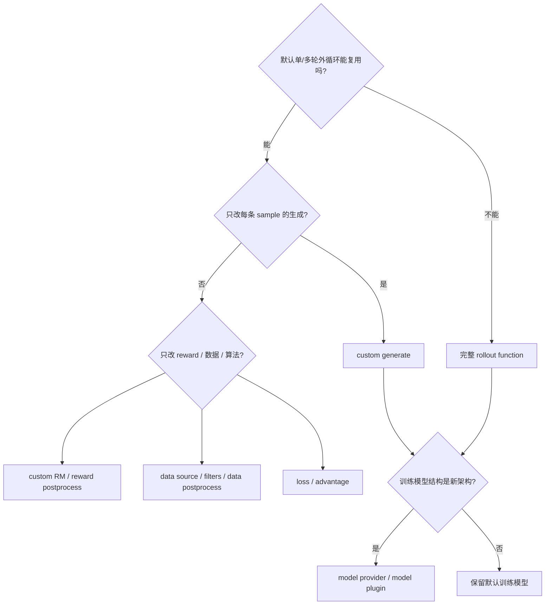
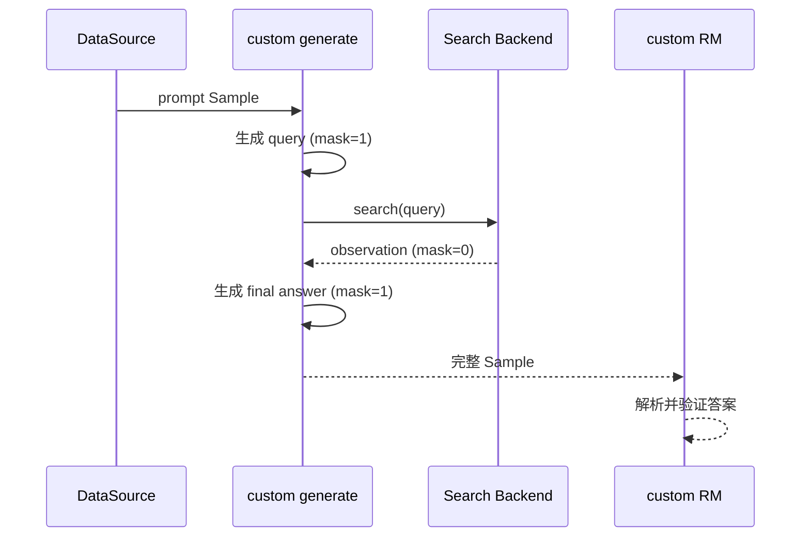

# 07. 扩展点与真实场景：从一个 hook 到完整 Agentic RL

> **快照说明**：本文基于 `main@aaf5c209`（2026-07-26）整理。扩展函数签名和示例会随代码演进；本文中的命令全部是**示例，不保证在本机直接运行**。第三方工具、搜索服务和 sandbox 还涉及网络、凭据与隔离策略，不能把 recipe 当作生产安全承诺。

slime 的核心扩展思路是：**用 Python import path 替换流水线中的一个窄环节，只有默认外循环不再适用时才替换整个 rollout。** 面试中不要只背参数名，应说清“为什么选这一层、输入输出契约是什么、怎样验证不会把错误 token 训练进去”。

## 1. import-path hook 到底是什么

slime 的 loader 接受形如 `package.module.attribute` 的**点分路径**：先 `importlib.import_module(package.module)`，再 `getattr(attribute)`，实现见 [`load_function`](https://github.com/THUDM/slime/blob/aaf5c2092b01219fa0d5c2d323741d409086ca32/slime/utils/misc.py#L37)。因此：

- 这里的可靠格式是 `your_pkg.rollout.generate`，不是文件路径，也不是 `module.py:function`。
- 包必须在 driver 和所有 Ray worker 的 `PYTHONPATH` 上；只在当前 shell `cd` 到某目录不够。
- import 会执行模块顶层代码。不要在顶层连接数据库、下载模型或读取秘密；把副作用放进函数或显式初始化 hook。
- hook 是可信代码边界，不是安全沙箱。加载用户不可控的 import path 等同于执行任意 Python。

示例（只验证 import，不保证本机可运行）：

```bash
PYTHONPATH=/path/to/project python -c \
  'from slime.utils.misc import load_function; print(load_function("my_rl.rollout.generate"))'
```

## 2. 扩展层怎么选



### 主扩展点对比

| 需求 | 首选参数 | 典型契约 | 什么时候升级到更重的 hook |
|---|---|---|---|
| 多轮、搜索、工具调用、RAG、环境交互 | `--custom-generate-function-path` | `async def generate(args, sample, sampling_params) -> Sample | list[Sample]` | 需要自定义全局调度、完全异步 buffer 或改变整个 batch 形状时 |
| 替换整轮数据收集 | `--rollout-function-path` | `def generate_rollout(args, rollout_id, data_source, evaluation=False) -> RolloutFn*Output` | 已经无法复用默认 oversampling、RM、filter、abort 逻辑 |
| verifier / 规则 / 外部 RM | `--custom-rm-path` | 常见为 `async def rm(args, sample, **kwargs) -> float | dict` | 需要整组样本共同评分时可用 `--group-rm`；但当前它不能直接消费 custom generate 返回的 fan-out 嵌套列表 |
| 数据游标、队列、在线 buffer | `--data-source-path` | 实现 `get_samples/add_samples/save/load/__len__` | 只想过滤默认静态数据时先用 filter hook |
| 自定义训练目标 | `--loss-type custom_loss` + `--custom-loss-function-path` | 训练侧 loss callable，遵循默认 loss 调用形状 | 只改 advantage 时不要连 loss 一起重写 |
| 自定义 advantage / return | `--custom-advantage-function-path` | `func(args, rollout_data)`，原地写入 `advantages`、`returns` | estimator 可由内置 GRPO/PPO/CISPO 等表达时直接用内置项 |
| 新 Megatron 架构 | `--custom-model-provider-path` | `provider(pre_process, post_process, vp_stage=None) -> GPTModel` | 只是换权重或 tokenizer 时不需要模型插件 |

完整 rollout/data/reward hook 在 manager 初始化时通过 import path 加载，见 [`RolloutManager.__init__`](https://github.com/THUDM/slime/blob/aaf5c2092b01219fa0d5c2d323741d409086ca32/slime/ray/rollout.py#L430)；custom advantage 的原地写入契约见 [`loss.py`](https://github.com/THUDM/slime/blob/aaf5c2092b01219fa0d5c2d323741d409086ca32/slime/backends/megatron_utils/loss.py#L661)，custom loss 的选择入口见 [`loss.py`](https://github.com/THUDM/slime/blob/aaf5c2092b01219fa0d5c2d323741d409086ca32/slime/backends/megatron_utils/loss.py#L1229)。

### “最窄 hook”原则

1. **只改生成**：保留默认 `sglang_rollout`，得到内置并发、reward、动态采样、filter、metrics 和 fault-tolerance 行为。
2. **只改评分**：保留真实生成 token，只替换 RM；避免把“环境逻辑”误塞进 loss。
3. **只改学习信号**：先选 advantage，再决定是否需要 custom loss。二者一起改会使 NaN/收益退化难定位。
4. **完整 rollout**：承担 batch 数量、嵌套形状、`Sample` 必填字段、metrics、取消与异常语义；这是能力最大、维护成本也最高的一层。

## 3. `Sample` 是跨层协议

一个可训练 sample 至少要让下游拿到：

| 字段 | 含义 | 关键约束 |
|---|---|---|
| `tokens` | prompt + response 的真实 token ids | 尽量保存模型实际采样的 ids，不要“decode 后再 tokenize”冒充原轨迹 |
| `response_length` | response token 数 | 必须能从 `tokens` 尾部切出 response |
| `reward` | 标量或可按 key 取值的字典 | 与 RM/`--reward-key` 约定一致 |
| `status` | completed/truncated/failed/aborted 等 | 主要是观测/控制信号；`FAILED` 不会自动过滤或清零梯度 |
| `loss_mask` | response 中每个 token 是否训练 | 长度必须严格等于 `response_length` |
| `rollout_id` | 一次逻辑 rollout 的身份 | fan-out sibling 必须全部非空且相同 |

字段定义见 [`Sample`](https://github.com/THUDM/slime/blob/aaf5c2092b01219fa0d5c2d323741d409086ca32/slime/utils/types.py#L93)。默认转换在 `loss_mask is None` 时把整个 response 置 1，`remove_sample=True` 时全部置 0，并断言 mask 长度正确，见 [`_convert_samples_to_train_data`](https://github.com/THUDM/slime/blob/aaf5c2092b01219fa0d5c2d323741d409086ca32/slime/ray/rollout.py#L709)。所以对工具场景来说，“不填 loss mask”通常是危险默认值：tool observation、模板、环境错误文本可能被当成模型输出训练。仅设置 `status=FAILED` 也不够；基础设施失败必须显式重试/回填、过滤、设置 `remove_sample=True` 或全零 mask。

## 4. fan-out：ID、prompt 分组与 loss mask 的三重契约

一次 agent 执行可能产生 main agent、subagent、compact 前后片段等多个训练样本。此时：

```text
一次逻辑 rollout
  ├─ Sample A: rollout_id=42, loss_mask=[模型 token=1, observation=0]
  ├─ Sample B: rollout_id=42, loss_mask=[subagent 模型 token=1, 工具输出=0]
  └─ Sample C: rollout_id=42, loss_mask=[final answer=1]
```

三个字段解决不同问题：

- `rollout_id` 决定**计数和归约单位**。同一 fan-out 的 siblings 共享 id，训练 step 按 rollout 而不是按 fan-out 后的样本数计数；manager 会为整个 rollout 预计算 loss-mask 总量作为 denominator，见 [`rollout.py`](https://github.com/THUDM/slime/blob/aaf5c2092b01219fa0d5c2d323741d409086ca32/slime/ray/rollout.py#L759)。
- `group_index` 决定**reward normalization 的 prompt 组**。可变 fan-out 时，默认固定 reshape 会失败；若要逻辑 rollout 等权，应先在 prompt 组内按 `rollout_id` 聚合 reward，再归一化并广播回 siblings。
- `loss_mask` 决定**哪些 response token 产生梯度**。prompt 不在 response mask 中；response 内的模型 token 通常为 1，模板、工具 observation、环境反馈、人工拼接文字通常为 0。

compact/subagent 三层嵌套输出会被显式校验：每个 sibling 都必须有相同的非空 `rollout_id`，否则立即断言失败，见 [`_validate_rollout_id_annotated`](https://github.com/THUDM/slime/blob/aaf5c2092b01219fa0d5c2d323741d409086ca32/slime/ray/rollout.py#L898)。

### 一个安全的 fan-out 伪代码

示例（教学伪代码，不保证本机可运行）：

```python
async def generate(args, sample, sampling_params):
    trajectory = await run_agent(sample.prompt)
    rid = sample.rollout_id if sample.rollout_id is not None else sample.index
    siblings = []
    for branch in trajectory.trainable_branches():
        child = branch.to_sample()       # 保留实际 token ids
        child.rollout_id = rid           # 同一次逻辑 rollout
        child.group_index = sample.group_index  # 保留 prompt reward group
        child.loss_mask = branch.mask()  # 模型输出 1，observation/template 0
        assert len(child.loss_mask) == child.response_length
        siblings.append(child)
    return siblings
```

不要给 siblings 分配不同 id 来“避免冲突”：那会把一次 agent execution 重复算成 N 次 rollout，并改变 loss 归一化与 step 切分。

若 siblings 数量可变，应再提供 `--custom-reward-post-process-path`，显式定义 sibling reward 如何聚合为逻辑 rollout reward。现有默认 post-process 和测试 helper 都不能自动替你决定该语义。另一个当前限制是 `--group-rm` 直接遍历 group 中的 `Sample`，无法处理 fan-out 产生的嵌套 `list[Sample]`；不要在没有额外展平/组合测试时同时开启。

## 5. 方案 walkthrough A：数学 + 搜索工具

### 目标

模型对数学题可多轮搜索，最终答案由规则 verifier 评分；搜索结果不参与梯度。

### 设计

1. 默认 `sglang_rollout` 负责 batch、并发和动态采样。
2. `custom generate` 实现 `thought → search query → observation → ... → answer`。
3. 搜索 query 和模型 answer 是模型生成 token，mask=1；系统拼接的搜索结果和 tool wrapper，mask=0。
4. `custom RM` 解析最终答案，用数学 verifier 打 0/1；工具调用格式错误可记录 metadata，再由 reward 或 filter 处理。
5. 若要 DAPO 风格动态采样，再接 `--dynamic-sampling-filter-path`，不要重写 rollout。



示例参数（不保证本机可运行）：

```bash
--custom-generate-function-path generate_with_search.generate \
--custom-rm-path generate_with_search.reward_func \
--loss-mask-type qwen \
--rollout-max-response-len 4096
```

仓库 recipe [`examples/search-r1`](https://github.com/THUDM/slime/blob/aaf5c2092b01219fa0d5c2d323741d409086ca32/examples/search-r1/README.md#code-structure) 正是“custom generate + custom RM”的参考。它证明仓库提供了一种接法，不代表搜索服务 SLA、索引质量或外部 API 成本已经由 slime 保证。

### 验收

- dump 中能逐 token 对齐 `tokens/response_length/loss_mask`。
- 搜索 observation 的 mask 全为 0，最终 answer 有非零可训练 token。
- 对固定 20 条题，verifier 与离线脚本结果一致；reward 分组不是全常数。
- 搜索 timeout 产生可诊断 metadata，并通过重试/回填或 filter/remove 清除训练贡献；仅写 `FAILED` 不会自动阻止训练。

## 6. 方案 walkthrough B：代码 Agent + sandbox + multi-agent fan-out

### 目标

模型在隔离环境里读代码、编辑、运行测试；subagent 与主 agent 分支都作为一次逻辑 rollout 的训练片段，最终 patch 在另一干净环境评分。

### 设计

1. `custom generate` 为每个 sample 创建短生命周期 sandbox，准备仓库与问题。
2. agent harness 通过 SGLang adapter 发消息并调用 Read/Edit/Grep/Bash/Agent 等工具。
3. trajectory manager 保存真实采样 token；工具结果、模板、后续拼接 observation 全部 mask=0。
4. subagent 分支 fan-out 为 `list[Sample]`，共享 `rollout_id`。
5. 在**第二个干净 sandbox** 中应用 patch 并运行 grader，防止通过修改测试作弊；reward 写回 sample。
6. 凭据只以最小权限注入 sandbox，日志/dump 必须脱敏；限制网络、CPU、内存、磁盘和 wall-clock。

示例参数（不保证本机可运行；真实路径和解析器依模型调整）：

```bash
--custom-generate-function-path examples.coding_agent_rl.generate.generate \
--sglang-tool-call-parser qwen3_coder \
--save-debug-rollout-data /secure/debug/rollout_{rollout_id}.pt
```

参考实现地图见 [`examples/coding_agent_rl`](https://github.com/THUDM/slime/blob/aaf5c2092b01219fa0d5c2d323741d409086ca32/examples/coding_agent_rl/README.md#running-the-script)。该 README 描述了 per-sample sandbox、干净 evaluator 与 fan-out trajectory；这是 recipe，不等于任意 sandbox provider 都达到生产隔离等级。

### 失败策略

| 失败 | 建议状态/处理 | 不要做什么 |
|---|---|---|
| sandbox boot timeout | 记录 provider/时延并重试；最终失败则 filter/remove 或全零 mask | 只写 `FAILED` 后仍让默认全 1 mask 进入训练 |
| agent 超时 | `TRUNCATED`，保留已完成模型 token | 把 timeout 文本 mask=1 |
| 工具 JSON 解析失败 | 低 reward 或格式 reward；保留原始生成 token | 修改 response 后忘记同步 token/mask |
| evaluator 基础设施失败 | 与“patch 测试失败”分开，避免错误惩罚模型 | 把基础设施错误当 0 分真值 |
| fan-out 某分支为空 | 删除空分支或全 mask=0，并保持 group id | 给空分支新 rollout id |

## 7. 方案 walkthrough C：多轮 VLM + 环境反馈

### 目标

输入图片和几何题；模型可多轮调用环境获得提示，最终数学答案计分。

### 设计

1. 数据层将 image path/URL 映射到 `multimodal_inputs`；processor 产生训练侧 multimodal inputs。
2. 这个仓库示例复用默认 rollout 外循环，只以 custom generate 控制多轮图文上下文、SGLang 请求和 log-prob 对齐；只有还要改全局 batch 调度时才升级为完整 `--rollout-function-path`。
3. 每轮模型文本 token mask=1；环境反馈 mask=0。图像占位 token 与训练 processor 的展开必须一致，不能只用字符串长度估算。
4. `response_length`、loss mask、log-prob 必须在多轮拼接后仍逐 token 对齐。
5. RM 只读取最终答案或环境终态，格式分与正确性分要明确是否相加。

示例参数（不保证本机可运行）：

```bash
--custom-generate-function-path examples.geo3k_vlm_multi_turn.rollout.generate \
--multimodal-keys '{"image":"image_file"}' \
--loss-mask-type qwen3 \
--rm-type math
```

单轮入口见 [`examples/geo3k_vlm`](https://github.com/THUDM/slime/blob/aaf5c2092b01219fa0d5c2d323741d409086ca32/examples/geo3k_vlm/README.md#reproduce)，多轮环境和 rollout 职责见 [`examples/geo3k_vlm_multi_turn`](https://github.com/THUDM/slime/blob/aaf5c2092b01219fa0d5c2d323741d409086ca32/examples/geo3k_vlm_multi_turn/README.md#what-each-file-does)。

### 验收

- 图片在 driver、rollout worker 和 trainer 上均可访问，或已转为明确可传输的数据。
- 同一 sample 的 multimodal token 展开、总 token、response span 和 loss mask 一致。
- 环境反馈不会产生梯度；多轮达到 max turns/max tokens 时状态是 `TRUNCATED`。
- 用少量固定样本做 rollout-only dump，再做 train-only replay。

## 8. 方案 walkthrough D：OPD（在策略蒸馏）

OPD 不是新的 advantage estimator，而是在基础 estimator 的 advantage 上叠加 teacher-student token KL；源码在 [`apply_opd_kl_to_advantages`](https://github.com/THUDM/slime/blob/aaf5c2092b01219fa0d5c2d323741d409086ca32/slime/backends/megatron_utils/loss.py#L620)。

| 模式 | 教师在哪里 | 设计重点 |
|---|---|---|
| `--opd-type sglang` | 外部 SGLang teacher | rollout/RM 阶段取得逐 token teacher log-prob；网络超时和 token 对齐必须可观测 |
| `--opd-type megatron` | 训练侧 Megatron teacher | 需要 `--opd-teacher-load` Megatron checkpoint；额外训练显存与计算成本 |

示例参数（不保证本机可运行）：

```bash
--use-opd --opd-type sglang --opd-kl-coef 1.0 \
--rm-url http://teacher.example:8000/generate \
--custom-rm-path slime.rollout.on_policy_distillation.reward_func \
--custom-reward-post-process-path slime.rollout.on_policy_distillation.post_process_rewards
```

可运行思路和模式比较见 [`examples/on_policy_distillation`](https://github.com/THUDM/slime/blob/aaf5c2092b01219fa0d5c2d323741d409086ca32/examples/on_policy_distillation/README.md#mode-comparison) 与 [OPD 文档](../advanced/on-policy-distillation.md#两种教师模式)。不要把示例结果外推到其他学生/教师、数据集和 KL 系数。

## 9. 数据源、loss、advantage 与模型插件

### 自定义 DataSource

[`DataSource`](https://github.com/THUDM/slime/blob/aaf5c2092b01219fa0d5c2d323741d409086ca32/slime/rollout/data_source.py#L17) 要实现五件事：取样、退回样本、保存游标、加载游标、报告长度。默认全局数据源保存 `sample_offset`、epoch、group/sample index 和 metadata，见 [`data_source.py`](https://github.com/THUDM/slime/blob/aaf5c2092b01219fa0d5c2d323741d409086ca32/slime/rollout/data_source.py#L123)。

适合自定义 data source 的场景包括在线队列、课程学习、外部 replay buffer、按任务配额采样。关键不是“能拿到数据”，而是 `save/load` 与模型 checkpoint 使用同一个 rollout 边界，否则恢复后可能重复或跳过样本。

### custom advantage 与 custom loss

- custom advantage 在 KL 已计算后运行，必须原地填充每个 sample 的 `advantages` 和 `returns`；保留现有 loss 可减少变量。
- custom loss 直接替换训练目标，应明确返回 loss/metrics 约定、mask 归约、DP/CP 语义和数值精度。优先从 [`loss.py` 的内置分派](https://github.com/THUDM/slime/blob/aaf5c2092b01219fa0d5c2d323741d409086ca32/slime/backends/megatron_utils/loss.py#L1264) 复制最接近的一支，再写契约测试。
- reward postprocess 位于 reward 与 advantage 之间；适合 group normalization 或 teacher log-prob 整理，不适合偷偷改变 token 序列。

### 模型插件

模型 provider 解决的是 Megatron 如何构造架构；HF→Megatron bridge/映射解决权重名和张量布局；SGLang 是否支持该 HF 架构又是第三件事。真实接入要同时检查：

1. HF config / tokenizer / processor；
2. Megatron model provider；
3. HF↔Megatron 权重映射；
4. SGLang serving 支持；
5. 在线权重同步在 TP/EP 变化下的映射。

仓库插件样例集中在 [`slime_plugins/models`](https://github.com/THUDM/slime/tree/aaf5c2092b01219fa0d5c2d323741d409086ca32/slime_plugins/models) 与 [`slime_plugins/mbridge`](https://github.com/THUDM/slime/tree/aaf5c2092b01219fa0d5c2d323741d409086ca32/slime_plugins/mbridge)。不要因存在一个 provider 文件就宣称端到端训练、checkpoint round-trip 和在线同步均已覆盖。

## 10. 真实场景与示例地图

| 场景 | 推荐起点 | 仓库示例 | 读它时关注 |
|---|---|---|---|
| 数学规则 RM | 内置/自定义 RM | [`slime/rollout/rm_hub`](https://github.com/THUDM/slime/tree/aaf5c2092b01219fa0d5c2d323741d409086ca32/slime/rollout/rm_hub) | 答案抽取、二值/非二值 reward、异常语义 |
| 搜索增强 | custom generate + RM | [`examples/search-r1`](https://github.com/THUDM/slime/blob/aaf5c2092b01219fa0d5c2d323741d409086ca32/examples/search-r1/README.md) | 多轮搜索、工具 observation mask、外部服务 |
| Python 工具 | custom generate + sandbox | [`examples/retool`](https://github.com/THUDM/slime/blob/aaf5c2092b01219fa0d5c2d323741d409086ca32/examples/retool/README.md) | 工具 schema、执行隔离、reward |
| 通用 agent tool loop | custom generate | [`examples/tau-bench`](https://github.com/THUDM/slime/blob/aaf5c2092b01219fa0d5c2d323741d409086ca32/examples/tau-bench/README.md) | user simulator、环境终态、API key |
| 框架适配 | custom generate | [`examples/strands_sglang`](https://github.com/THUDM/slime/blob/aaf5c2092b01219fa0d5c2d323741d409086ca32/examples/strands_sglang/README.md) | text↔token 对齐；README 明示本地 subprocess 非隔离 |
| Coding-agent RL | custom generate + sandbox + fan-out | [`examples/coding_agent_rl`](https://github.com/THUDM/slime/blob/aaf5c2092b01219fa0d5c2d323741d409086ca32/examples/coding_agent_rl/README.md) | 干净 evaluator、轨迹分支、超时 |
| Multi-agent | custom generate | [`examples/multi_agent`](https://github.com/THUDM/slime/blob/aaf5c2092b01219fa0d5c2d323741d409086ca32/examples/multi_agent/README.md) | shared rollout_id、分支 reward/权重 |
| VLM 单轮 | multimodal data + 默认 rollout | [`examples/geo3k_vlm`](https://github.com/THUDM/slime/blob/aaf5c2092b01219fa0d5c2d323741d409086ca32/examples/geo3k_vlm/README.md) | processor、图像可达性、RM 精度 |
| VLM 多轮 | 完整 rollout 或 custom generate | [`examples/geo3k_vlm_multi_turn`](https://github.com/THUDM/slime/blob/aaf5c2092b01219fa0d5c2d323741d409086ca32/examples/geo3k_vlm_multi_turn/README.md) | 环境反馈、mask/log-prob 对齐 |
| OPD | teacher + reward postprocess | [`examples/on_policy_distillation`](https://github.com/THUDM/slime/blob/aaf5c2092b01219fa0d5c2d323741d409086ca32/examples/on_policy_distillation/README.md) | teacher log-prob、KL、两种教师部署 |
| long-tail 异步 | 完整 rollout | [`examples/fully_async`](https://github.com/THUDM/slime/blob/aaf5c2092b01219fa0d5c2d323741d409086ca32/examples/fully_async/README.md) | stale policy、buffer、取消和背压 |

这里的“示例”分三种成熟度：源码中的默认实现是项目行为；测试覆盖的契约有 CI 保护；`examples/` recipe 是参考配置。三者不能互换表述。

## 11. 扩展上线前的契约测试

项目提供 plugin contract tests，覆盖路径加载、生成、完整 rollout 和 runtime hooks；入口见 [`tests/plugin_contracts`](https://github.com/THUDM/slime/tree/aaf5c2092b01219fa0d5c2d323741d409086ca32/tests/plugin_contracts)。对自己的扩展，至少验证：

1. 点分路径可从干净 Python 进程 import。
2. 函数签名、同步/异步形式和返回类型与调用点一致。
3. 正常、timeout、空输出、解析失败、外部 5xx 都有确定状态。
4. `tokens`、`response_length`、`loss_mask`、log-prob 逐 token 对齐。
5. fan-out siblings 共享 `rollout_id`，跨 micro-batch 后 loss denominator 不变。
6. DataSource save/load 恢复到同一游标。
7. 日志和 debug dump 不包含 token、API key、用户隐私等不该落盘的数据。

示例（仅演示最小测试入口，不保证本机可运行）：

```bash
pytest -q tests/plugin_contracts/test_plugin_generate_contracts.py
pytest -q tests/plugin_contracts/test_plugin_path_loading_contracts.py
pytest -q tests/test_qwen2.5_0.5B_fanout_short.py
```

前两个可能需要依赖/stub 环境，最后一个是 GPU E2E；应根据项目 CI 镜像选择，不要把未运行的命令报告为通过。

## 12. 面试速答

**问：工具调用为什么通常选 custom generate，而不是完整 rollout？**

答：工具逻辑只替换单 sample 生成时，默认 rollout 仍可提供 batch 并发、RM、动态采样、过滤、metrics 和容错；重写完整 rollout 会接管更多契约，维护面更大。

**问：fan-out 最容易错在哪里？**

答：一是 siblings 没共享 `rollout_id`，导致一次 agent execution 被多计；二是工具 observation/template 的 loss mask 没清零，导致训练环境文本。

**问：自定义 RM、advantage、loss 的边界？**

答：RM 产出任务得分，advantage 把 reward/KL/value 变成学习信号，loss 把 advantage 与 policy 输出组成可优化目标。先改最窄一层，避免三层同时变化。

**问：示例目录存在是否代表生产可用？**

答：不代表。需要区分默认源码行为、CI 保护的契约和仅供参考的 recipe，还要单独验证依赖、隔离、外部服务与数据安全。
