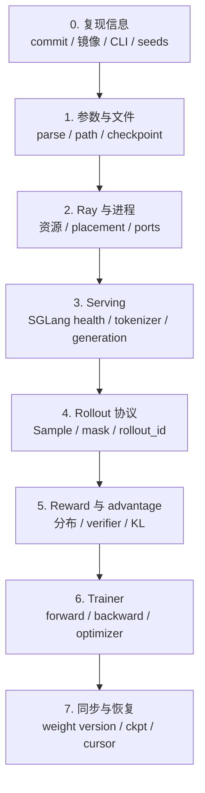
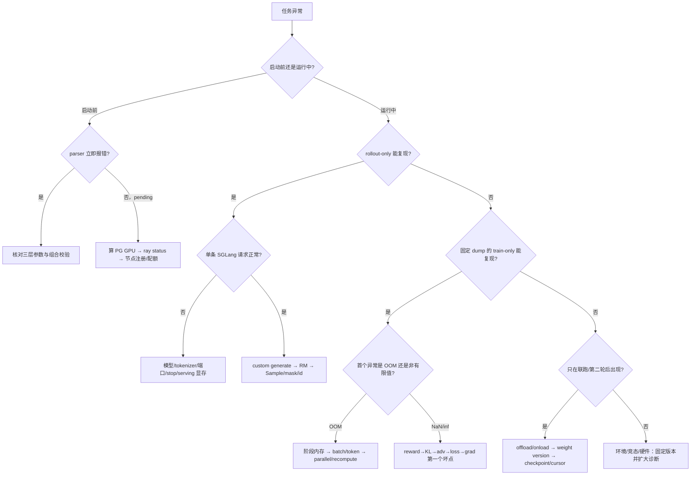

# 08. 调试、可靠性与性能：把“训练挂了”拆成可证伪的问题

> **快照说明**：本文基于 `main@3778dbf6d1a533ab478ecf5ddaa11449a47752b2`（v0.3.2，2026-08-29 扫描）整理。故障表现高度依赖 accelerator、驱动、通信 backend、Ray、Megatron、SGLang 和模型版本；本文命令全部是**示例，不保证在本机直接运行**。任何未实际执行的检查都不能声称“已通过”。

分布式 RL 同时运行数据源、rollout、reward、trainer、checkpoint 与权重同步。“OOM”“卡住”“乱码”只是表象。好的面试回答应体现两个习惯：**按层隔离变量**，以及**先保存能回放的证据**。

## 1. 分层调试地图



| 层 | 先看什么 | 最小证据 | 能排除什么 |
|---|---|---|---|
| 0 复现 | commit、完整参数、容器 digest、依赖、节点/GPU、随机种子 | 一份脱敏后的 job spec | “环境其实不同” |
| 1 参数/文件 | HF/Megatron checkpoint、路径可见性、并行整除、hook import | parser 错误、tracker/config.json、import smoke | 启动前配置错误 |
| 2 Ray | cluster/available resources、placement group、actor logs | `ray status`、pending 原因、节点列表 | 资源不足与调度等待 |
| 3 Serving | health、router、单请求、finish reason、token ids | SGLang log、单条 response、`/metrics` | 生成侧 hang/乱码/stop 问题 |
| 4 Rollout | sample 数量、嵌套形状、token/mask/id/status | debug rollout dump | fan-out、mask、长度错误 |
| 5 Reward | raw reward、归一化后 reward、zero-std、失败分类 | 20 条人工对照 + 分布 | verifier 或 group 逻辑错误 |
| 6 Trainer | 固定 batch 的 loss、KL、entropy、grad norm、显存 | train-only replay | rollout 随机性与训练计算分离 |
| 7 同步/恢复 | actor/engine weight version、checkpoint step、数据游标 | version、tracker、cursor state | stale policy、重复/跳样本 |

**停止条件**：一旦根因、编辑位置和验证方法已经明确，就停止继续扩大搜索；先做最小修复和回归验证。

## 2. 第一步：保留可复现证据

发生故障后优先保留：

- 仓库 commit、dirty diff、容器/环境版本；
- 经过脱敏的完整 CLI 和相关 YAML；
- Ray driver、每个 trainer rank、router/SGLang 的日志时间窗口；
- 最近一个可读 checkpoint、`latest_checkpointed_iteration.txt`；
- 对新 rollout/RM 逻辑保存少量 debug dump；
- 发生同步问题时记录 rollout id、weight version、transport 和版本目录。

示例（采集环境，均不保证本机可运行；输出可能含主机名/路径，分享前脱敏）：

```bash
git rev-parse HEAD
git status --short
python -c 'import torch, ray; print(torch.__version__, torch.version.cuda, ray.__version__)'
nvidia-smi
ray status
```

不要在公开日志中打印 API key、W&B key、数据样本隐私内容或完整 runtime env。

## 3. rollout-only / train-only：可重复回放

这是最有价值的二分法：先证明 rollout 能产出合法数据，再把同一批数据反复喂给 trainer。

### 阶段 A：只跑 rollout 并保存

`--debug-rollout-only` 只创建 rollout 资源；manager 在生成和落盘后直接返回，不转换为训练数据，源码见 [`RolloutManager.generate`](https://github.com/THUDM/slime/blob/3778dbf6d1a533ab478ecf5ddaa11449a47752b2/slime/ray/rollout.py#L163)。

示例（不保证本机可运行，`COMMON_ARGS`/路径必须替换）：

```bash
python3 train.py \
  ${COMMON_ARGS} \
  --debug-rollout-only \
  --save-debug-rollout-data '/secure/debug/rollout_{rollout_id}.pt'
```

dump 由 observability 层的 `save_debug_rollout_data` 写入 `rollout_id` 和 samples，见 [`rollout_data_utils.py`](https://github.com/THUDM/slime/blob/3778dbf6d1a533ab478ecf5ddaa11449a47752b2/slime/observability/rollout_data_utils.py#L140)。**只对可信文件使用 `torch.load`**；dump 还可能包含 prompt、response 和 metadata，路径权限与保留周期必须受控。

### 阶段 B：加载同一 dump，只跑训练

设置 `--load-debug-rollout-data` 会自动进入 train-only，跳过 SGLang 初始化，见 [`slime_validate_args`](https://github.com/THUDM/slime/blob/3778dbf6d1a533ab478ecf5ddaa11449a47752b2/slime/utils/arguments.py#L1901)。

示例（不保证本机可运行）：

```bash
python3 train.py \
  ${COMMON_ARGS} \
  --load-debug-rollout-data '/secure/debug/rollout_{rollout_id}.pt'
```

还可用 `--load-debug-rollout-data-subsample 0.1` 做快速定位，但子采样会改变 group/reward 分布，不能用来证明完整训练数值等价。

训练侧另有一个独立的 dump 开关：`--save-debug-train-data` 保存训练侧每个 step 真正喂给 loss 的张量（token、advantage、logprob 等），实现现位于 [`observability/train_data_utils.py`](https://github.com/THUDM/slime/blob/3778dbf6d1a533ab478ecf5ddaa11449a47752b2/slime/observability/train_data_utils.py#L191)，并能直接复用训练 forward 捕获 log-prob（避免额外前向）。它与 rollout dump 组合，可以把“rollout 数据错了”与“训练消费错了”分开验证，对应 GPU E2E 测试 `test_qwen2.5_0.5B_debug_train_dump_e2e.py`。启动校验明确拒绝 `--save-debug-train-data` 与 `--save-debug-rollout-data` 使用完全相同的路径，避免两类 payload 互相覆盖，见 [`slime_validate_args`](https://github.com/THUDM/slime/blob/3778dbf6d1a533ab478ecf5ddaa11449a47752b2/slime/utils/arguments.py#L1898)。

### 如何解释结果

| 结果 | 更可能的问题层 |
|---|---|
| rollout-only 已失败 | 数据、SGLang、custom generate、工具/RM、端口 |
| rollout-only 成功，train-only 稳定失败 | Sample→train data、并行、loss/advantage、trainer 内存/数值 |
| 两者单独成功，联跑失败 | colocate 切换、权重同步、时序、Ray object store、资源峰值 |
| 同一 dump 有时成功有时失败 | 分布式竞态、未固定随机性、异步 kernel/硬件、未确定行为 |

该两阶段路径不只是文档 recipe：GPU E2E test 先保存两轮 rollout，再加载相同数据训练两轮，见 [`tests/test_qwen2.5_0.5B_debug_rollout_then_train.py`](https://github.com/THUDM/slime/blob/3778dbf6d1a533ab478ecf5ddaa11449a47752b2/tests/test_qwen2.5_0.5B_debug_rollout_then_train.py#L1)，并被 PR workflow 列入，见 [`.github/workflows/pr-test.yml.j2`](https://github.com/THUDM/slime/blob/3778dbf6d1a533ab478ecf5ddaa11449a47752b2/.github/workflows/pr-test.yml.j2#L19)。

## 4. Metrics 与可观测性

### 三种观测面

| 面 | 频率/粒度 | 适合回答 | 不是用来做什么 |
|---|---|---|---|
| W&B / TensorBoard | 每 train/rollout step 聚合 | reward/loss/KL/entropy 趋势、回归对比 | 高频 serving queue 的完整历史 |
| SGLang / router Prometheus | scrape 时序 | running/queued requests、延迟、transfer、吞吐 | per-sample 完整轨迹 |
| debug dump / trace | sample/request spans | 哪条样本长尾、工具耗时、token/mask | 长期低成本全量监控 |

默认 rollout 日志把 sample 指标加 `rollout/` 前缀、性能指标加 `perf/` 前缀，再写日志和 tracker，见 [`observability/rollout_metrics.py`](https://github.com/THUDM/slime/blob/3778dbf6d1a533ab478ecf5ddaa11449a47752b2/slime/observability/rollout_metrics.py#L256)。W&B/TensorBoard 的实际分发在 [`observability/logging_utils.log`](https://github.com/THUDM/slime/blob/3778dbf6d1a533ab478ecf5ddaa11449a47752b2/slime/observability/logging_utils.py#L45)。不要混淆两套同名入口：`rollout_metrics.py` 聚合 generation/sample/request 指标；[`train_metric_utils.py`](https://github.com/THUDM/slime/blob/3778dbf6d1a533ab478ecf5ddaa11449a47752b2/slime/observability/train_metric_utils.py#L142) 在训练 rank 上归约 loss、log-prob、entropy、passrate 与 trainer perf，它们的输入、分布式归约位置和适用故障不同。

### 一组实用指标

| 指标/信号 | 解释 | 异常方向 |
|---|---|---|
| `rollout/response_len/*` | 生成长度分布 | 持续顶到上限通常是 stop/格式/任务难度问题 |
| `rollout/truncated_ratio` | 因长度截断比例 | 突升会改变训练样本与 reward |
| reward mean/std、zero-std | verifier 与 group 是否有区分度 | 全 0、全同分或突然漂移 |
| loss / KL / entropy | policy 更新与探索 | NaN、尖峰、entropy 快速塌缩 |
| grad norm | backward 稳定性 | inf/NaN 或持续极大 |
| `perf/rollout_time` | 整轮墙钟时间 | 与 token 数不成比例增长 |
| `perf/non_generation_time/*` | 工具/RM/环境等非生成耗时 | agent 场景的外部服务瓶颈 |
| `perf/request/queue_time/*` | serving 排队 | engine 并发/路由失衡 |
| SGLang queue/running/transfer | engine 内部状态 | queue 累积、PD transfer 变慢 |

slime 聚合 response length、repetition、truncation 和 SGLang request timing 的实现见 [`compute_metrics_from_samples`](https://github.com/THUDM/slime/blob/3778dbf6d1a533ab478ecf5ddaa11449a47752b2/slime/observability/rollout_metrics.py#L44)。Prometheus endpoint、TSDB 保存与 trace viewer 的部署说明见 [可观测性文档](../advanced/observability.md#prometheus-metrics-存在哪里)。

示例（只演示查看 endpoint，不保证本机可运行）：

```bash
curl --fail --max-time 5 'http://ROUTER_IP:ROUTER_PORT/engine_metrics'
python tools/trace_timeline_viewer.py /secure/debug/rollout_0.pt
```

## 5. 高频故障手册

### 5.1 OOM

先回答“谁在什么阶段 OOM”：SGLang 初始化、rollout KV/cache、训练 forward、backward/optimizer、权重同步转换，还是 checkpoint save。

排查顺序：

1. 用 rollout-only / train-only 隔离。
2. 查看失败前每 rank 的 allocated/reserved、序列长度、有效 token 数和 batch。
3. train-only 先减 `micro-batch-size` 或 `max-tokens-per-gpu`；长序列再评估 CP、recompute、dynamic batch。
4. rollout-only 先减并发、response/context length、`--sglang-mem-fraction-static` 或 CUDA graph batch 上限。
5. colocate 失败而分离成功，检查 offload 切换与初始化峰值；不要只看稳态显存。
6. 权重同步瞬时 OOM，检查 `--update-weight-buffer-size`、HF 转换临时 tensor、CPU pinned snapshot 和 object store。

示例（采样显存，不保证本机可运行）：

```bash
nvidia-smi dmon -s pucm
```

### 5.2 NaN / inf / reward 退化

按数据流找“第一个非有限值”，而不是只在最终 loss 加 `nan_to_num`：

```text
raw reward → normalized reward → log_probs/ref_log_probs → KL
→ advantage/return → policy loss → grad norm → optimizer parameters
```

检查：

- reward 是否全同、存在异常大值或 verifier 基础设施错误混入 0 分；
- loss mask 是否全 0，或 denominator 与 fan-out rollout 不一致；
- rollout temperature/top-p 与训练侧 log-prob 重算是否一致；
- KL、clip、learning rate、混合精度和 grad scaling；
- 首个坏 step 前的权重同步/恢复是否改变了模型。

对固定 dump，从无 optimizer step 的 forward 开始，再依次打开 backward、clip、step；每次只增加一个变量。隐藏 NaN 会让训练“继续跑但已无意义”。

### 5.3 乱码、异常重复、不可读文本

先区分终端显示/编码问题和 token 本身错误：保存 token ids，用 `--hf-checkpoint` 对应 tokenizer 离线 decode，并比较 SGLang 返回 token。

常见原因：

- HF checkpoint 的 tokenizer/chat template 与训练模型架构或词表不一致；
- 自定义 rollout 对 response 做了 decode→拼字符串→retokenize，破坏原采样 token；
- special-token skip、tool parser 或 `loss-mask-type` 与模型不匹配；
- 权重没有正确同步，结构相同但参数 stale/错位；
- 重复本身是模型退化或 stop 未生效，而不是 UTF-8 问题。

不要把“response 字符串看起来正常”当成训练数据正常；真正的训练契约是 token ids、response span 和 mask。

### 5.4 端口冲突 / 连接失败

slime 同时需要 Ray/GCS/dashboard、router HTTP/Prometheus、SGLang server、NCCL/distributed init 等端口。排查时记录“哪个进程、哪个节点、监听还是主动连接”。

示例（不保证本机可运行）：

```bash
ss -ltnp
curl --fail --max-time 3 'http://HOST:PORT/health_generate'
```

多 server group 的端口按节点维护 cursor，避免组间复用；相关分配逻辑已移到 [`engine_group.py`](https://github.com/THUDM/slime/blob/3778dbf6d1a533ab478ecf5ddaa11449a47752b2/slime/backends/sglang_utils/engine_group.py#L390)。容器网络、IPv6、NAT 和 firewall 仍可能让“端口空闲”但跨节点不可达。

### 5.5 stop token 不生效

`--rollout-stop` 传字符串，特殊 token 难以通过 shell 表达时应使用 `--rollout-stop-token-ids`；参数定义见 [`arguments.py`](https://github.com/THUDM/slime/blob/3778dbf6d1a533ab478ecf5ddaa11449a47752b2/slime/utils/arguments.py#L402)。

检查：

1. 用实际 tokenizer 打印目标字符串的 token ids；它可能是多个 token。
2. 检查 chat template 是否给 stop token 加了空格/换行。
3. 同时查看 SGLang `finish_reason` 与 `Sample.status`，不要只看末尾文本。
4. 区分 stop、EOS、length truncation、custom generate 自己的 max-turn 条件。

示例（不保证本机可运行）：

```bash
python -c 'from transformers import AutoTokenizer; t=AutoTokenizer.from_pretrained("/path/to/hf"); print(t.encode("<STOP>", add_special_tokens=False))'
```

### 5.6 Ray placement group 一直 pending

资源公式先看 [第 06 章](06-configuration-resources-and-weight-sync.md)。placement group 无界等待时会每 30 秒报告总 GPU 和可用 GPU，见 [`_create_placement_group`](https://github.com/THUDM/slime/blob/3778dbf6d1a533ab478ecf5ddaa11449a47752b2/slime/ray/placement_group.py#L42)。

检查：

- 所有节点是否注册到同一 Ray 集群，报告的 GPU 数是否正确；
- 分离模式是否误算成只需 `max(A,R)`；
- 已有 actor/placement group 是否占住资源；
- Ray custom resources、节点 label、容器 `CUDA_VISIBLE_DEVICES` 是否一致；
- autoscaler 是正在扩容，还是配额/实例启动失败。

示例（不保证本机可运行）：

```bash
ray status
python -c 'import ray; ray.init(address="auto"); print(ray.nodes()); print(ray.available_resources())'
```

### 5.7 权重不同步

症状包括：训练 loss 变化但 rollout 行为完全不变；engine 重启后退回旧策略；full-disk reload 后版本不一致；乱码/NaN 只在同步后出现。

逐层检查：

1. 训练循环是否真的触发 update；默认初始化后和每轮训练后都有同步，见 [`train.py`](https://github.com/THUDM/slime/blob/3778dbf6d1a533ab478ecf5ddaa11449a47752b2/train.py#L27)。
2. 记录 actor 发布版本、每个 engine 报告版本和 rollout sample 的 `weight_versions`。
3. `full+disk` 检查完整 index/safetensors、共享目录可见性和本地拉取目录。
4. `delta+disk` 检查 base version、delta 顺序、checksum、本地完整 checkpoint；XOR delta 不能重复 apply。
5. engine fault recovery 后必须先更新到正确权重再接请求；但 external rollout engine 当前明确跳过 slime 内建 recover，见 [`external.py`](https://github.com/THUDM/slime/blob/3778dbf6d1a533ab478ecf5ddaa11449a47752b2/slime/backends/sglang_utils/external.py#L169)。
6. 诊断时可开启 `--check-weight-update-equal` 做快照/比较；这会增加成本，不应默认用于大规模长期任务。

full-disk reload 的 engine version 查询与 mismatch 报错当前只在 `--ci-test` 分支执行，并不是默认生产保护，见 [`actor_group.py`](https://github.com/THUDM/slime/blob/3778dbf6d1a533ab478ecf5ddaa11449a47752b2/slime/ray/actor_group.py#L255)。版本目录默认也可能被清理；需要保留时显式设置 `--update-weight-disk-keep-files`。对应 GPU E2E test 会验证版本目录、index 和 safetensors 存在，见 [`tests/test_full_disk_weight_update.py`](https://github.com/THUDM/slime/blob/3778dbf6d1a533ab478ecf5ddaa11449a47752b2/tests/test_full_disk_weight_update.py#L130)。生产环境仍应自行记录并核对每个 engine 的版本。

## 6. checkpoint 与数据游标：恢复的是一个一致性边界

完整恢复不只是“模型文件能 load”。至少有四类状态：

| 状态 | 例子 | 丢失后的表现 |
|---|---|---|
| 模型/optimizer/scheduler/RNG | Megatron checkpoint | 参数倒退、学习率错、随机轨迹变化、无法续训 |
| 训练进度 | loaded rollout id / checkpoint tracker | 重跑或跳过训练 step |
| rollout 数据游标 | offset、epoch、sample/group index | 重复或漏掉 prompt，shuffle 顺序变化 |
| 权重同步版本 | full/delta version、engine 本地 base | stale engine 或 delta apply 到错误 base |

默认全局数据源保存 offset、epoch 和 indices 到 `save/rollout/global_dataset_state_dict_{rollout_id}.pt`，见 [`RolloutDataSource.save`](https://github.com/THUDM/slime/blob/3778dbf6d1a533ab478ecf5ddaa11449a47752b2/slime/rollout/data_source.py#L123)。非 PPO 路径会检查 actor group 内 IDs 一致；PPO 当前只采用并检查 critic group 的 IDs，并不比较 actor 与 critic，也不把显式 `--start-rollout-id` 与 checkpoint ID 交叉校验（显式值自 [PR #2236](https://github.com/THUDM/slime/pull/2236) 起不再被参数校验覆盖为 0，但交叉校验仍不存在），见 [`placement_group.py`](https://github.com/THUDM/slime/blob/3778dbf6d1a533ab478ecf5ddaa11449a47752b2/slime/ray/placement_group.py#L208)。恢复 PPO 前必须额外核对两侧 checkpoint。同步训练主循环在 checkpoint 边界保存 data source，见 [`train.py`](https://github.com/THUDM/slime/blob/3778dbf6d1a533ab478ecf5ddaa11449a47752b2/train.py#L80)。

异步模式还存在更强限制：`train_async.py` 会在训练/保存模型 N 之前预提交 `generate(N+1)`，manager 保存数据游标时 offset 可能已经越过 N+1；fully-async 的 active tasks、完成队列和 buffer 也没有随模型持久化。因此当前实现不能承诺异步 exact resume，恢复后可能跳过或重排 prompt。若业务要求精确恢复，需要把 prompt 预留、在途任务、完成队列与模型版本设计成同一可恢复事务，并用故障注入验证。

恢复前检查清单：

- tracker 指向的 step 是否存在且所有 rank 文件完整；
- optimizer/RNG 是否真的保存；使用 `--no-save-optim` 不能声称完整续训；
- `start_rollout_id` 与数据游标文件是否相邻一致；
- PPO 的 actor 与 critic checkpoint progress 是否一致；异步任务是否接受非 exact resume；
- 若改变 world size/TP/PP/CP/EP，checkpoint loader 是否支持该重分片；
- delta 链能否从 engine 本地 base 连续推进，必要时以 full checkpoint 重置链。

示例（只读核对，不保证本机可运行）：

```bash
cat /path/to/save/latest_checkpointed_iteration.txt
find /path/to/save/rollout -maxdepth 1 -name 'global_dataset_state_dict_*.pt' -print | tail
```

## 7. 容错边界：系统能恢复什么

| 能力 | 当前证据 | 边界 |
|---|---|---|
| 本地 rollout engine health monitor 与重建 | manager 创建 monitor，恢复 dead engine 后重新处理权重，见 [`rollout.py`](https://github.com/THUDM/slime/blob/3778dbf6d1a533ab478ecf5ddaa11449a47752b2/slime/ray/rollout.py#L224) | 不是 trainer rank 的透明恢复 |
| debug dump/replay | 源码 + GPU E2E CI | dump 不是分布式事务 checkpoint；落盘前崩溃仍会丢 |
| checkpoint resume | 多组 checkpoint GPU tests 被列入 CI，[workflow](https://github.com/THUDM/slime/blob/3778dbf6d1a533ab478ecf5ddaa11449a47752b2/.github/workflows/pr-test.yml.j2#L28) | 只覆盖测试矩阵中的模型/拓扑/保存模式 |
| external engine fault recovery | 源码明确不支持 | 必须由外部编排/服务自身负责 |
| 整作业抢占、节点永久故障 | 需要 Ray/调度器/checkpoint 共同处理 | slime 的 rollout health check 不能替代集群级恢复 |

项目文档将当前容错重点描述为 rollout-engine health check、重启、重新更新参数与 debug replay，见 [容灾文档](../advanced/fault-tolerance.md#当前覆盖范围)。面试时应明确说：**rollout 侧自愈 ≠ exactly-once 数据处理 ≠ trainer 自动容错 ≠ 全作业无损恢复。**

## 8. 性能瓶颈定位

先分解一轮墙钟：

```text
T_round ≈ T_rollout + T_reward/tool + T_convert/transfer
        + T_train + T_checkpoint + T_weight_sync + T_offload/onload
```

| 瓶颈 | 证据形态 | 优先实验 |
|---|---|---|
| rollout decode | GPU 利用高、decode throughput 低、response 很长 | 长度分布、batch/concurrency、TP、spec decode |
| router/排队 | queue time、num_queue_reqs 上升，部分 engine 空闲 | 路由策略、engine 数、请求长度倾斜 |
| agent 工具/RM | `non_generation_time` 高，SGLang GPU 空闲 | 外部服务并发、cache、timeout、异步化、sandbox boot 限流 |
| trainer compute | train-only 慢、GPU 利用高 | TP/PP/CP、dynamic batch、recompute、kernel/backend |
| padding/负载不均 | rank step time 差异大、有效 token/总 token 比低 | 按 token/FLOPs balance、microbatch packing |
| rollout data transport | Ray object store 压力、spill/serialization | tensor 化、对象尺寸、评估 NIXL transport |
| full NCCL sync | sync 阶段网络/显存峰值 | buffer size、网络拓扑、同步频率 |
| full disk sync/checkpoint | I/O 吞吐打满、version 发布慢 | 本地 NVMe、并行 I/O、降低频率、评估 delta |
| offload/onload | 训推切换间隙大 | 分离部署对照、减少切换、release 与 offload 成本对照 |

性能改动要用**相同 dump/相同有效 token 数**对照。仅比较每 step 秒数可能被 response 变短、过滤更多样本或 loss mask 变少“优化”。Profiling 工具入口见 [性能分析文档](../developer_guide/profiling.md#3-使用自动化-profiling-工具)。

## 9. 排障决策树



## 10. 实现、CPU 测试、GPU E2E 与生产验证要分开

| 表述层级 | 可以怎样说 | 不能怎样说 |
|---|---|---|
| 实现/项目声明 | “当前源码实现了 rollout health monitor”“参数校验拒绝 delta+NCCL” | “所有故障都会自动恢复” |
| CPU unit/contract test | “纯逻辑分派、参数校验或数据契约有回归保护” | “GPU kernel、显存和跨机通信已经验证” |
| GPU E2E | “workflow 在列出的模型、GPU 数、镜像和拓扑运行过该路径” | “所有卡型、规模、colocate/FP8/DeepEP 组合都被覆盖” |
| 生产验证 | 给出实际卡型/规模、网络、运行时长、故障注入与 SLO 后描述观察结果 | 用 recipe、README 或一次短测承诺兼容性、稳定性或性能 SLA |

当前 PR test 模板明确列出 full-disk、release-train、debug replay、external PD、fan-out、SGLang config 与多种 checkpoint 组合，见 [`.github/workflows/pr-test.yml.j2`](https://github.com/THUDM/slime/blob/3778dbf6d1a533ab478ecf5ddaa11449a47752b2/.github/workflows/pr-test.yml.j2#L1)。这是很强的回归信号，但仍是有限的镜像、模型、GPU 数和测试时长。

## 11. 一套最小响应流程

1. 冻结 commit、镜像、CLI/YAML，保留时间对齐日志。
2. 明确首个失败阶段和首个异常值，不从最终异常倒猜。
3. 若能生成，保存一个可信 debug dump。
4. rollout-only 与 train-only 二分。
5. 对 OOM 改一个内存变量；对 NaN 找第一个坏 tensor；对 hang 看 queue/placement/端口。
6. 若只在联跑出现，检查 offload/onload、同步 version 和 checkpoint/cursor 边界。
7. 修复后用最小单测/契约测试，再用原始最小复现验证；最后比较完整 diff 和 workspace 状态。

## 12. 面试速答

**问：为什么 replay 对 RL 系统特别重要？**

答：rollout 含采样、工具和外部服务随机性。保存合法 Sample 后用 train-only 重放，能固定训练输入，把 serving/reward 与 Megatron 数值问题分开。

**问：Ray pending 为什么不一定是死锁？**

答：placement group 可能在等节点注册或 autoscaler 扩容；先比较所需 GPU 与 cluster/available resources。slime 会周期打印资源，而等待本身无界。

**问：训练恢复只看 checkpoint 可以吗？**

答：不够。还要对齐 rollout id、数据源游标和权重同步版本；否则模型恢复了，数据可能重复/跳过，engine 也可能仍是旧权重。

**问：怎样证明性能真的提升？**

答：固定 dump、有效 token 数、硬件和版本，对比端到端 round time并分解 rollout/tool/train/sync/I/O；不能用更短输出或更多 mask 伪装吞吐提升。
