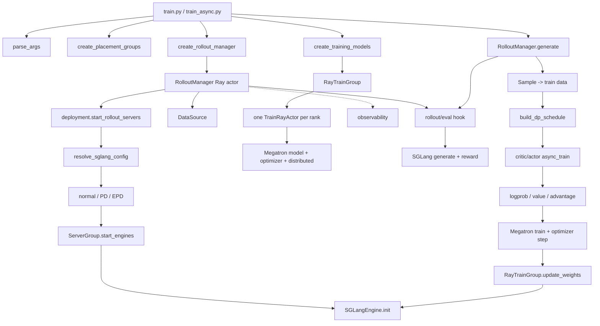

# 09. 源码阅读路线：从 99 行入口追到训练内核

> 适用快照：`v0.3.2@3778dbf6`（扫描日期 2026-08-29）。本篇的目标不是逐文件翻译，而是用最少的阅读量建立可验证的调用链。

## 1. 先看仓库分层

| 路径 | 职责 | 初读优先级 |
|---|---|---:|
| [`train.py`](https://github.com/THUDM/slime/blob/3778dbf6d1a533ab478ecf5ddaa11449a47752b2/train.py) | 标准同步 round 的总控入口 | P0 |
| [`train_async.py`](https://github.com/THUDM/slime/blob/3778dbf6d1a533ab478ecf5ddaa11449a47752b2/train_async.py) | 生成 N+1 与训练 N 重叠的入口 | P0 |
| [`slime/ray/`](https://github.com/THUDM/slime/tree/3778dbf6d1a533ab478ecf5ddaa11449a47752b2/slime/ray) | Ray 资源布局、actor group、rollout 控制面 | P0 |
| [`slime/rollout/`](https://github.com/THUDM/slime/tree/3778dbf6d1a533ab478ecf5ddaa11449a47752b2/slime/rollout) | data source、SGLang 生成、reward/filter、fully async 等策略 | P0 |
| [`slime/utils/types.py`](https://github.com/THUDM/slime/blob/3778dbf6d1a533ab478ecf5ddaa11449a47752b2/slime/utils/types.py) | `Sample`、`RolloutBatch` 等跨模块数据契约 | P0 |
| [`slime/utils/dp_schedule.py`](https://github.com/THUDM/slime/blob/3778dbf6d1a533ab478ecf5ddaa11449a47752b2/slime/utils/dp_schedule.py) | step、micro-batch 和 DP rank 调度 | P0 |
| [`slime/backends/megatron_utils/`](https://github.com/THUDM/slime/tree/3778dbf6d1a533ab478ecf5ddaa11449a47752b2/slime/backends/megatron_utils) | Megatron 初始化、batch、前向、advantage/loss、checkpoint、权重转换 | P0/P1 |
| [`slime/backends/sglang_utils/`](https://github.com/THUDM/slime/tree/3778dbf6d1a533ab478ecf5ddaa11449a47752b2/slime/backends/sglang_utils) | SGLang deployment、normal/PD/EPD topology、server group、engine、router 与 external engine | P1 |
| [`slime/observability/`](https://github.com/THUDM/slime/tree/3778dbf6d1a533ab478ecf5ddaa11449a47752b2/slime/observability) | 日志、指标归约、trace、profile、rollout/train debug data | P1 |
| [`slime/utils/accelerator/`](https://github.com/THUDM/slime/tree/3778dbf6d1a533ab478ecf5ddaa11449a47752b2/slime/utils/accelerator) | backend-aware device/stream/memory/distributed 接口及 CUDA、MUSA 实现 | P1/P2 |
| [`slime_plugins/`](https://github.com/THUDM/slime/tree/3778dbf6d1a533ab478ecf5ddaa11449a47752b2/slime_plugins) | 新模型结构插件（如 qwen3_5_vl）、rollout buffer 等扩展；HF↔Megatron 权重映射已内部化到 `slime/backends/megatron_utils/hf_to_megatron/`（#2251） | P2 |
| [`scripts/`](https://github.com/THUDM/slime/tree/3778dbf6d1a533ab478ecf5ddaa11449a47752b2/scripts) | 模型结构 recipe 与标准启动脚本 | P1 |
| [`examples/`](https://github.com/THUDM/slime/tree/3778dbf6d1a533ab478ecf5ddaa11449a47752b2/examples) | agentic、VLM、async、OPD、delta sync 等场景 | P1/P2 |
| [`tests/`](https://github.com/THUDM/slime/tree/3778dbf6d1a533ab478ecf5ddaa11449a47752b2/tests) | 最接近“可执行规范”的行为证据 | P0/P1 |

不要从 2000 行的 `arguments.py` 或 1300 行的 `loss.py` 第一行顺序读起。先让入口告诉你“何时调用”，再到实现里回答“怎样调用”。

## 2. 90 分钟最短路径

### 第 0—15 分钟：只读外层闭环

打开 [`train.py:9-99`](https://github.com/THUDM/slime/blob/3778dbf6d1a533ab478ecf5ddaa11449a47752b2/train.py#L9)，给每一段写一个动词：

1. `create_placement_groups`：占资源。
2. `create_rollout_manager`：起 serving 和数据源。
3. `create_training_models`：起 actor/critic ranks。
4. `generate`：产训练数据。
5. `critic.async_train` / `actor.async_train`：算 value、advantage、loss 并优化。
6. `save_model` / `rollout_manager.save`：保存模型和数据游标。
7. `update_weights`：把 actor 推给 SGLang。
8. `eval`：按周期评估。

此时先不钻进函数。你应该能回答“训练一轮的 happens-before 关系”，并注意同步入口在 rollout 0 前还有一个可选 baseline eval，而异步入口没有。

### 第 15—30 分钟：资源和 actor 是怎样创建的

依次读：

- [`_get_placement_group_layout`](https://github.com/THUDM/slime/blob/3778dbf6d1a533ab478ecf5ddaa11449a47752b2/slime/ray/placement_group.py#L100)：分离、colocate、external、debug 模式需要多少 GPU bundle。
- [`_create_placement_group`](https://github.com/THUDM/slime/blob/3778dbf6d1a533ab478ecf5ddaa11449a47752b2/slime/ray/placement_group.py#L42)：为什么使用 `PACK`，为什么还要按节点 IP/GPU id 重排 bundle。
- [`create_training_models`](https://github.com/THUDM/slime/blob/3778dbf6d1a533ab478ecf5ddaa11449a47752b2/slime/ray/placement_group.py#L186)：何时创建 critic，恢复的 rollout id 如何确定。
- [`RayTrainGroup._allocate_gpus_for_actor`](https://github.com/THUDM/slime/blob/3778dbf6d1a533ab478ecf5ddaa11449a47752b2/slime/ray/actor_group.py#L57)：为什么每个 rank 是一个 Ray actor，如何固定到 placement bundle。
- [`TrainRayActor`](https://github.com/THUDM/slime/blob/3778dbf6d1a533ab478ecf5ddaa11449a47752b2/slime/ray/train_actor.py)：actor 内怎样建立 torch distributed 环境。

阅读问题：Ray 负责的是调度还是张量并行计算？答案是前者；Megatron/torch distributed 才完成训练 collective。

### 第 30—50 分钟：一条数据怎样过 rollout

依次读：

- [`Sample`](https://github.com/THUDM/slime/blob/3778dbf6d1a533ab478ecf5ddaa11449a47752b2/slime/utils/types.py#L94)：先看字段，不看后续所有工具方法。
- [`RolloutDataSource.get_samples`](https://github.com/THUDM/slime/blob/3778dbf6d1a533ab478ecf5ddaa11449a47752b2/slime/rollout/data_source.py#L90)：一个 prompt 怎样深拷贝成 sibling group。
- [`generate_rollout`](https://github.com/THUDM/slime/blob/3778dbf6d1a533ab478ecf5ddaa11449a47752b2/slime/rollout/sglang_rollout.py#L627)：定位默认函数，再跟到 per-group generate/reward。
- [`RolloutManager.generate`](https://github.com/THUDM/slime/blob/3778dbf6d1a533ab478ecf5ddaa11449a47752b2/slime/ray/rollout.py#L163)：生成结果怎样进入转换与 DP 切分。
- [`_convert_samples_to_train_data`](https://github.com/THUDM/slime/blob/3778dbf6d1a533ab478ecf5ddaa11449a47752b2/slime/ray/rollout.py#L306)：哪些字段真正跨到训练侧。
- [`build_dp_schedule`](https://github.com/THUDM/slime/blob/3778dbf6d1a533ab478ecf5ddaa11449a47752b2/slime/utils/dp_schedule.py#L82)：step 先按 `rollout_id` 组成，再 pack micro-batch，最后分给 DP rank。

此时在纸上写出一个样本的形状变化：

```text
dataset row
  -> Sample(prompt, label, metadata)
  -> Sample(tokens, response, reward, rollout_log_probs, loss_mask)
  -> dict[list] / RolloutBatch
  -> per-rank partition + list[micro-batch]
  -> packed Megatron tensors
```

### 第 50—70 分钟：训练侧为什么要多次前向

读 [`MegatronTrainRayActor.train_actor`](https://github.com/THUDM/slime/blob/3778dbf6d1a533ab478ecf5ddaa11449a47752b2/slime/backends/megatron_utils/actor.py#L391)，只跟五条分支：

1. reference 前向：需要 reward KL 或 KL loss 时产生 `ref_log_probs`。
2. teacher 前向：OPD 场景产生 `teacher_log_probs`。
3. old/current actor 前向：得到训练侧 logprob，或在满足条件时复用 loss 内前向。
4. critic values：PPO 从 critic actor 的 Ray refs 传入。
5. `compute_advantages_and_returns` 后进入 `train(...)`。

然后读 [`compute_advantages_and_returns`](https://github.com/THUDM/slime/blob/3778dbf6d1a533ab478ecf5ddaa11449a47752b2/slime/backends/megatron_utils/loss.py#L704) 的 estimator 分派，不要先读整份 policy loss。先回答“输入是什么、输出是什么、哪条分支需要 values”。

### 第 70—90 分钟：权重怎样回到 serving

从 [`RayTrainGroup.update_weights`](https://github.com/THUDM/slime/blob/3778dbf6d1a533ab478ecf5ddaa11449a47752b2/slime/ray/actor_group.py#L162) 往下追，再看独立的 [`create_weight_updater` factory](https://github.com/THUDM/slime/blob/3778dbf6d1a533ab478ecf5ddaa11449a47752b2/slime/backends/megatron_utils/update_weight/__init__.py#L10)：

- 普通 full + NCCL/distributed；
- colocate 下 tensor/CUDA IPC；
- full + disk checkpoint reload；
- delta + disk patch/reload。

最后回到 `train.py`，解释为什么 `optimizer.step()` 已经发生后还必须 `actor_model.update_weights()`。

## 3. 主调用图



## 4. P0 文件：读什么、跳过什么

### `train.py`：外层状态机

重点：初始化顺序、offload/onload、critic-only warmup、周期保存、权重同步、eval。

初读可跳过：tracking 的具体后端。它不改变核心 happens-before。

自测：如果 `generate` 成功但 actor train 失败，哪些状态可能已经推进？dataset cursor 何时保存？

### `train_async.py`：只有一轮 look-ahead

重点看 [`32-73`](https://github.com/THUDM/slime/blob/3778dbf6d1a533ab478ecf5ddaa11449a47752b2/train_async.py#L32)：future 何时提交、何时 `ray.get`、同步权重前为何 drain future、为何断言非 colocate。

自测：画出 round 0、1、2 的 generation/train/weight-sync 时间条；说明 `update_weights_interval > 1` 会怎样改变采样策略版本。

### `slime/ray/placement_group.py`：逻辑角色到物理 GPU

重点：

- 分离模式 GPU 数是 actor 加 rollout；colocate 取二者最大值。
- external rollout 不为本地 serving 占 GPU，但 placement 仍要满足训练相关路径的布局约束。
- critic 当前复用 actor placement；PPO 阶段通过 offload/切换而不是另加一套常驻 GPU。
- rollout manager 无 GPU，真正的 SGLang engine actor 才占卡。

自测：给出 2 节点×8 卡、actor 8 卡、rollout 8 卡在分离和 colocate 下的资源公式。

### `slime/ray/rollout.py`：最重要也最容易迷路

按函数读，不要顺读全文件：

1. [`RolloutManager.__init__`](https://github.com/THUDM/slime/blob/3778dbf6d1a533ab478ecf5ddaa11449a47752b2/slime/ray/rollout.py#L41)
2. [`generate`](https://github.com/THUDM/slime/blob/3778dbf6d1a533ab478ecf5ddaa11449a47752b2/slime/ray/rollout.py#L163)
3. `_get_rollout_data`
4. [`_post_process_rewards`](https://github.com/THUDM/slime/blob/3778dbf6d1a533ab478ecf5ddaa11449a47752b2/slime/ray/rollout.py#L279)
5. [`_convert_samples_to_train_data`](https://github.com/THUDM/slime/blob/3778dbf6d1a533ab478ecf5ddaa11449a47752b2/slime/ray/rollout.py#L306)
6. [`_split_train_data_by_dp`](https://github.com/THUDM/slime/blob/3778dbf6d1a533ab478ecf5ddaa11449a47752b2/slime/ray/rollout.py#L428)

第一遍到此为止：把 server 启动、health monitor、多模型配置留到第二遍。

### 第二遍：SGLang 部署从配置到 engine

第二遍不要再沿旧版大文件 `rollout.py` 找 server 创建；按下面的部署链读：

```text
RolloutManager.__init__
  -> deployment.start_rollout_servers
  -> sglang_config.resolve_sglang_config
  -> normal branch / disaggregation.start_pd_server_groups / start_epd_server_groups
  -> ServerGroupPlacement.create
  -> ServerGroup.start_engines
  -> SGLangEngine.init
```

1. [`RolloutManager.__init__`](https://github.com/THUDM/slime/blob/3778dbf6d1a533ab478ecf5ddaa11449a47752b2/slime/ray/rollout.py#L41)：只看 lifecycle 起点、init handles 的等待、health monitor 和权重更新锁。
2. [`start_rollout_servers`](https://github.com/THUDM/slime/blob/3778dbf6d1a533ab478ecf5ddaa11449a47752b2/slime/backends/sglang_utils/deployment.py#L79)：看 external 分支、router、model loop，以及 normal/PD/EPD 分派。
3. [`resolve_sglang_config`](https://github.com/THUDM/slime/blob/3778dbf6d1a533ab478ecf5ddaa11449a47752b2/slime/backends/sglang_utils/sglang_config.py#L210)：区分 YAML、legacy `prefill_num_servers` 与默认 regular group。
4. [`start_pd_server_groups` / `start_epd_server_groups`](https://github.com/THUDM/slime/blob/3778dbf6d1a533ab478ecf5ddaa11449a47752b2/slime/backends/sglang_utils/disaggregation.py#L14)：PD 可直接依次发起；EPD 必须先等 encoder 并把 URL 注入后续 group。
5. [`ServerGroup.start_engines`](https://github.com/THUDM/slime/blob/3778dbf6d1a533ab478ecf5ddaa11449a47752b2/slime/backends/sglang_utils/engine_group.py#L63)：看 GPU offset、placeholder、端口、Ray actor 和 init handles。
6. [`SGLangEngine.init`](https://github.com/THUDM/slime/blob/3778dbf6d1a533ab478ecf5ddaa11449a47752b2/slime/backends/sglang_utils/sglang_engine.py#L105)：最后才落到 server args、进程启动和 router 注册。

模块边界要口述清楚：`rollout.py` 管 rollout/data-source 生命周期，`deployment.py` 管拓扑装配，`engine_group.py` 管同构 engine actors；`slime/observability/` 记录指标、trace、profile 和 debug data，不参与部署决策。故障恢复会再次调用 group 的 `start_engines()`，但这仍由 rollout lifecycle 协调。

### `slime/rollout/sglang_rollout.py`：默认生成策略

用 `rg -n '^(async )?def |^def '` 先列函数。阅读重点：

- sampling params 如何构造；
- `n_samples_per_prompt` group 怎样并发；
- SGLang 返回 token/logprob/finish reason 后怎样写回 `Sample`；
- custom generate 与 custom RM 在何处被调用；
- dynamic sampling 为什么要过采样；
- ABORTED、TRUNCATED、FAILED 如何流转。

### `slime/utils/types.py`：跨边界契约

必看字段：

- `group_index`：同一 prompt 的 sibling group；
- `index`：默认样本序号；
- `rollout_id`：一次生成执行的身份，fan-out siblings 必须共享；
- `tokens/response_length/loss_mask`：训练 token 边界；
- `rollout_log_probs`：真实 serving behavior logprob；
- `reward/status/metadata/train_metadata`：奖励、失败和扩展语义。

再读 [`append_response_tokens`](https://github.com/THUDM/slime/blob/3778dbf6d1a533ab478ecf5ddaa11449a47752b2/slime/utils/types.py#L253)，理解 agent/tool 轨迹为什么必须把环境 observation 标成 `trainable=False`。

### `slime/utils/dp_schedule.py`：性能与正确性交界

读函数注释和四阶段实现：

1. 按唯一 rollout id 组成完整 training step；
2. 静态按 sample 数或动态按 token cap 打 micro-batch；
3. 将 micro-batch 数对齐 DP/VPP 约束；
4. round-robin 或按估计 FLOPs 分给各 DP rank。

这里的 `global_batch_size` 表示每 step 的 **distinct rollout ID 数**。默认路径中每个物理 Sample 会得到一个唯一 ID，所以 `n_samples_per_prompt>1` 时这些响应都会计入 GBS；只有 custom fan-out 显式让多个 siblings 共享 ID 时，它们才合计为一个逻辑 rollout。scheduler 不查看 loss mask，因而全零 mask 的 ID 仍占 GBS slot。不要把“按 rollout ID”误读成“总是只按 prompt 数”。

### `slime/backends/megatron_utils/data.py`：从 Python list 到 packed tensor

重点：padding、response mask 对齐、packed sequence、context parallel slicing、多模态字段。这里回答“变长序列如何进入 Megatron”。

### `slime/backends/megatron_utils/actor.py`：训练角色状态机

分两遍：

- 第一遍只读 `init`、`train_critic`、`train_actor`、`save_model`、`update_weights`。
- 第二遍再读 model switch/backup、routing replay、offload/wake-up 和 updater 实现。

权重 updater 的**选择**已从 actor 初始化中提取到 [`update_weight/__init__.py:create_weight_updater`](https://github.com/THUDM/slime/blob/3778dbf6d1a533ab478ecf5ddaa11449a47752b2/slime/backends/megatron_utils/update_weight/__init__.py#L10)。先读 factory 的 `delta` / `disk` / `colocate tensor` / `NCCL distributed` 四个分支，再进入对应实现；不要再从 `actor.py` 猜分派条件。

### `slime/backends/megatron_utils/loss.py` 与 `ppo_utils.py`

用调用点切入：

- `compute_advantages_and_returns`：estimator 分派；
- policy loss：ratio、clip、KL、TIS/OPD；
- value loss：critic 目标；
- reducer：token、sample、rollout 归约；
- `ppo_utils.py`：GSPO sequence ratio、CISPO、GAE、R++ return。

不要把函数名当论文结论。实现还受 `loss_mask`、归一化、KL 位置、old logprob 来源、reducer 和自定义 hook 影响。

### `slime/observability/` 与 `slime/utils/accelerator/`

`observability/` 是诊断横切层：从 `logging_utils.py` 看 tracking 生命周期，从 `rollout_metrics.py` / `train_metric_utils.py` 看指标，从 `rollout_data_utils.py` / `train_data_utils.py` 看 debug dump/replay，再按需要读 trace、profile 和 timer。它不拥有 rollout lifecycle，也不决定 SGLang topology。

`utils/accelerator/` 先读 [`get_accelerator`](https://github.com/THUDM/slime/blob/3778dbf6d1a533ab478ecf5ddaa11449a47752b2/slime/utils/accelerator/__init__.py#L176) 的 backend 选择，再看 `base.py` contract 和 CUDA/MUSA 实现。仓库中的抽象与 [`tests/test_accelerator.py`](https://github.com/THUDM/slime/blob/3778dbf6d1a533ab478ecf5ddaa11449a47752b2/tests/test_accelerator.py) 能证明接口行为被测试；不能仅凭这些文件宣称目标 MUSA 机器上的完整训练/rollout E2E 已验证。

## 5. 用测试当“可执行规范”

以下测试适合按主题阅读：

| 想确认的行为 | 测试 |
|---|---|
| `Sample` token/mask/logprob 契约 | [`tests/test_sample.py`](https://github.com/THUDM/slime/blob/3778dbf6d1a533ab478ecf5ddaa11449a47752b2/tests/test_sample.py) |
| rollout 数据 tensorize、ID/routing replay 校验与 debug I/O | [`tests/test_rollout_data_utils.py`](https://github.com/THUDM/slime/blob/3778dbf6d1a533ab478ecf5ddaa11449a47752b2/tests/test_rollout_data_utils.py) |
| rollout id、step 与 DP 调度 | [`tests/test_dp_schedule.py`](https://github.com/THUDM/slime/blob/3778dbf6d1a533ab478ecf5ddaa11449a47752b2/tests/test_dp_schedule.py) |
| CISPO 公式与梯度 | [`tests/test_cispo_loss.py`](https://github.com/THUDM/slime/blob/3778dbf6d1a533ab478ecf5ddaa11449a47752b2/tests/test_cispo_loss.py) |
| CP 下 loss 不变量 | [`tests/test_loss_cp_invariance.py`](https://github.com/THUDM/slime/blob/3778dbf6d1a533ab478ecf5ddaa11449a47752b2/tests/test_loss_cp_invariance.py) |
| plugin import path/contract | [`tests/plugin_contracts/`](https://github.com/THUDM/slime/tree/3778dbf6d1a533ab478ecf5ddaa11449a47752b2/tests/plugin_contracts) |
| full disk 权重更新 | [`tests/test_full_disk_weight_update.py`](https://github.com/THUDM/slime/blob/3778dbf6d1a533ab478ecf5ddaa11449a47752b2/tests/test_full_disk_weight_update.py) |
| external engine | [`tests/test_external_sglang_engines.py`](https://github.com/THUDM/slime/blob/3778dbf6d1a533ab478ecf5ddaa11449a47752b2/tests/test_external_sglang_engines.py) |
| placement 资源公式 | [`tests/test_placement_group.py`](https://github.com/THUDM/slime/blob/3778dbf6d1a533ab478ecf5ddaa11449a47752b2/tests/test_placement_group.py) |
| rollout→train replay | [`tests/test_qwen2.5_0.5B_debug_rollout_then_train.py`](https://github.com/THUDM/slime/blob/3778dbf6d1a533ab478ecf5ddaa11449a47752b2/tests/test_qwen2.5_0.5B_debug_rollout_then_train.py) |
| PPO actor/critic | [`tests/test_qwen3_4B_ppo.py`](https://github.com/THUDM/slime/blob/3778dbf6d1a533ab478ecf5ddaa11449a47752b2/tests/test_qwen3_4B_ppo.py) |
| 流水异步/fully async | [`tests/test_qwen3.5_0.8B_gsm8k_async_short.py`](https://github.com/THUDM/slime/blob/3778dbf6d1a533ab478ecf5ddaa11449a47752b2/tests/test_qwen3.5_0.8B_gsm8k_async_short.py)、[`tests/test_qwen2.5_0.5B_fully_async_short.py`](https://github.com/THUDM/slime/blob/3778dbf6d1a533ab478ecf5ddaa11449a47752b2/tests/test_qwen2.5_0.5B_fully_async_short.py) |

本地环境允许时，优先跑最小 CPU 范围；GPU E2E 依赖项目镜像、模型、数据和卡数，不能把“pytest 命令启动了”当成功：

```bash
pytest -q tests/test_sample.py tests/test_dp_schedule.py tests/test_cispo_loss.py
pytest -q tests/plugin_contracts
```

## 6. 四条专项追踪路线

### 路线 A：新增自定义 reward

```text
arguments.py --custom-rm-path
  -> misc.load_function
  -> sglang_rollout generate_and_rm_group
  -> Sample.reward
  -> RolloutManager._post_process_rewards
  -> compute_advantages_and_returns
```

重点验证：同步/异步签名、标量还是字典 reward、group RM 顺序、失败策略、zero-variance group、日志字段。

### 路线 B：排查 train/infer logprob mismatch

```text
SGLang rollout_log_probs
  -> Sample.rollout_log_probs
  -> train data rollout_log_probs
  -> Megatron current/old log_probs
  -> ratio / mismatch metrics / TIS
```

重点验证：tokenizer/chat template、stop token、温度/top-p、精度、MoE routing、loss mask 和 response span 是否一致。

### 路线 C：恢复训练

```text
Megatron checkpoint load
  -> actor / critic workers各自返回 next rollout id
  -> 普通训练与 eval-only 取 actor；PPO 训练当前只选 critic
  -> 检查被选中角色的组内一致
  -> RolloutDataSource.load(start_rollout_id - 1)
  -> outer loop resumes
```

重点验证：actor/critic checkpoint 是否配套、显式 start id 是否一致、optimizer/RNG 是否加载、global dataset state 是否存在、`--load` 与 `--save` 是否同一生命周期。eval-only 不创建 critic，恢复 ID 来自 actor；PPO 训练当前不比较 actor 与 critic IDs。异步 driver 还可能先生成 N+1 再保存模型 N，使数据游标领先，fully-async 的 active/finished queue 也不持久化，所以不能把这条路径描述成异步 exact resume。

### 路线 D：rollout 长尾

```text
sglang_rollout asyncio group
  -> round waits for required valid groups
  -> train_async N/N+1 overlap
  -> fully_async background worker + warm queue
```

重点验证：P50/P95/P99 trajectory latency、队列深度、ABORTED 重试、权重版本、评估与 checkpoint 语义。fully-async 自 [PR #2238](https://github.com/THUDM/slime/pull/2238) 起通过 `get_completed_groups(limit=...)` 按需取完成组，多余的留在队列供下一轮消费，并以 `qsize` 门限对新任务做背压；阅读时应把“queue stays warm”契约与 ABORTED 组回炉这两条分开验证。

## 7. 读启动脚本的方法

以 [`scripts/run-glm4-9B.sh`](https://github.com/THUDM/slime/blob/3778dbf6d1a533ab478ecf5ddaa11449a47752b2/scripts/run-glm4-9B.sh) 为例，不要逐参数背诵，按以下组拆：

1. `MODEL_ARGS`：模型结构和 Megatron 并行前提。
2. `CKPT_ARGS`：HF config/tokenizer、reference、actor load/save。
3. `ROLLOUT_ARGS`：数据、group、reward、采样、round 数。
4. `EVAL_ARGS`：评估数据与覆盖采样参数。
5. `PERF_ARGS`：dynamic batch、token cap、TP/PP/CP/EP 等。
6. algorithm/loss：estimator、KL、clip、归一化。
7. optimizer：学习率、warmup、weight decay。
8. SGLang：TP、memory fraction、concurrency、router。
9. Ray job：head 地址、runtime env、actor/rollout 卡数、入口脚本。

读完后做三次守恒检查：资源能否 placement、数据能否形成完整 step、模型结构能否正确加载和同步。

## 8. 当前快照中要主动指出的语义漂移

### GBS 口径

参数帮助文本把 rollout batch 说成 prompt/response 数（[`arguments.py#L702`](https://github.com/THUDM/slime/blob/3778dbf6d1a533ab478ecf5ddaa11449a47752b2/slime/utils/arguments.py#L702)）；[`dp_schedule.py#L127`](https://github.com/THUDM/slime/blob/3778dbf6d1a533ab478ecf5ddaa11449a47752b2/slime/utils/dp_schedule.py#L127) 与 [`rollout.py#L428`](https://github.com/THUDM/slime/blob/3778dbf6d1a533ab478ecf5ddaa11449a47752b2/slime/ray/rollout.py#L428) 更精确地说 training step 按 distinct rollout ID 组成。二者在标准路径并不冲突：默认每个生成响应获得唯一 ID，custom fan-out 的 siblings 共享原响应 ID，所以 ID 数都还是 `rollout_batch_size × n_samples_per_prompt`。真正的风险是把 fan-out 后每个物理片段都计入 GBS，或让完整自定义 rollout 改变逻辑 ID 数却仍盲用默认公式；mask 不参与 ID 计数。

### 输入格式

CLI/部分文档称主路径“currently only JSONL”，而 [`slime/utils/data.py`](https://github.com/THUDM/slime/blob/3778dbf6d1a533ab478ecf5ddaa11449a47752b2/slime/utils/data.py) 已有 JSONL 与 Parquet 读取分支。准确说法是“标准 recipe 主要使用 JSONL；当前 Dataset 代码也能读 Parquet，具体字段 contract 仍需按场景测试”。

### fully-async 示例引用

这一类漂移会被逐步修掉：旧版 [`examples/fully_async/README.md`](https://github.com/THUDM/slime/blob/3778dbf6d1a533ab478ecf5ddaa11449a47752b2/examples/fully_async/README.md) 曾指向一个不存在的 `examples/swe_codex/`，当前版本已改为指向 [`examples/coding_agent_rl/`](https://github.com/THUDM/slime/tree/3778dbf6d1a533ab478ecf5ddaa11449a47752b2/examples/coding_agent_rl)。方法论不变：遇到文档与目录不一致时先当文档迁移问题核实，不据此推断功能缺失。

## 9. 阅读完成标准

- 能从 `train.py` 任何一行跳到对应实现并说出输入/输出。
- 能解释 Ray ObjectRef/actor 调度与 torch distributed collective 的边界。
- 能追踪一个 token 的生成 logprob、mask、advantage 和 loss。
- 能指出一次 optimizer step、一次 rollout round、一次 weight sync 的编号为何可能不同。
- 能用测试证明 `rollout_id`、CISPO、disk sync 等关键行为。
- 能识别注释、文档、recipe 和执行代码冲突，并设计最小实验裁决，而不是任选一个相信。
