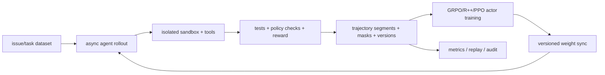

# 10. 面试题库与模拟追问

> 适用快照：`main@aaf5c209`。题库中的“参考回答”是组织答案的骨架，不是逐字背诵稿。涉及生产规模、吞吐或稳定性的数字必须来自你自己的实验，不要用仓库宣传语代替证据。

## 1. 评分标准

一个成熟回答通常包含四件事：

| 层次 | 面试官在听什么 |
|---|---|
| 结论 | 你是否直接回答了问题。 |
| 机制 | 你是否知道具体组件、数据和调用顺序。 |
| 取舍 | 你是否理解吞吐、显存、staleness、正确性与复杂度。 |
| 验证 | 你是否会用指标、测试、dump、checkpoint 或实验裁决。 |

只说“slime 很灵活、性能高”几乎没有信息量；能说出 `RolloutManager.generate → Sample 转换 → DP schedule → actor.train → update_weights` 才算落到机制。

## 2. 基础与定位

### Q1：slime 是什么？解决什么问题？

**参考回答：** slime 是大模型 RL/post-training 框架，用 Ray 编排资源，Megatron 完成分布式训练，SGLang 完成高吞吐 rollout，并用统一的数据契约连接生成、reward/verifier、训练、权重同步、评估和 checkpoint。它重点解决大模型在线 RL 中“训练引擎和推理引擎不同、数据生成高度可定制、权重需要高频同步、资源昂贵且流程难调试”的系统整合问题。

**追问：它不是什么？** 当前核心训练参数只接受 Megatron，rollout 主路径有意深度使用 SGLang；它不是通用的任意 trainer×任意 inference backend 矩阵，也不把所有 agent orchestration 内建到核心。

### Q2：为什么不是直接用 Megatron 训练脚本？

Megatron 擅长模型并行、优化器和 checkpoint，但在线 RL 还需要 serving、采样、reward、数据缓冲、rollout/训练资源切换以及把新权重推回 serving。slime 的价值主要在这个跨引擎闭环与控制面，不是替代 Megatron kernel。

### Q3：为什么只深度支持 SGLang rollout？

项目的取舍是避免多 backend 的最低公共能力抽象，直接透传 SGLang 的 serving、router、cache、PD、weight-update 等能力。好处是上游能力能较快使用、集成更深；代价是版本/patch 耦合和迁移成本更高。生态项目替换 rollout backend 不代表核心仓库已经无差别支持多 backend。

### Q4：Ray、Megatron、SGLang 各负责什么？

- Ray：控制面和资源编排，placement group、actor 生命周期、远程调用、object refs。
- Megatron：训练数据并行/模型并行、前后向、optimizer、checkpoint。
- SGLang：生成服务、router、KV cache、采样 logprob、权重 reload。

Ray 不替 Megatron 做 tensor parallel collective；SGLang 也不是 actor optimizer 的所在地。

### Q5：Data Buffer 是数据库吗？

不是必然。它是生成和训练之间的数据桥梁/抽象：默认 data source 读取 prompt、按 group 发样本，rollout 产生 `Sample`，可选 buffer/filter 再组织数据。实现可能主要在内存、Ray object store 或自定义 data source 中，不应把概念名误解成固定外部数据库。

### Q6：slime 最重要的设计取舍是什么？

可答三点：深度绑定 Megatron+SGLang 主路径；把 agent/tool/reward 看成可插拔数据生成而非另起训练框架；保持显式 round/data flow，优先可调试和正确性。再补代价：生态兼容面更窄、上游版本耦合、配置和资源规划复杂。

### Q7：怎样判断“支持某个模型”？

分层回答：是否只有转换代码；是否有模型 recipe；是否有 unit/contract test；是否有真实 GPU E2E/CI；是否有持续生产验证。存在脚本只能证明有人写过路径，不能证明你当前版本、硬件、精度、并行组合都可靠。

### Q8：slime 适合哪些 workload？

适合需要 Megatron 规模训练、SGLang rollout、在线 reward/verifier 或 agentic 数据生成的 RL/post-training；数学/代码可验证 reward、VLM、多轮工具、搜索、sandbox、多 agent 都有扩展/示例路径。若只是单卡 SFT、无需在线生成，整个系统可能过重。

## 3. 架构与执行链

### Q9：标准同步一轮发生什么？

1. `RolloutManager.generate` 用当前 SGLang 权重生成并评分。
2. `Sample` 转成训练字段并按 DP rank/micro-batch 分发。
3. PPO 时 critic 先算 values 和 value loss，actor 用 values 算 advantage；其他 estimator 通常直接 actor train。
4. 周期保存 actor/critic 和数据源游标。
5. actor 权重同步给 SGLang。
6. 按间隔 eval。

关键 happens-before 是“生成完成 → 训练 → 权重同步”，参见 [执行模式](03-synchronous-and-asynchronous-execution.md)。

### Q10：为什么先创建 RolloutManager，再创建训练模型？

RolloutManager 持有 data source；使用 `num_epoch` 时要先根据数据集长度算 round 数。训练 actor 初始化后还会把真实 DP/CP/VPP 配置回传给 rollout manager，用于正确切 batch。

### Q11：RolloutManager 的职责会不会太多？

它确实是 orchestration 中枢：起 server/router、加载 data source 和 hooks、生成/eval、reward 后处理、训练数据转换、DP 分片、health monitor。好处是闭环显式；风险是模块复杂度和单点控制压力。面试中可建议用清晰 contract、纯函数 DP scheduler、rollout-only replay 和测试降低风险，而不是随意拆服务。

### Q12：为什么每个训练 rank 是一个 Ray actor？

Ray actor 便于固定 placement bundle、隔离进程和远程 fan-out；actor 内再初始化 torch distributed，让 Megatron 按 rank 执行 collective。这样控制面资源调度与训练数据面分工清晰。

### Q13：placement group 为什么用 PACK，还要重排 bundle？

PACK 尽量把资源紧密放置，减少跨节点通信；调度出的 bundle 顺序未必等于物理节点/GPU 顺序，所以代码通过临时 info actor 取 IP/GPU id 后稳定重排，为 rank 与拓扑映射提供确定性。

### Q14：actor、critic、reference、old actor、teacher 有何区别？

- actor：被更新的策略。
- critic：PPO value 模型，学习 return baseline。
- reference：通常冻结，用于 KL。
- old actor：PPO ratio 的旧策略快照；配置不同也可能用当前 actor 前向或 rollout logprob。
- teacher：OPD 的教师分布。

它们不一定都是独立常驻 GPU 副本；实现会通过 backup/switch/offload 复用训练资源。

### Q15：为什么 rollout engine 的 logprob 和 Megatron logprob 都可能需要？

前者是实际 behavior policy 在 serving 采样时的概率；后者是训练侧 old/current/reference/teacher 的概率。训练/推理 kernel、精度、路由或权重版本不同会产生 mismatch；两者支持 importance ratio、off-policy correction 和一致性监控。

### Q16：optimizer step 和 weight sync 有什么区别？

optimizer step 在 Megatron 中更新 actor 参数；weight sync 把结果发布给 SGLang。一次 rollout 可能有多个 optimizer step，也可能隔若干 round 才同步 serving。两个频率决定样本新鲜度和通信成本。

### Q17：checkpoint 保存哪些状态？

至少区分：Megatron actor（PPO 还包括 critic）的模型/optimizer/RNG/iteration 相关状态，以及 RolloutDataSource 的 dataset offset、epoch、sample/group id 等游标。只有模型没游标会重复/跳过 prompt；只有游标没模型会使策略版本不一致。

### Q18：恢复时如何确定从哪一轮开始？

训练 workers 从 checkpoint 初始化返回 next rollout id。非 PPO 时当前代码检查 actor 组内一致；PPO 时只采用并检查 critic 组内 IDs，并不比较 actor/critic，显式 start id 也不与 checkpoint 交叉校验。若启用全局数据集，再加载 `start_rollout_id - 1` 对应状态。生产上必须额外核对 actor/critic、optimizer、RNG、数据游标和 serving 权重；异步 driver 还可能让数据游标领先模型，当前不能承诺 exact resume。

## 4. “异步”与 staleness

### Q19：`train_async.py` 异步在哪里？

它预提交第 N+1 轮 `generate`，同时训练第 N 轮，形成一轮 look-ahead pipeline。每轮训练仍等待对应 batch，权重同步前会 drain 在途 generation，避免同一生成途中换权重。它不是无限队列、任意陈旧度的 fully async。

### Q20：普通 rollout 已用 asyncio，为什么还需要 `train_async.py`？

两个层级不同：rollout 内 asyncio 并发多个请求，只减少一轮内部的空闲；`train_async.py` 跨 generation 和 training 两个阶段重叠。若一轮仍等最慢样本，跨阶段流水也不能完全消除长尾。

### Q21：fully-async 又有什么不同？

专用后台 worker 在 round 边界外持续维持 in-flight generation，完成的 group 进入 warm queue，下一 training batch 不必绑定此前那批最慢任务。当前示例没有 evaluation、跨 round 顺序 best-effort，ABORTED group 会整组重排；一次 drain 若取到超过 target 的完成组，excess 还会在切片时丢弃。队列状态不随 checkpoint 持久化，也必须处理权重版本/staleness。

### Q22：异步训练最大的算法风险是什么？

采样 policy 落后于当前 actor，behavior/target 分布偏移导致 importance ratio、KL 和梯度方差变坏。系统优化得到吞吐，算法上要用权重版本、rollout logprob、ratio/clipfrac/mismatch 指标和最大 staleness 边界约束。

### Q23：为什么 `train_async.py` 不支持 colocate？

流水要求生成和训练同时占 GPU；colocate 的基本节省来自两个阶段在同一 GPU 上交替驻留并 offload/onload，二者目标冲突。若强行同卡并发，显存和 kernel 争用会破坏设计假设。

### Q24：如何选择同步、流水异步、fully async？

- 首个正确 baseline、样本时延接近、评估严格：同步。
- 训练和生成耗时接近且有独立 GPU：N/N+1 流水。
- tool/API/sandbox/多 agent 导致 P99 长尾：评估 fully async。

选择前测阶段时间、P50/P95/P99、GPU 利用率和 staleness，而不是仅凭 workload 名称。

## 5. 数据契约与 batching

### Q25：`Sample` 为什么是核心对象？

它同时承载 prompt/messages、多模态输入、token/response、label、reward、loss mask、rollout logprob、状态和扩展 metadata，是数据生成层与训练转换层的共同契约。扩展逻辑保持这个 contract，就不必 fork training kernel。

### Q26：`group_index`、`index`、`rollout_id` 分别是什么？

- `group_index`：同 prompt 多响应的 reward group。
- `index`：默认样本唯一序号。
- `rollout_id`：一次生成执行的身份；一次 agent trajectory fan-out 成多个训练片段时，siblings 必须共享。

混淆会破坏 group normalization、step 切分或 loss 归约。

### Q27：为什么同一 prompt 要采多个响应？

GRPO/GSPO/CISPO 等用同 prompt sibling 的 reward 相对关系构造 baseline/advantage，避免独立 critic。多样本也便于 pass@k 和难度判断；代价是 rollout token 成本按 N 放大。

### Q28：`loss_mask` 有什么用？

它定义哪些 response token 参与梯度。模型生成 token 通常为 1；工具返回、环境 observation、不可训练前缀、过滤样本可置 0。只把文本拼进 prompt 而不正确维护 mask/logprob，会把外部环境内容误当模型动作训练。

### Q29：一次 agent rollout 拆成多个训练片段要注意什么？

custom generate 可返回 `list[Sample]`；所有片段共享 `rollout_id`、继承正确 `group_index`，各自 token/mask/logprob 对齐。正确共享 ID 时 reducer 不会简单把 loss 放大 K 倍，但复制总 reward仍会改变 credit assignment、重复 token 的权重和归一化前的 sibling 权重。可变 fan-out 要明确逻辑 rollout 级 reward 聚合，并使用 custom reward post-process；当前 `--group-rm` 也不能直接消费这种嵌套列表。

### Q30：dynamic sampling 解决什么？

若同 prompt 所有 sibling reward 相同，组内去均值后 advantage 为零，生成成本没有学习信号。dynamic filter 可丢弃零方差 group并继续过采样，换来更多 rollout 成本和潜在数据分布偏移；要监控 zero-std rate 与接受率。

### Q31：变长序列怎样避免拖慢训练？

当前 scheduler 先在 step 内按 token cap first-fit pack（或配置的 FLOPs balancing）形成 micro-batch，再满足 DP/VPP 对齐并分发；Megatron 侧使用 packed sequence 和 CP slicing。要同时看 padding/packing 效率、每 rank token、micro-batch 数和最长序列。

### Q32：`global_batch_size` 在当前代码中是什么意思？

这是必须带限定的陷阱题。当前 `dp_schedule.py` 按 distinct `rollout_id` 计每 step 的 GBS。默认每次生成各有唯一 ID；custom fan-out 的 siblings 共享原生成 ID，所以标准两条路径的 ID 数都仍是 `rollout_batch_size × n_samples_per_prompt`，参数自动公式并未因 fan-out 失效。scheduler 不看 mask，全零 mask rollout 仍占 slot。旧注释的问题是把物理片段和逻辑 rollout 都叫 sample；只有完整自定义 rollout 改变逻辑 ID 数时才需手工推导并测试。

## 6. 算法与 loss

### Q33：reward、return、advantage 有什么区别？

reward 是 verifier/RM/环境给出的信号；return 是从某 token/状态看未来 token reward 的累计目标；advantage 表示该动作相对 baseline 有多好，是 policy gradient 的权重。GRPO 中组均值可作 baseline；PPO 中 critic value 参与 GAE。

### Q34：GRPO 为什么不需要 critic？

同 prompt 多响应的组内均值提供相对 baseline，reward 去均值（可再除 std）后广播到响应 token 作为 advantage/return。它降低资源和实现复杂度，但依赖有信息量的 group、多样性和可靠 reward。

### Q35：GRPO 与 GSPO 的核心差异？

在 slime 默认实现中，两者 group advantage 路径相近；关键差异是 policy importance ratio：GRPO/PPO 风格按 token，GSPO 把整条 response 的平均 old-current signed log-ratio 广播给 token。这里不是 actor-reference KL；后者是独立约束路径。GSPO 需 gather/序列级计算，成本可能更高、粒度更粗。

### Q36：CISPO 与 PPO clip 有何差异？

PPO clipped surrogate 在 ratio 越界区域可能形成梯度平台；CISPO 对截断 ratio 做 stop-gradient，但梯度继续从 `log_probs` 流动，因此被截断 token 仍贡献梯度。canonical 配置通常关闭不需要的下界；最终行为仍取决于 clip 参数和 reducer。

### Q37：REINFORCE++ 适合什么场景？

它不需要 critic，却把 terminal reward 和 token KL shaping 组成 token reward，再从后往前计算折扣 return并做 whitening。适合想比纯 group scalar 更细粒度传播 delayed reward、又不想承担 critic 的情况。Baseline 版本先减 group baseline。

### Q38：PPO 为什么最贵？

需要 critic/value head 的初始化、forward、value loss、checkpoint，actor 还要接收 values 算 GAE；框架会为 PPO 自动启用 critic并允许 critic-only warmup。它的价值是学习状态 baseline，可能更适合多轮 credit assignment，但不是“更复杂所以一定更好”。

### Q39：KL 可以放在哪里？

至少区分 reward shaping KL 与显式 KL loss：前者在 PPO 和两种 REINFORCE++ built-in 分支中影响 reward/advantage，后者直接加进 policy objective；当前 GRPO/GSPO/CISPO 的 `get_grpo_returns` 不消费传入 KL，不能只设置 `kl_coef` 就声称 shaping 生效。还要说明 KL estimator、系数、reference 更新、mask 和 logprob 来源。

### Q40：on-policy distillation 是 estimator 吗？

当前参数帮助明确说明 OPD 与 advantage estimator 正交：teacher reverse log-ratio penalty 会直接修改 estimator 产生的 advantage，随后仍进入对应 policy loss；它不是额外的独立 OPD objective。启动脚本中同时出现 GRPO 和 OPD 不矛盾。

### Q41：怎样判断训练健康？

联合看：reward 与 pass@k、zero-std、响应长度/截断率、entropy、PPO KL/ratio/clipfrac、rollout-vs-train logprob mismatch、grad norm/NaN、每阶段时间、token throughput、GPU 利用率、队列/等待。单独 reward 上升可能来自 reward hacking 或长度偏置。

### Q42：为什么 estimator 名称不能代表完整算法？

实际目标还由 reward normalization、std normalization、KL 位置/类型、old logprob 来源、clip、TIS/OPD、loss reducer、dynamic sampling、mask 和 custom hooks 决定。比较实验必须记录完整配置和代码版本。

## 7. 分布式资源与权重同步

### Q43：colocate 与训推分离怎样选？

分离可并发、切换少、故障域清晰，但需要 actor GPU + rollout GPU；colocate 取两者最大资源并靠 offload/onload 交替，节省卡但增加切换、CPU 内存、显存碎片和调试复杂度，且不支持默认流水异步。用端到端 round time 和成本评估，不能只看单阶段吞吐。

### Q44：TP、PP、DP、CP、EP 分别解决什么？

- TP：层内张量切分，降低单卡参数/计算，通信频繁。
- PP：层间流水，降低单 stage 参数显存，有 pipeline bubble。
- DP：复制模型、切数据，需要梯度同步。
- CP：切长序列/context，适合长上下文，增加 gather/通信约束。
- EP：MoE expert 分布到设备，关注 token all-to-all 和负载不均。

回答必须把并行策略与模型结构、序列长度、网络拓扑联系起来。

### Q45：full NCCL、full disk、delta disk 怎么选？

- full + NCCL：低延迟、高速互联、训练和 serving 可建通信组的常规分离部署。
- full + disk：跨环境或不便建 collective，写完整 HF checkpoint 后 reload；要求共享可见路径，I/O 大。
- delta + disk：只发布变化字节，适合大模型/跨集群降低传输；当前代码校验只允许 disk，还要求 rollout host 本地 checkpoint 目录，版本、base、checksum 和 exactly-once apply 很关键。

colocate 通常走 tensor/CUDA IPC，不应再做 delta bookkeeping。

### Q46：权重同步如何避免生成中途换版本？

RolloutManager 提供 engine 和锁；disk reload 会 pause generation、flush cache、reload 后 resume。流水入口在 update 前 drain future。更严格的 agentic async 还应把 weight version 写到 `Sample` 并定义 trajectory 一致性策略。

### Q47：external rollout engine 的价值与风险？

价值是训练/serving 生命周期、环境、硬件甚至集群解耦，serving 可独立扩缩。风险包括网络和认证、共享存储可见性、版本发布原子性、热加载时间、部分 engine 失败、router 一致性和跨故障域排障。HTTP 可达不等于 disk path 可见。

### Q48：为什么 HF checkpoint 和 Megatron checkpoint 都出现？

HF 路径常提供 tokenizer/config 并供 SGLang 初始化；Megatron `torch_dist` checkpoint 承载训练分片、optimizer/RNG等。初次训练通常需 HF→Megatron 转换；发布或 disk reload 还会涉及 Megatron→HF 格式。模型结构参数仍须与 recipe 严格一致。

## 8. 扩展与真实场景

### Q49：什么时候用 custom generate，什么时候覆盖 rollout function？

单 sample 的 RAG、tool、sandbox、多轮 agent loop优先 `--custom-generate-function-path`，配 `--custom-rm-path`，复用默认并发、过滤、日志和 buffer。只有要改全局 task scheduling、跨 sample 协调或完全替换 round 语义时才用 `--rollout-function-path`。

### Q50：设计一个数学 GRPO 方案。

答题结构：JSONL prompt/label + chat template；每 prompt 多采样；规则 verifier；GRPO group normalization；可选 dynamic sampling丢零方差组；同步 round先做正确 baseline；观察 accuracy/pass@k、zero-std、长度、截断、KL、clipfrac；先小模型 smoke，再扩大 TP/DP。说明 verifier 防解析投机和 held-out eval。

### Q51：设计一个代码 agent RL 方案。

custom generate 驱动多轮模型—工具—sandbox循环，模型 token mask=1、工具输出 mask=0；test-based custom reward；每个 sandbox 隔离、限时、限网/资源。基础设施失败不能只写 `FAILED`，还要重试/回填或 filter/remove/全零 mask。长尾明显时再评估 fully async；trajectory fan-out共享 rollout id并保留 group index；监控测试通过率、超时/ABORTED、reward hacking、token/工具成本和权重 staleness。

### Q52：设计一个搜索/RAG RL 方案。

custom generate 在多轮中调用检索服务，保留模型 query/answer token，检索文档作为不可训练 observation；reward 可结合答案正确性、引用/证据和成本；设置 session/重试/缓存；关注外部服务长尾、陈旧数据、数据泄漏和检索 reward hacking。先复用默认 rollout，不必立即重写全局调度。

### Q53：如何支持一个 Megatron 原生不完整支持的新模型？

先判断只是权重映射还是模型层实现缺失：用 `slime_plugins/mbridge`/转换器处理 HF↔Megatron 映射；必要时用 model provider/ModuleSpec 或 HF module wrapper替换组件。然后补 key/shape round-trip、attention/rope、CP/TP 和小模型 E2E。当前文档提示被替换的 HF module 本身未必支持 TP，不能假设任意并行度。

### Q54：reward model 返回多个维度怎么办？

`Sample.reward` 可为 dict，配置 `reward_key` 选择训练信号，或用 reward post-process组合。必须记录原始各维度、归一化和权重；避免不同量纲直接相加，并用独立指标发现某维度被牺牲。

## 9. 调试、可靠性与性能

### Q55：生成正常但训练 reward/grad 异常，怎么定位？

先 dump rollout，检查 token、response span、reward、status、mask、rollout logprob；再 train-only replay固定同一 batch，检查 Megatron logprob、advantage、loss、grad。若 replay稳定，问题在 serving/异步/数据；若仍异常，继续查 tokenizer、模型配置、loss 和 optimizer。

### Q56：模型生成乱码，最先查什么？

先确认 Megatron checkpoint 是否真正加载、目录 marker/iteration 是否有效，HF tokenizer/config是否匹配，权重转换和模型 recipe是否一致；再做小 prompt前向与权重同步 equality check。不要先调温度掩盖错误权重。

### Q57：Ray job 一直 pending 怎么办？

按 placement 公式算请求 GPU，检查 cluster registered/available resources、actor+rollout或colocate最大值、每 engine TP、节点标签和 placement group状态。代码会周期记录 registered/available GPU；若资源永远不满足，等待不会自动修复配置。

### Q58：训练 OOM 怎么分层处理？

区分 rollout KV OOM 与 Megatron train OOM。rollout 调低 SGLang static memory fraction、并发、max context/response；训练降低 max tokens per GPU/micro-batch，开启 recompute或CP，核对TP/PP；colocate还看offload峰值与碎片。先保留失败时各阶段内存指标，再改一个变量。

### Q59：出现 NaN/grad norm异常怎么办？

查数据和 chat template、超长/全 mask样本、reward/advantage尺度、KL/ratio极值、precision、learning rate、MoE路由和checkpoint结构。`skip NaN step` 只能止血，必须定位第一个非有限 tensor，并用固定 rollout replay复现。

### Q60：rollout 一直不结束怎么办？

查 stop token/stop strings 与 HF config、max response/context、custom generate退出条件、外部工具超时、server请求状态。记录 finish reason和response length分布；不要只把全局 timeout调大。

### Q61：如何验证权重同步正确？

初始化和更新后可用 equality/checksum机制抽查；记录weight version；用固定 prompt 比较更新前后 serving logprob；disk模式验证发布目录完整、每 engine版本一致、cache flush/reload成功；delta模式校验base版本、checksum与apply次数。注意 full-disk 的 engine version 主动比较当前只在 `--ci-test` 分支，生产环境需自行做一致性检查。

### Q62：当前容错边界是什么？

仓库有本地 rollout engine health monitor/restart和checkpoint恢复路径，但不能据此承诺 trainer任意失败、external engine、自定义工具副作用、跨服务 exactly-once 或全任务自动恢复。异步模式的数据游标/在途队列也不是 exact resume。说明“覆盖什么、没覆盖什么”，并把集群调度器、Ray、共享存储、checkpoint和幂等环境纳入生产方案。

### Q63：性能低先看什么？

先拆 round：generation、reward/tool、train wait、actor forward/backward、weight sync、save/eval。看 GPU 利用率、token throughput、P95/P99 trajectory、每 DP rank token、packing效率、router/cache命中和sync I/O。瓶颈在哪一段，优化哪一段；不要先盲目加并发。

### Q64：怎样保证可复现？

固定代码/镜像/上游版本、模型和数据哈希、seed、sampling参数、并行配置、batch/排序、reward服务版本、checkpoint/RNG和数据游标。异步完成顺序、外部API和非确定GPU kernel会削弱bitwise reproducibility，应明确目标是数值/统计还是逐token一致。

## 10. 代码级追问

### Q65：`RolloutManager.generate` 的输入输出是什么？

输入是 outer `rollout_id`；内部调用 rollout hook得到 sample和metrics，保存/记录，转换训练字段，再按DP配置切分；输出是每个train rank对应的 Ray object ref/Box列表。debug rollout-only时可不转换直接返回。

### Q66：为什么转换阶段要预计算 `rollout_mask_sums`？

一次 rollout fan-out 的多个 sample可能被first-fit packing分到不同micro-batch。预先按rollout汇总有效token数并广播给每个sample，loss reducer才能跨micro-batch得到一次rollout的正确token加权均值，避免重复计数。

### Q67：为什么同 rollout 的 sample 要放在同一个 training step？

group/rollout级归约需要完整 denominator和一致策略版本；跨step会让一次rollout被不同optimizer状态消费，并破坏每step GBS和loss语义。当前 scheduler先按rollout id分step，再pack sample。

### Q68：PPO critic values 如何传给 actor？

critic group的各rank remote train返回refs；pipeline last stage返回CPU values，actor对应rank在last stage把values搬回GPU，算GAE后训练policy。其他stage返回空dict，避免无意义传输。

### Q69：为什么同步权重时需要 engine lock？

防止generation和参数更新竞争，尤其reload/flush cache或collective update期间。锁只是本进程/控制面协议的一部分；external engine还需版本发布和服务端原子切换语义。

### Q70：为什么参数解析分阶段？

SGLang和Megatron各自有原生parser，slime先预解析决定是否跳过某后端，再独立解析SGLang参数、解析Megatron+slime参数，合并namespace并分别校验。这保留上游参数透传，但也让版本兼容和同名参数管理更复杂。

## 11. 三套模拟面试

### 15 分钟快速面

1. 90 秒介绍 slime。
2. 画标准训练闭环。
3. 比较 GRPO 与 PPO。
4. 区分四种 async 语义。
5. 说一个你会如何调试的真实故障。

及格标准：每题先结论，能落到至少一个类/函数/数据字段。

### 45 分钟框架深挖

1. 从 `train.py` 追到一个 optimizer step。
2. 从 JSONL row 追到 packed micro-batch。
3. 解释 behavior/old/ref/teacher logprob。
4. 给定 16 卡，设计分离与colocate两案。
5. 解释 full/delta权重同步的故障模型。
6. 解释 GBS 的唯一 rollout-ID 口径，并设计 default/fan-out 两个验证例。

优秀标准：能主动指出边界和不确定性，并提出最小测试裁决。

### 60 分钟系统设计：训练代码 agent

建议白板顺序：

依次回答：

1. task schema 与防数据泄漏；
2. custom generate、tool observation mask和fan-out contract；
3. sandbox隔离、超时、幂等和外部副作用；
4. test-based reward、防reward hacking与held-out verifier；
5. 同步/fully async选择、队列和staleness；
6. estimator、batch与并行策略；
7. checkpoint、数据游标和版本恢复；
8. 指标、成本、failure injection和上线门槛。

## 12. 面试前最后检查

- [ ] 不把 `train_async.py` 说成 fully async。
- [ ] 不把 optimizer step 说成 weight sync。
- [ ] 不把 rollout logprob 说成 reference logprob。
- [ ] 不把 `group_index`、outer round id、`Sample.rollout_id` 混为一谈。
- [ ] 能解释默认/fan-out 下参数公式为何仍成立，以及何时自定义 rollout 会让它失效。
- [ ] 不用“有脚本”证明“生产稳定”。
- [ ] 不只讲吞吐，也讲staleness、恢复和正确性。
- [ ] 每个方案都能说出最小smoke、关键指标和失败回放方法。

继续复习：[架构](02-architecture-and-control-flow.md) · [数据](04-data-pipeline.md) · [算法](05-algorithms-and-losses.md) · [实战](07-extension-and-real-world-scenarios.md) · [调试](08-debugging-reliability-and-performance.md)
