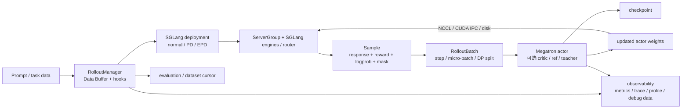

# slime 面试与源码解读指南

> 适用快照：`v0.3.2`，提交 `3778dbf6`（扫描日期：2026-08-29）。本指南是基于该快照的静态源码解读；未在本机执行多 GPU 训练，硬件能力与稳定性等级以仓库 CI 和对应版本文档为准。相对上一轮文档的主要变化：SGLang server 启动被拆分为 deployment/config/disaggregation/engine-group 层并支持 normal、PD、EPD 配置路径，指标、trace、profile 与调试数据工具集中到 `slime/observability/`，新增 backend-aware accelerator 抽象与 MUSA 代码路径，权重 updater 选择提取为独立 factory，并修正 eval-only 初始化。这里的 MUSA 表述只说明 v0.3.2 存在实现与仓库测试，不把它等同于本文完成了 MUSA 硬件 E2E 或生产验证。

这套文档不是“参数字典”，而是一条从零建立心智模型、能读代码、能回答追问、能设计真实训练方案的学习路线。读完后，你应该能把 slime 讲成一个完整的在线 RL 后训练系统，而不是只记住“Megatron + SGLang”。

## 一句话与 30 秒回答

一句话：**slime 用 Ray 编排 Megatron 训练进程和 SGLang rollout 服务，以 `Sample`/Data Buffer 为数据契约，循环完成生成、奖励、训练、权重同步、评估和保存。**

面试中的 30 秒版本：

> slime 是面向大规模 LLM RL/post-training 的框架。控制面用 Ray 管理 GPU placement 和 actor，训练面深度使用 Megatron，生成面深度使用 SGLang。一次标准 round 先让 rollout engine 生成响应并计算 reward，再把 `Sample` 转成按数据并行 rank 切分的训练 batch，Megatron 计算 logprob、advantage 和 loss、更新 actor，最后把新权重同步回 SGLang。它的突出取舍是只深度优化 Megatron + SGLang 主路径，同时提供很多 Python import-path hook，让数学验证、搜索、工具、sandbox、多 agent 等场景复用同一训练闭环。

如果面试官继续追问，立即补上两个边界：

1. `train_async.py` 默认只是让第 `N+1` 轮生成与第 `N` 轮训练重叠，不等于任意 staleness 的完全异步训练。
2. “支持某模型/硬件”要区分 README 声明、仓库有 recipe、CPU contract test、GPU E2E/CI 和生产验证，不能混为一谈。

## 先记住这张图

把它理解成两个闭环：

- **学习闭环**：prompt → rollout → reward → advantage/loss → optimizer step。
- **系统闭环**：资源编排 → 数据传输 → 训练 → 权重同步 → checkpoint/恢复。

面试题通常只是从这两个闭环中抽一个节点继续追问。

## 文档目录与推荐顺序

| 顺序 | 文档 | 读完能回答什么 |
|---:|---|---|
| 1 | [项目定位与设计取舍](01-project-overview.md) | slime 解决什么问题，为什么选 Ray/Megatron/SGLang，边界是什么？ |
| 2 | [系统架构与控制流](02-architecture-and-control-flow.md) | 组件如何创建、通信，rollout/actor/critic/权重同步怎样闭环？ |
| 3 | [同步、流水异步与完全异步](03-synchronous-and-asynchronous-execution.md) | 三种“异步”到底差在哪，什么时候选哪种？ |
| 4 | [数据生命周期与批处理](04-data-pipeline.md) | 一条 prompt 怎样变成训练 token，`Sample`、mask、logprob、GBS 分别是什么？ |
| 5 | [算法、优势与损失](05-algorithms-and-losses.md) | GRPO/GSPO/CISPO/R++/PPO 如何实现和选型？ |
| 6 | [配置、分布式资源与权重同步](06-configuration-resources-and-weight-sync.md) | 怎样看启动脚本、算 GPU、选并行策略和同步方式？ |
| 7 | [扩展机制与真实场景](07-extension-and-real-world-scenarios.md) | 如何接 reward、工具、搜索、sandbox、多 agent、VLM？ |
| 8 | [调试、可靠性与性能](08-debugging-reliability-and-performance.md) | OOM、NaN、乱码、卡住、权重不一致如何分层排查？ |
| 9 | [源码阅读路线](09-source-code-reading-guide.md) | 从哪些入口读、怎样跟调用链、哪些测试是可执行规范？ |
| 10 | [面试题库与模拟追问](10-interview-question-bank.md) | 如何组织高质量回答，怎样应对架构、算法和实战追问？ |
| 11 | [2025–2026 厂商真题精讲](11-company-interview-questions.md) | 字节/百度/阿里/腾讯等公开面经真题怎么答，slime 如何成为加分项？ |

## 零基础学习路线

### 第一遍：只建立地图（约 2 小时）

读 01、02、03，只要求能回答：

- 训练、生成、控制面分别是谁？
- 标准一轮依次发生什么？
- actor、critic、reference、rollout engine 的“模型”有什么区别？
- optimizer step 与向 SGLang 同步权重为什么不是一件事？
- colocate、训推分离、external rollout 的资源边界是什么？

### 第二遍：补算法与数据（约 3 小时）

读 04、05，并手画一遍：

`JSONL row → prompt group → Sample → reward group → RolloutBatch → micro-batch → policy loss`

必须能解释：reward 与 advantage、behavior/old/ref logprob、`loss_mask`、`group_index/index/rollout_id` 的差别。

### 第三遍：面向实战（约 3 小时）

读 06、07、08，为以下三个场景各写一页方案：

1. 8 卡数学 GRPO baseline。
2. 带搜索或 sandbox 的长尾 agentic RL。
3. 训练集群和推理集群分离、通过共享存储同步权重的大模型任务。

每页都写清数据、reward、GPU、并行度、执行模式、同步方式、观测指标、失败恢复和验证标准。

### 第四遍：源码与模拟面试（约 3 小时）

按 09 的路线读关键函数，再用 10 做两轮口述：第一轮每题 60 秒，第二轮允许追问 5 分钟。答案必须包含“结论 → 机制 → 取舍 → 证据/验证”，不要背功能清单。最后用 11 过一遍各厂公开面经真题，把通用回答校准到真实问法。

## 回答框架

面对任何框架题，使用四层回答：

1. **结论**：先用一句话回答，不从背景讲起。
2. **机制**：指出具体组件、数据或调用顺序。
3. **取舍**：说明吞吐、显存、staleness、正确性、复杂度中的代价。
4. **验证**：说出会看哪些指标、跑哪个 smoke test、如何做 rollout/train replay。

例如“为什么选择 colocate？”：

> 当 GPU 总量不足以同时驻留训练和推理副本时，我会考虑 colocate。slime 让 actor 和 rollout 共用 placement bundles，并在两个阶段间 offload/onload 显存。它节省卡，但引入切换开销、CPU 内存和恢复复杂度，而且默认流水异步入口不支持 colocate。我会先用小模型验证权重切换和峰值显存，再比较分离部署的 round time。

## 事实强度与常见误区

本指南使用以下证据强度：

| 表述 | 含义 |
|---|---|
| 源码实现 | 当前提交存在明确执行路径或参数校验。 |
| 测试覆盖 | 仓库存在对应 CPU unit/contract test 或 GPU E2E recipe；不自动等于所有配置都稳定。 |
| 文档/README 声明 | 项目维护者给出的能力说明，仍需结合版本、硬件和 CI。 |
| 示例/recipe | 有可参考脚本，不代表有生产 SLA 或覆盖所有上游版本。 |

特别注意：

- 当前核心参数只接受 Megatron 训练后端；核心 rollout 路径有意深度绑定 SGLang。生态项目可能替换 backend，不代表本仓库主路径已经多 backend 化。
- 普通 SGLang rollout 内部使用 asyncio 并发，不代表训练 round 之间完全异步。
- 当前 DP scheduler 以 distinct `rollout_id` 计 `global_batch_size`。默认路径中每次生成各有一个唯一 ID，所以数量仍是 `rollout_batch_size × n_samples_per_prompt`；custom fan-out 的 siblings 共享 ID 后也仍只计原生成一次。全零 mask 的 rollout 仍占 GBS slot，只是 loss contribution 为 0。部分注释把它笼统称为“training sample”，容易让人误以为 fan-out 后每个物理片段都计数，详见 [数据生命周期](04-data-pipeline.md)。
- `hf-checkpoint`、Megatron `load/ref-load/save` 和 rollout engine 当前权重不是同一个概念。
- 有模型转换器或启动脚本，只说明存在适配路径；生产前仍要核对模型结构、并行配置、数值精度与 E2E 测试。

## 最小术语表

| 术语 | 本项目中的意思 |
|---|---|
| actor | 被 RL 更新、最终同步给 rollout engine 的策略模型。 |
| critic | PPO 的 value model；当前参数校验只在 `advantage_estimator=ppo` 时自动启用。 |
| reference | 通常冻结的参考策略，用于计算 KL；不等于 rollout behavior policy。 |
| teacher | OPD 场景中的教师策略，可提供 teacher logprob。 |
| rollout | 一次生成执行或一轮生成阶段；上下文不同时要明确是哪种含义。 |
| rollout round/id | 外层训练循环编号。 |
| `Sample.rollout_id` | 标识一次生成执行；一次执行 fan-out 的多个训练片段必须共享它。 |
| Data Buffer | 广义的数据桥梁；默认实现围绕 data source、生成结果和可选 buffer/filter 组织。 |
| on-policy | 训练数据由接近当前 actor 的策略生成；异步和低频权重同步会引入 staleness，需要额外关注。 |
| weight sync | 把训练后的 actor 参数更新到 SGLang，不是 optimizer step。 |

## 源码锚点

- 同步入口：[train.py](https://github.com/THUDM/slime/blob/3778dbf6d1a533ab478ecf5ddaa11449a47752b2/train.py#L9)
- 流水异步入口：[train_async.py](https://github.com/THUDM/slime/blob/3778dbf6d1a533ab478ecf5ddaa11449a47752b2/train_async.py#L10)
- Ray 资源布局：[slime/ray/placement_group.py](https://github.com/THUDM/slime/blob/3778dbf6d1a533ab478ecf5ddaa11449a47752b2/slime/ray/placement_group.py#L100)
- rollout 生命周期与数据控制：[slime/ray/rollout.py](https://github.com/THUDM/slime/blob/3778dbf6d1a533ab478ecf5ddaa11449a47752b2/slime/ray/rollout.py#L38)
- SGLang 部署入口：[slime/backends/sglang_utils/deployment.py](https://github.com/THUDM/slime/blob/3778dbf6d1a533ab478ecf5ddaa11449a47752b2/slime/backends/sglang_utils/deployment.py#L79)
- 默认 rollout：[slime/rollout/sglang_rollout.py](https://github.com/THUDM/slime/blob/3778dbf6d1a533ab478ecf5ddaa11449a47752b2/slime/rollout/sglang_rollout.py#L627)
- 核心样本类型：[slime/utils/types.py](https://github.com/THUDM/slime/blob/3778dbf6d1a533ab478ecf5ddaa11449a47752b2/slime/utils/types.py#L94)
- DP/micro-batch 调度：[slime/utils/dp_schedule.py](https://github.com/THUDM/slime/blob/3778dbf6d1a533ab478ecf5ddaa11449a47752b2/slime/utils/dp_schedule.py#L82)
- Megatron actor：[slime/backends/megatron_utils/actor.py](https://github.com/THUDM/slime/blob/3778dbf6d1a533ab478ecf5ddaa11449a47752b2/slime/backends/megatron_utils/actor.py#L391)
- advantage/loss：[slime/backends/megatron_utils/loss.py](https://github.com/THUDM/slime/blob/3778dbf6d1a533ab478ecf5ddaa11449a47752b2/slime/backends/megatron_utils/loss.py#L704)
- 参数解析与校验：[slime/utils/arguments.py](https://github.com/THUDM/slime/blob/3778dbf6d1a533ab478ecf5ddaa11449a47752b2/slime/utils/arguments.py#L1588)

## 学完后的自检

不看文档，尝试回答：

- [ ] 能在 90 秒内画出训练闭环并说出每条边传什么。
- [ ] 能逐行解释 `train.py` 主循环，而不是只复述 README。
- [ ] 能区分标准同步、流水异步、fully-async 和 rollout 内 asyncio。
- [ ] 能解释 `Sample` 中 reward、mask、四种 logprob 和三个 ID。
- [ ] 能比较六种 estimator，并说清何时需要 critic。
- [ ] 能从卡数、显存、网络、共享存储和长尾程度选择部署形态。
- [ ] 能为一个工具调用或代码 agent 选择最小扩展接口。
- [ ] 能用 rollout-only/train-only、checkpoint 和指标把问题分层定位。
- [ ] 能明确指出当前源码/文档口径冲突，而不是自信地背错误公式。
